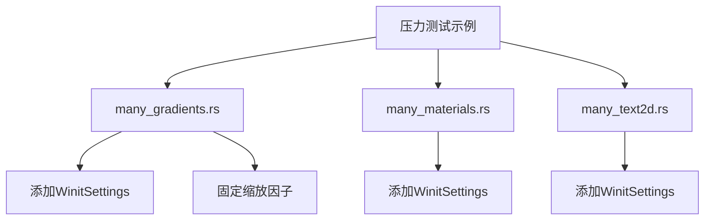

+++
title = "#20751 update some stress tests to use the common setup"
date = "2025-08-25T00:00:00"
draft = false
template = "pull_request_page.html"
in_search_index = false

[extra]
current_language = "zh-cn"
available_languages = {"en" = { name = "English", url = "/pull_request/bevy/2025-08/pr-20751-en-20250825" }, "zh-cn" = { name = "中文", url = "/pull_request/bevy/2025-08/pr-20751-zh-cn-20250825" }}
+++

# 更新压力测试以使用通用配置

## 基本信息
- **标题**: update some stress tests to use the common setup
- **PR链接**: https://github.com/bevyengine/bevy/pull/20751
- **作者**: mockersf
- **状态**: 已合并
- **标签**: D-Trivial, C-Examples
- **创建时间**: 2025-08-25T15:27:58Z
- **合并时间**: 2025-08-25T21:18:22Z
- **合并者**: mockersf

## 描述翻译
### 目标
- `many_gradients`、`many_materials` 和 `many_text2d` 测试并不总是以其全部潜力运行

### 解决方案
- 使用与其他压力测试相同的缩放因子
- 使用与其他压力测试相同的 winit 设置

## 本次PR的故事

这个PR解决了一个简单但重要的问题：Bevy引擎中的几个压力测试示例没有使用统一的配置设置，导致它们无法始终以最佳性能运行。压力测试的目的是评估引擎在极端条件下的性能表现，因此确保测试配置的一致性至关重要。

问题的核心在于三个压力测试示例（many_gradients、many_materials和many_text2d）缺少两个关键配置：

1. **Winit设置**：没有明确设置更新模式，导致窗口在失去焦点时可能降低更新频率
2. **缩放因子**：没有固定缩放因子，系统级别的缩放设置可能影响测试结果的一致性

开发者通过分析现有的压力测试示例，发现了这些测试与其他类似测试在配置上的差异。解决方案是让这些测试使用与其他压力测试相同的标准配置：

```rust
// 添加Winit设置，确保无论窗口焦点状态如何都持续更新
.insert_resource(WinitSettings {
    focused_mode: UpdateMode::Continuous,
    unfocused_mode: UpdateMode::Continuous,
})
```

对于many_gradients示例，还额外添加了缩放因子覆盖：

```rust
// 固定缩放因子为1.0，避免系统缩放影响测试结果
resolution: WindowResolution::new(1920, 1080).with_scale_factor_override(1.0),
```

这些修改确保了：
1. 测试运行时不会因为窗口失去焦点而降低更新频率
2. 在不同系统上测试时，缩放因子保持一致
3. 所有压力测试使用相同的基准配置，使结果更具可比性

从工程角度看，这是一个典型的配置统一化工作。虽然修改本身很简单，但它确保了测试的准确性和一致性，这对于性能测试至关重要。这种统一配置的模式也体现了良好的工程实践——确保同类组件使用相同的配置标准。

## 可视化表示



## 关键文件变更

### `examples/stress_tests/many_gradients.rs` (+6/-1)
**变更描述**：添加了WinitSettings配置和缩放因子覆盖，确保测试持续运行且不受系统缩放影响

**关键代码变更**：
```rust
// 添加缩放因子覆盖
resolution: WindowResolution::new(1920, 1080).with_scale_factor_override(1.0),

// 添加WinitSettings配置
.insert_resource(WinitSettings {
    focused_mode: UpdateMode::Continuous,
    unfocused_mode: UpdateMode::Continuous,
})
```

### `examples/stress_tests/many_materials.rs` (+6/-1)
**变更描述**：添加了WinitSettings配置，确保测试持续运行

**关键代码变更**：
```rust
// 添加WinitSettings配置
.insert_resource(WinitSettings {
    focused_mode: UpdateMode::Continuous,
    unfocused_mode: UpdateMode::Continuous,
})
```

### `examples/stress_tests/many_text2d.rs` (+5/-0)
**变更描述**：添加了WinitSettings配置，确保测试持续运行

**关键代码变更**：
```rust
// 添加WinitSettings配置
.insert_resource(WinitSettings {
    focused_mode: UpdateMode::Continuous,
    unfocused_mode: UpdateMode::Continuous,
})
```

## 进一步阅读

对于想要深入了解相关概念的开发者，建议阅读：

1. **Bevy Winit设置文档**：了解UpdateMode的不同选项及其对应用性能的影响
2. **窗口分辨率与缩放**：理解缩放因子如何在不同的显示设置下影响渲染
3. **压力测试最佳实践**：学习如何设计有效的性能测试用例
4. **Bevy插件系统**：了解如何通过统一的资源配置来管理应用行为

这些资源可以帮助开发者更好地理解如何配置Bevy应用以获得一致且可靠的性能测试结果。