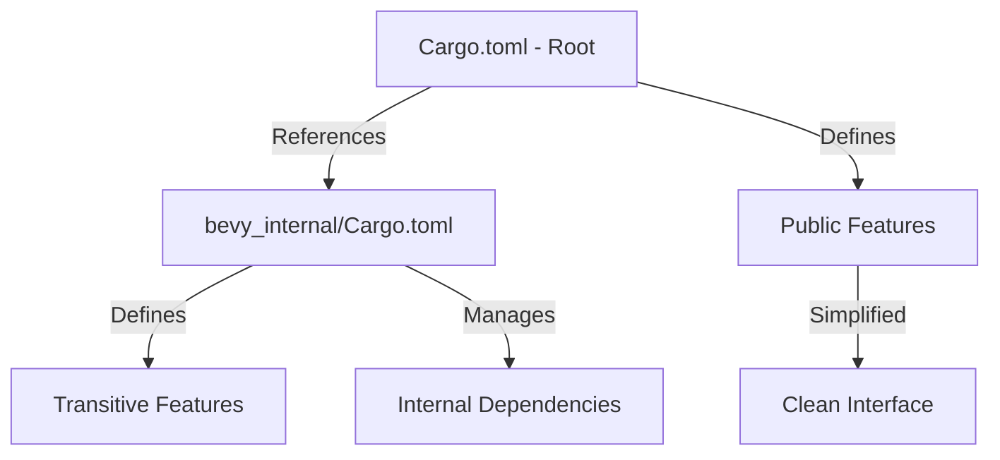

+++
title = "#20752 Clean up root toml features"
date = "2025-08-27T00:00:00"
draft = false
template = "pull_request_page.html"
in_search_index = true

[taxonomies]
list_display = ["show"]

[extra]
current_language = "en"
available_languages = {"en" = { name = "English", url = "/pull_request/bevy/2025-08/pr-20752-en-20250827" }, "zh-cn" = { name = "中文", url = "/pull_request/bevy/2025-08/pr-20752-zh-cn-20250827" }}
labels = ["C-Dependencies", "A-Cross-Cutting"]
+++

# Clean up root toml features

## Basic Information
- **Title**: Clean up root toml features
- **PR Link**: https://github.com/bevyengine/bevy/pull/20752
- **Author**: atlv24
- **Status**: MERGED
- **Labels**: C-Dependencies, S-Ready-For-Final-Review, A-Cross-Cutting
- **Created**: 2025-08-25T15:28:39Z
- **Merged**: 2025-08-26T23:44:53Z
- **Merged By**: alice-i-cecile

## Description Translation
# Objective

- We currently specify transitive feature dependencies in two places: bevy and bevy_internal Cargo.tomls
- This means they get out of sync often, accumulate unnecessary duplication, and sometimes forget certain transitive deps.

## Solution

- Standardize on bevy_internal. Why: this makes it impossible to use it incorrectly if you depend on bevy_internal directly for some reason. If we standardized on bevy Cargo.toml holding these, it would mean that they could be bypassed by depending on bevy_internal. Not sure why someone would do that, but this feels right.
- Move the few transitive feature dependency specifications that are still in bevy to bevy_internal
- clean up a lot of duplicates
- add a few missing dependencies
- add top level bevy_mesh, bevy_camera, bevy_light, and bevy_shader features.

## Testing

- this stuff is hard to test automatically or comprehensively. #20741 might make it easy to have a no-render test suite we can maintain coverage for, but other than that its just manual verification.

## The Story of This Pull Request

This PR addresses a persistent maintenance issue in Bevy's dependency management system. The core problem was that transitive feature dependencies were being specified in two separate locations: the root `Cargo.toml` and `crates/bevy_internal/Cargo.toml`. This duplication led to frequent synchronization issues, unnecessary code repetition, and occasional missing dependencies.

The solution approach was straightforward but required careful execution: standardize on a single location for transitive feature definitions. The developer chose `bevy_internal` as the canonical location because it prevents incorrect usage patterns - if someone directly depends on `bevy_internal`, they can't accidentally bypass the proper dependency chain that would be defined in the root `Cargo.toml`.

The implementation involved several key changes. First, the root `Cargo.toml` was significantly simplified by removing redundant transitive dependency specifications. Features that previously listed multiple dependencies now simply reference their corresponding `bevy_internal` feature:

```toml
# Before:
bevy_mesh_picking_backend = [
  "bevy_picking",
  "bevy_internal/bevy_mesh_picking_backend",
]

# After:
bevy_mesh_picking_backend = ["bevy_internal/bevy_mesh_picking_backend"]
```

This pattern was applied consistently across all picking backends and many core features like `bevy_pbr`, `bevy_render`, and `bevy_scene`.

The second major change was enhancing `bevy_internal/Cargo.toml` to properly handle all the transitive dependencies that were removed from the root. This involved adding missing dependencies and ensuring proper feature propagation:

```toml
# Enhanced feature definitions in bevy_internal
bevy_image = ["dep:bevy_image", "bevy_color", "bevy_asset"]
bevy_sprite = ["dep:bevy_sprite", "bevy_camera", "bevy_gizmos?/bevy_sprite"]
```

The PR also introduced several new top-level features (`bevy_mesh`, `bevy_camera`, `bevy_light`, and `bevy_shader`) to provide better modularity and clearer dependency boundaries.

From a technical perspective, this change improves maintainability by following the DRY (Don't Repeat Yourself) principle. It eliminates the synchronization burden between two files and reduces the surface area for errors. The architecture now follows a cleaner pattern where the root `Cargo.toml` acts as a public interface, while `bevy_internal` handles the internal dependency graph.

The impact is significant for Bevy maintainers - they no longer need to update dependency lists in two places when adding or modifying features. For users, the change is mostly transparent but provides more consistent feature behavior and potentially better compile times due to reduced redundant dependency resolution.

One important consideration was preserving all existing functionality while simplifying the structure. The developer carefully verified that no essential dependencies were lost during the migration, and added several missing ones that were previously overlooked due to the duplication issue.

## Visual Representation



## Key Files Changed

### `Cargo.toml` (+42/-73)
This file was significantly simplified by removing redundant transitive dependency declarations and adding new top-level features.

**Key changes:**
```toml
# Added new top-level features to default set
default = [
  # ... existing features ...
  "bevy_image",
  "bevy_mesh",
  "bevy_camera",
  "bevy_light",
  "bevy_shader",
]

# Simplified feature definitions
bevy_pbr = ["bevy_internal/bevy_pbr"]  # Previously had 5 dependencies
bevy_render = ["bevy_internal/bevy_render"]  # Previously had 2 dependencies
bevy_scene = ["bevy_internal/bevy_scene"]  # Previously had 2 dependencies

# Added new top-level features
bevy_mesh = ["bevy_internal/bevy_mesh"]
bevy_camera = ["bevy_internal/bevy_camera"]
bevy_light = ["bevy_internal/bevy_light"]
bevy_shader = ["bevy_internal/bevy_shader"]
```

### `crates/bevy_internal/Cargo.toml` (+26/-15)
This file was enhanced to handle all transitive dependencies that were removed from the root Cargo.toml.

**Key changes:**
```toml
# Enhanced feature definitions with proper dependencies
bevy_image = ["dep:bevy_image", "bevy_color", "bevy_asset"]
bevy_sprite = ["dep:bevy_sprite", "bevy_camera", "bevy_gizmos?/bevy_sprite"]
bevy_render = [
  "dep:bevy_render",
  "bevy_camera",
  "bevy_shader",
  "bevy_color/wgpu-types",
  "bevy_color/encase",
  "bevy_gizmos?/bevy_render",
]

# Fixed trace_tracy_memory dependencies
trace_tracy_memory = ["bevy_log/trace_tracy_memory", "trace", "trace_tracy"]

# Consolidated texture feature dependencies
tonemapping_luts = [
  "bevy_core_pipeline?/tonemapping_luts",
  "ktx2",
  "bevy_image/zstd",
]
smaa_luts = ["bevy_anti_aliasing?/smaa_luts", "ktx2", "bevy_image/zstd"]
bluenoise_texture = ["bevy_pbr?/bluenoise_texture", "ktx2", "bevy_image/zstd"]
```

### `docs/cargo_features.md` (+5/-1)
Updated documentation to reflect the new top-level features and maintain accuracy.

**Key changes:**
```markdown
# Added documentation for new features
|bevy_camera|Provides camera and visibility types, as well as culling primitives.|
|bevy_image|Load and access image data. Usually added by an image format|
|bevy_light|Provides light types such as point lights, directional lights, spotlights.|
|bevy_mesh|Provides a mesh format and some primitive meshing routines.|
|bevy_shader|Provides shaders usable through asset handles.|
```

## Further Reading

- [Cargo Features Documentation](https://doc.rust-lang.org/cargo/reference/features.html)
- [Bevy Engine Documentation](https://bevyengine.org/learn/)
- [Dependency Management in Rust](https://rust-lang.github.io/api-guidelines/dependencies.html)