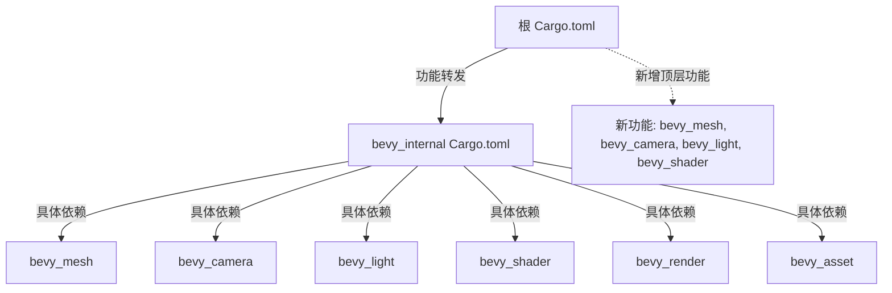

+++
title = "#20752 Clean up root toml features"
date = "2025-08-27T00:00:00"
draft = false
template = "pull_request_page.html"
in_search_index = false

[extra]
current_language = "zh-cn"
available_languages = {"en" = { name = "English", url = "/pull_request/bevy/2025-08/pr-20752-en-20250827" }, "zh-cn" = { name = "中文", url = "/pull_request/bevy/2025-08/pr-20752-zh-cn-20250827" }}
+++

# Clean up root toml features

## 基本信息
- **标题**: Clean up root toml features
- **PR链接**: https://github.com/bevyengine/bevy/pull/20752
- **作者**: atlv24
- **状态**: 已合并
- **标签**: C-Dependencies, S-Ready-For-Final-Review, A-Cross-Cutting
- **创建时间**: 2025-08-25T15:28:39Z
- **合并时间**: 2025-08-26T23:44:53Z
- **合并者**: alice-i-cecile

## 描述翻译
### Objective
- 我们目前在两个地方指定传递性功能依赖：bevy 和 bevy_internal 的 Cargo.toml 文件
- 这导致它们经常不同步，积累不必要的重复，有时还会忘记某些传递性依赖。

### Solution
- 标准化到 bevy_internal。原因：这样如果你因为某些原因直接依赖 bevy_internal，就不可能错误使用。如果我们标准化到 bevy Cargo.toml 来保存这些，意味着通过依赖 bevy_internal 可以绕过它们。不确定为什么会有人这样做，但这感觉是正确的。
- 将仍在 bevy 中的少量传递性功能依赖规范移动到 bevy_internal
- 清理大量重复项
- 添加一些缺失的依赖
- 添加顶层的 bevy_mesh、bevy_camera、bevy_light 和 bevy_shader 功能。

### Testing
- 这些东西很难自动或全面测试。#20741 可能使得维护一个无渲染测试套件变得容易，但除此之外只是手动验证。

## 本次PR的故事

### 问题和背景
在Bevy项目中，功能依赖管理存在一个结构性问题。传递性功能依赖（transitive feature dependencies）被分散定义在两个不同的Cargo.toml文件中：根目录的Cargo.toml和crates/bevy_internal/Cargo.toml。这种分散管理导致了几个实际问题：

1. **同步问题**：两个文件中的依赖定义经常不同步
2. **代码重复**：存在大量不必要的重复定义
3. **遗漏依赖**：有时会忘记添加必要的传递性依赖

这种状况增加了维护负担，也增加了用户错误配置的风险。特别是，如果有人直接依赖bevy_internal而不是通过主bevy包，可能会绕过某些必要的功能依赖。

### 解决方案方法
开发者采取了集中管理的策略，将所有传递性功能依赖的定义统一移动到bevy_internal/Cargo.toml中。这种设计选择基于几个考虑：

1. **防止绕过**：如果依赖定义放在根Cargo.toml，用户可以通过直接依赖bevy_internal来绕过这些依赖要求
2. **单一来源**：所有传递性依赖现在有单一的定义来源，消除了同步问题
3. **简化接口**：根Cargo.toml现在只提供简洁的功能定义，具体实现细节隐藏在bevy_internal中

### 具体实现
实现过程涉及对两个Cargo.toml文件的重构。根Cargo.toml中的功能定义被大幅简化，只保留对bevy_internal中间接功能的引用，而具体的依赖链现在完全在bevy_internal中定义。

**根Cargo.toml的关键变化**：
```toml
# 之前：
bevy_pbr = [
  "bevy_internal/bevy_pbr",
  "bevy_asset",
  "bevy_render",
  "bevy_core_pipeline",
  "bevy_anti_aliasing",
]

# 之后：
bevy_pbr = ["bevy_internal/bevy_pbr"]
```

这种简化模式被应用到几乎所有功能定义中，消除了大量的重复代码。同时，添加了几个新的顶层功能：

```toml
# 新增的顶层功能
bevy_mesh = ["bevy_internal/bevy_mesh"]
bevy_camera = ["bevy_internal/bevy_camera"]
bevy_light = ["bevy_internal/bevy_light"]
bevy_shader = ["bevy_internal/bevy_shader"]
```

**bevy_internal/Cargo.toml的对应变化**：
相应的，bevy_internal中的功能定义得到了增强和完善，现在包含了完整的依赖链：

```toml
# 在bevy_internal中完善依赖定义
bevy_pbr = [
  "dep:bevy_pbr",
  "bevy_light",
  "bevy_core_pipeline",
  "bevy_gizmos?/bevy_pbr",
]
```

还修复了一些依赖关系的问题，比如将`bluenoise_texture`的依赖项从根目录移动到bevy_internal中：

```toml
# 之前（在根目录）：
bluenoise_texture = [
  "bevy_internal/bluenoise_texture",
  "ktx2",
  "bevy_image/zstd",
]

# 之后（在bevy_internal中）：
bluenoise_texture = ["bevy_pbr?/bluenoise_texture", "ktx2", "bevy_image/zstd"]
```

### 技术洞察
这个PR展示了几个重要的Cargo功能管理实践：

1. **中间包模式**：使用bevy_internal作为内部实现细节的容器，对外提供干净的接口
2. **条件依赖**：广泛使用`?`语法表示可选依赖，如`bevy_gizmos?/bevy_pbr`
3. **功能转发**：通过`bevy_internal/feature_name`模式将功能请求转发到内部实现

这种架构使得Bevy的功能系统更加模块化和可维护，同时保持了向后的兼容性。

### 影响
这些变更带来了几个具体改进：

1. **维护性提升**：消除了73行重复代码，减少了同步负担
2. **错误预防**：防止用户通过直接依赖bevy_internal来绕过必要的功能依赖
3. **功能完整性**：添加了缺失的依赖关系，修复了潜在的构建问题
4. **文档更新**：相应的文档也得到更新，反映了新的功能结构

从工程角度看，这个PR展示了良好的依赖管理实践：通过集中化和标准化来减少复杂度，同时保持接口的简洁性。

## 可视化表示



## 关键文件变更

### 1. `Cargo.toml` (+42/-73)
**变更描述**：简化了根Cargo.toml中的功能定义，移除了重复的传递性依赖，添加了新的顶层功能。

**关键代码片段**：
```toml
# 简化功能定义示例
# 之前：
bevy_pbr = [
  "bevy_internal/bevy_pbr",
  "bevy_asset",
  "bevy_render",
  "bevy_core_pipeline",
  "bevy_anti_aliasing",
]

# 之后：
bevy_pbr = ["bevy_internal/bevy_pbr"]

# 新增顶层功能
bevy_mesh = ["bevy_internal/bevy_mesh"]
bevy_camera = ["bevy_internal/bevy_camera"]
bevy_light = ["bevy_internal/bevy_light"]
bevy_shader = ["bevy_internal/bevy_shader"]
```

### 2. `crates/bevy_internal/Cargo.toml` (+26/-15)
**变更描述**：在bevy_internal中完善了功能依赖链，确保了所有必要的传递性依赖都被正确定义。

**关键代码片段**：
```toml
# 完善依赖链示例
bevy_pbr = [
  "dep:bevy_pbr",
  "bevy_light",
  "bevy_core_pipeline",
  "bevy_gizmos?/bevy_pbr",
]

# 修复bluenoise_texture依赖
bluenoise_texture = ["bevy_pbr?/bluenoise_texture", "ktx2", "bevy_image/zstd"]
```

### 3. `docs/cargo_features.md` (+5/-1)
**变更描述**：更新了功能文档，添加了新功能的说明，调整了文档结构。

**关键代码片段**：
```markdown
# 文档更新示例
|bevy_camera|Provides camera and visibility types, as well as culling primitives.|
|bevy_light|Provides light types such as point lights, directional lights, spotlights.|
|bevy_mesh|Provides a mesh format and some primitive meshing routines.|
|bevy_shader|Provides shaders usable through asset handles.|
```

## 延伸阅读

对于想深入了解Cargo功能管理和Rust项目架构的开发者，建议阅读以下资源：

1. [The Cargo Book: Features](https://doc.rust-lang.org/cargo/reference/features.html) - 官方Cargo功能管理文档
2. [Rust Design Patterns: Feature Flags](https://rust-unofficial.github.io/patterns/patterns/behavioural/feature-flag.html) - 功能标志设计模式
3. [Bevy Engine Documentation](https://bevyengine.org/learn/) - Bevy引擎官方文档

这些资源可以帮助理解更复杂的功能管理策略和大型Rust项目的架构设计。