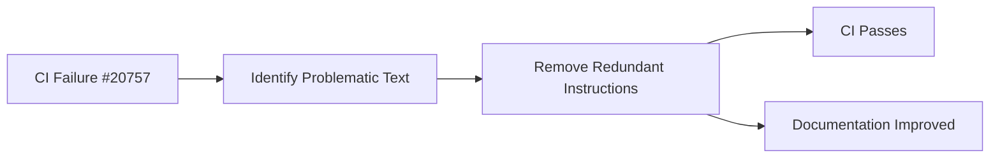

+++
title = "#20761 Fix CI in profiling.md"
date = "2025-08-26T00:00:00"
draft = false
template = "pull_request_page.html"
in_search_index = true

[taxonomies]
list_display = ["show"]

[extra]
current_language = "en"
available_languages = {"en" = { name = "English", url = "/pull_request/bevy/2025-08/pr-20761-en-20250826" }, "zh-cn" = { name = "中文", url = "/pull_request/bevy/2025-08/pr-20761-zh-cn-20250826" }}
labels = ["D-Trivial"]
+++

# Fix CI in profiling.md

## Basic Information
- **Title**: Fix CI in profiling.md
- **PR Link**: https://github.com/bevyengine/bevy/pull/20761
- **Author**: Weihnachtsbaum
- **Status**: MERGED
- **Labels**: D-Trivial, S-Ready-For-Final-Review
- **Created**: 2025-08-26T10:43:03Z
- **Merged**: 2025-08-26T20:00:42Z
- **Merged By**: alice-i-cecile

## Description Translation
# Objective

- Fixes #20757

## Solution

- ~~Rephrase profiling.md~~ Remove the text that causes the failure, as there are better instructions just above

## The Story of This Pull Request

This pull request addresses a CI failure in the Bevy documentation. The issue (#20757) was triggered by problematic content in the `profiling.md` file. The author identified redundant instructions about Tracy version compatibility that were causing the failure and chose the most straightforward solution: removing the problematic text entirely.

The problem stemmed from a section in the profiling documentation that provided instructions for matching Tracy versions. This content was redundant because clearer, more accurate instructions already existed earlier in the same document. Rather than attempting to rephrase or fix the problematic text, the author recognized that the existing instructions above were superior and simply removed the duplicate content.

This approach demonstrates good technical decision-making: when faced with redundant or problematic documentation, the cleanest solution is often to remove duplication rather than maintain multiple versions of the same instructions. The change maintains the documentation's utility while eliminating the CI failure source.

The implementation is minimal and surgical - a single line removal that resolves the CI issue without affecting the overall quality of the documentation. In fact, it improves the documentation by eliminating redundant content that could confuse readers.

## Visual Representation



## Key Files Changed

### `docs/profiling.md`
**Change**: Removed redundant Tracy version matching instructions that were causing CI failures
**Why**: The instructions were duplicate and the existing instructions above were clearer

**Code Diff**:
```markdown
# File: docs/profiling.md
# Before:
It has a command line capture tool that can record the execution of graphical applications, saving it as a profile file. Tracy has a GUI to inspect these profile files. The GUI app also supports live capture, showing you in real time the trace of your app. The version of tracy must be matched to the version of tracing-tracy used in bevy. A compatibility table can be found on [crates.io](https://crates.io/crates/tracing-tracy) and the version used can be found [here](https://github.com/bevyengine/bevy/blob/latest/crates/bevy_log/Cargo.toml).

# After:
It has a command line capture tool that can record the execution of graphical applications, saving it as a profile file. Tracy has a GUI to inspect these profile files. The GUI app also supports live capture, showing you in real time the trace of your app.
```

The change removes the redundant Tracy version matching instructions, which were causing CI failures and duplicated information already present in the preceding paragraphs.

## Further Reading

- [Tracy Profiler Documentation](https://github.com/wolfpld/tracy)
- [Bevy Profiling Guide](https://bevyengine.org/learn/advanced-topics/profiling/)
- [Rust Tracy Client Compatibility](https://github.com/nagisa/rust_tracy_client?tab=readme-ov-file#version-support-table)