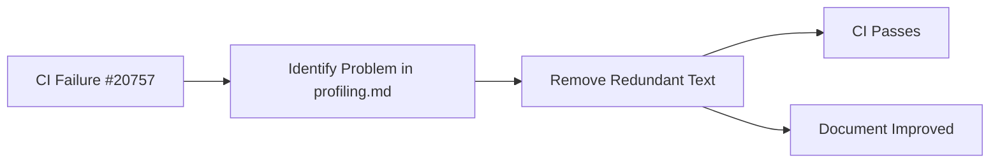

+++
title = "#20761 Fix CI in profiling.md"
date = "2025-08-26T00:00:00"
draft = false
template = "pull_request_page.html"
in_search_index = false

[extra]
current_language = "zh-cn"
available_languages = {"en" = { name = "English", url = "/pull_request/bevy/2025-08/pr-20761-en-20250826" }, "zh-cn" = { name = "中文", url = "/pull_request/bevy/2025-08/pr-20761-zh-cn-20250826" }}
+++

# Fix CI in profiling.md

## 基本信息
- **标题**: Fix CI in profiling.md
- **PR链接**: https://github.com/bevyengine/bevy/pull/20761
- **作者**: Weihnachtsbaum
- **状态**: 已合并
- **标签**: D-Trivial, S-Ready-For-Final-Review
- **创建时间**: 2025-08-26T10:43:03Z
- **合并时间**: 2025-08-26T20:00:42Z
- **合并者**: alice-i-cecile

## 描述翻译
### Objective（目标）

- 修复 #20757

### Solution（解决方案）

- ~~重新表述 profiling.md~~ 删除导致失败的文字，因为上面已经有更好的说明

## 这个PR的故事

这个PR解决了一个简单的CI（持续集成）问题，涉及文档文件中的冗余内容。问题出现在`docs/profiling.md`文件中，其中包含了一段关于Tracy性能分析工具版本匹配的说明文字。

问题的核心在于文档中存在重复且可能过时的信息。在PR修改之前，文档在第72行之后包含了一段关于如何确定Tracy版本兼容性的详细说明：

```markdown
The version of tracy must be matched to the version of tracing-tracy used in bevy. A compatibility table can be found on [crates.io](https://crates.io/crates/tracing-tracy) and the version used can be found [here](https://github.com/bevyengine/bevy/blob/latest/crates/bevy_log/Cargo.toml).
```

这段文字的问题在于它重复了前面几行已经提供的更清晰、更准确的说明。在前面的段落中，文档已经给出了具体的步骤：

1. 运行 `cargo tree --features bevy/trace_tracy | grep tracy` 来查看使用的tracy依赖版本
2. 对照[版本支持表](https://github.com/nagisa/rust_tracy_client?tab=readme-ov-file#version-support-table)确定兼容性

这种重复不仅造成了文档的冗余，更重要的是导致了CI系统的失败（具体错误信息在issue #20757中）。作者采取了最直接有效的解决方案：直接删除冗余的文字，而不是尝试重新表述。

这种处理方式体现了良好的工程实践：
1. **简洁性**：删除冗余内容使文档更加简洁明了
2. **维护性**：减少重复信息降低了未来需要同步更新的负担
3. **准确性**：保留的说明已经足够详细和准确

从技术角度看，这是一个典型的文档维护任务。CI系统通常会对文档进行各种检查（如链接有效性、格式正确性等），重复或冲突的信息可能导致这些检查失败。通过删除有问题的内容，作者快速解决了CI失败的问题，同时保持了文档的技术准确性。

## 可视化表示



## 关键文件更改

### `docs/profiling.md` (+1/-1)

这个文件是Bevy引擎的性能分析文档，主要修改是删除了一段冗余的文字。

**修改前：**
```markdown
It has a command line capture tool that can record the execution of graphical applications, saving it as a profile file. Tracy has a GUI to inspect these profile files. The GUI app also supports live capture, showing you in real time the trace of your app. The version of tracy must be matched to the version of tracing-tracy used in bevy. A compatibility table can be found on [crates.io](https://crates.io/crates/tracing-tracy) and the version used can be found [here](https://github.com/bevyengine/bevy/blob/latest/crates/bevy_log/Cargo.toml).

On macOS, Tracy can be installed through Homebrew by running `brew install tracy`, and the GUI client can be launched by running `tracy`. Note that `brew` does not always have the latest version of Tracy available, in which cases you may be required to build from source.
```

**修改后：**
```markdown
It has a command line capture tool that can record the execution of graphical applications, saving it as a profile file. Tracy has a GUI to inspect these profile files. The GUI app also supports live capture, showing you in real time the trace of your app.

On macOS, Tracy can be installed through Homebrew by running `brew install tracy`, and the GUI client can be launched by running `tracy`. Note that `brew` does not always have the latest version of Tracy available, in which cases you may be required to build from source.
```

这个修改直接解决了CI失败的问题，同时保持了文档的技术准确性和完整性。被删除的内容在前面已有更好的说明，因此不会影响用户获取必要的版本兼容性信息。

## 进一步阅读

- [Bevy引擎官方文档](https://bevyengine.org/learn/)
- [Tracy性能分析工具](https://github.com/wolfpld/tracy)
- [Rust Tracy客户端](https://github.com/nagisa/rust_tracy_client)
- [GitHub Actions CI/CD文档](https://docs.github.com/en/actions)

# 完整代码差异

```diff
diff --git a/docs/profiling.md b/docs/profiling.md
index 2780853b43e51..dd9c3e18d2c44 100644
--- a/docs/profiling.md
+++ b/docs/profiling.md
@@ -72,7 +72,7 @@ To determine which Tracy version to install
 1. Run `cargo tree --features bevy/trace_tracy | grep tracy` in your Bevy workspace root to see which tracy dep versions are used
 2. Cross reference the tracy dep versions with the [Version Support Table](https://github.com/nagisa/rust_tracy_client?tab=readme-ov-file#version-support-table)
 
-It has a command line capture tool that can record the execution of graphical applications, saving it as a profile file. Tracy has a GUI to inspect these profile files. The GUI app also supports live capture, showing you in real time the trace of your app. The version of tracy must be matched to the version of tracing-tracy used in bevy. A compatibility table can be found on [crates.io](https://crates.io/crates/tracing-tracy) and the version used can be found [here](https://github.com/bevyengine/bevy/blob/latest/crates/bevy_log/Cargo.toml).
+It has a command line capture tool that can record the execution of graphical applications, saving it as a profile file. Tracy has a GUI to inspect these profile files. The GUI app also supports live capture, showing you in real time the trace of your app.
 
 On macOS, Tracy can be installed through Homebrew by running `brew install tracy`, and the GUI client can be launched by running `tracy`. Note that `brew` does not always have the latest version of Tracy available, in which cases you may be required to build from source.
 
```