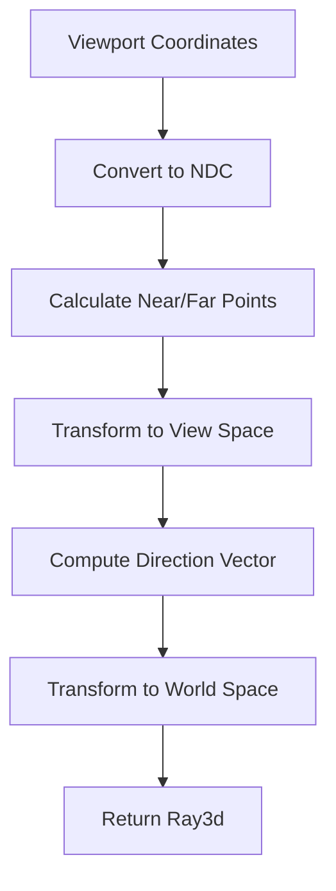

+++
title = "#20765 Fix viewport_to_world for orthographic cameras and add regression tests"
date = "2025-08-26T00:00:00"
draft = false
template = "pull_request_page.html"
in_search_index = true

[taxonomies]
list_display = ["show"]

[extra]
current_language = "en"
available_languages = {"en" = { name = "English", url = "/pull_request/bevy/2025-08/pr-20765-en-20250826" }, "zh-cn" = { name = "中文", url = "/pull_request/bevy/2025-08/pr-20765-zh-cn-20250826" }}
labels = ["C-Bug", "A-Rendering", "P-Regression", "D-Straightforward"]
+++

# Fix viewport_to_world for orthographic cameras and add regression tests

## Basic Information
- **Title**: Fix viewport_to_world for orthographic cameras and add regression tests
- **PR Link**: https://github.com/bevyengine/bevy/pull/20765
- **Author**: atlv24
- **Status**: MERGED
- **Labels**: C-Bug, A-Rendering, S-Ready-For-Final-Review, P-Regression, D-Straightforward
- **Created**: 2025-08-26T16:34:20Z
- **Merged**: 2025-08-26T20:52:58Z
- **Merged By**: alice-i-cecile

## Description Translation
# Objective

- Fixes #20762

## Solution

- Orthographic directions behave differently, and need the point-difference. We can still avoid the matrix compose and world translation precision losses though.

## Testing

- Added regression tests

## The Story of This Pull Request

This PR addresses a bug in the `viewport_to_world` method for orthographic cameras that was causing incorrect ray calculations. The issue stemmed from how the method handled near and far plane calculations differently between perspective and orthographic projections.

The core problem was in the mathematical approach used to compute the world-space ray direction. For perspective cameras, the direction calculation works correctly by transforming a single point from view space to world space. However, orthographic projections require calculating the difference between two points (near and far planes) to determine the proper direction vector.

The original implementation attempted to optimize precision by avoiding matrix composition and maintaining separate transformations, but it didn't account for the fundamental difference in how orthographic projections work compared to perspective projections. This led to incorrect ray directions being returned for orthographic cameras.

The solution maintains the precision optimizations while correctly handling both projection types. Instead of trying to derive the direction from a single point, the fix calculates both near and far points in view space, computes their difference to get the proper direction vector, and then transforms both components to world space separately.

Key technical aspects of the fix:
1. Calculates both near (Z=1.0) and far (Z=EPSILON) points in NDC space
2. Transforms both points to view space using the inverse clip-from-view matrix
3. Computes the direction vector in view space before transforming to world space
4. Maintains precision by avoiding unnecessary matrix compositions

The PR also adds comprehensive regression tests that verify correct behavior for both orthographic 2D, orthographic 3D, and perspective projections. These tests ensure that:
- Ray directions match the camera's forward vector
- Ray origins are correctly positioned based on viewport coordinates
- Both corner cases (viewport coordinates at 0,0 and maximum values) work correctly

## Visual Representation



## Key Files Changed

### `crates/bevy_camera/src/camera.rs` (+103/-19)

This file contains the main fix for the orthographic camera bug and adds comprehensive regression tests.

**Key changes to the viewport_to_world method:**
```rust
// Before:
let mut rect_relative = (viewport_position - target_rect.min) / target_rect.size();
// Flip the Y co-ordinate origin from the top to the bottom.
rect_relative.y = 1.0 - rect_relative.y;

let ndc_point_near = (rect_relative * 2. - Vec2::ONE).extend(1.0).into();
// ... single point transformation logic

// After:
let rect_relative = (viewport_position - target_rect.min) / target_rect.size();
let mut ndc_xy = rect_relative * 2. - Vec2::ONE;
// Flip the Y co-ordinate from the top to the bottom to enter NDC.
ndc_xy.y = -ndc_xy.y;

let ndc_point_near = ndc_xy.extend(1.0).into();
// Using EPSILON because an ndc with Z = 0 returns NaNs.
let ndc_point_far = ndc_xy.extend(f32::EPSILON).into();
let view_from_clip = self.computed.clip_from_view.inverse();
let world_from_view = camera_transform.affine();
// ... dual point transformation logic
```

**Regression tests added:**
```rust
#[test]
fn viewport_to_world_orthographic_3d_returns_forward() {
    // Tests both viewport corners for orthographic 3D
}

#[test]
fn viewport_to_world_orthographic_2d_returns_forward() {
    // Tests both viewport corners for orthographic 2D
}

#[test]
fn viewport_to_world_perspective_center_returns_forward() {
    // Tests center viewport point for perspective
}
```

## Further Reading

- [Bevy Camera Documentation](https://docs.rs/bevy_camera/latest/bevy_camera/)
- [Orthographic vs Perspective Projection](https://en.wikipedia.org/wiki/3D_projection#Orthographic_projection)
- [Coordinate Systems in Computer Graphics](https://learnopengl.com/Getting-started/Coordinate-Systems)