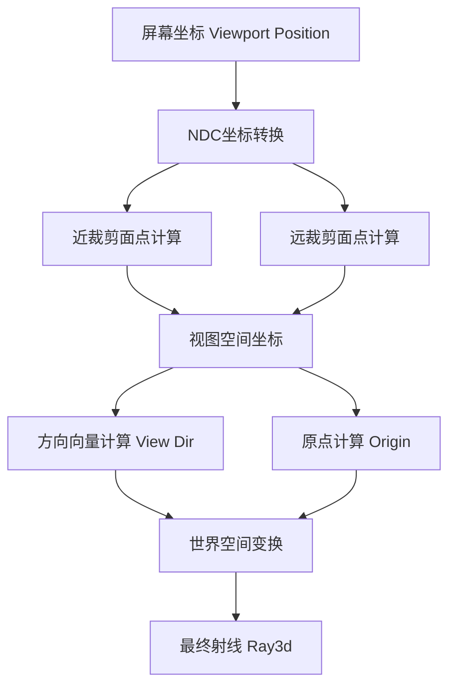

+++
title = "#20765 Fix viewport_to_world for orthographic cameras and add regression tests"
date = "2025-08-26T00:00:00"
draft = false
template = "pull_request_page.html"
in_search_index = false

[extra]
current_language = "zh-cn"
available_languages = {"en" = { name = "English", url = "/pull_request/bevy/2025-08/pr-20765-en-20250826" }, "zh-cn" = { name = "中文", url = "/pull_request/bevy/2025-08/pr-20765-zh-cn-20250826" }}
+++

# Fix viewport_to_world for orthographic cameras and add regression tests

## 基本信息
- **标题**: Fix viewport_to_world for orthographic cameras and add regression tests
- **PR链接**: https://github.com/bevyengine/bevy/pull/20765
- **作者**: atlv24
- **状态**: 已合并
- **标签**: C-Bug, A-Rendering, S-Ready-For-Final-Review, P-Regression, D-Straightforward
- **创建时间**: 2025-08-26T16:34:20Z
- **合并时间**: 2025-08-26T20:52:58Z
- **合并者**: alice-i-cecile

## 描述翻译
# 目标 (Objective)

- 修复 #20762

## 解决方案 (Solution)

- 正交投影 (Orthographic) 方向的行为不同，需要点差值计算。我们仍然可以避免矩阵组合和世界坐标转换的精度损失。

## 测试 (Testing)

- 添加了回归测试

## 本次PR的故事

这个PR解决了一个在Bevy引擎中正交相机viewport_to_world功能的问题。问题的核心在于正交投影和透视投影在深度方向计算上的根本差异。

### 问题背景

在Bevy的相机系统中，`viewport_to_world`方法用于将屏幕坐标转换为世界空间中的射线。这对于实现鼠标拾取、射线检测等功能至关重要。问题#20762报告了正交相机在使用此功能时返回的方向不正确。

问题的根本原因在于原实现错误地将透视投影的逻辑应用于正交投影。在透视投影中，从近裁剪面到远裁剪面的方向计算可以通过单一的点变换完成，但在正交投影中，需要计算两个点（近裁剪面和远裁剪面）的差值来获得正确的方向向量。

### 解决方案

开发者采用了精确的数学方法来解决这个问题。关键的洞察是：正交投影需要分别计算近裁剪面和远裁剪面上的点，然后通过它们的差值来确定方向。

原代码存在的问题：
```rust
// 原实现 - 错误处理正交投影
let view_point_near = self
    .computed
    .clip_from_view
    .inverse()
    .project_point3a(ndc_point_near);
let world_dir_near = camera_transform
    .affine()
    .transform_vector3a(view_point_near);
let origin: Vec3 = (world_dir_near + camera_transform.affine().translation).into();
```

新实现的解决方案：
```rust
// 新实现 - 正确处理正交投影
let view_point_near = view_from_clip.project_point3a(ndc_point_near);
let view_point_far = view_from_clip.project_point3a(ndc_point_far);  // 新增远裁剪面计算
let view_dir = view_point_far - view_point_near;  // 计算方向向量
let origin = world_from_view.transform_point3a(view_point_near).into();
let direction = world_from_view.transform_vector3a(view_dir).into();  // 正确转换方向
```

### 技术实现细节

1. **NDC坐标处理**：改进了NDC坐标的计算方式，更清晰地处理Y坐标翻转
2. **远裁剪面计算**：使用`f32::EPSILON`作为远裁剪面的Z值，避免除零错误
3. **方向计算**：通过`view_point_far - view_point_near`获得准确的方向向量
4. **精度保持**：继续使用原有的优化策略，避免矩阵预组合的精度损失

### 回归测试

为了确保修复的可靠性，PR添加了全面的测试用例：

```rust
#[test]
fn viewport_to_world_orthographic_3d_returns_forward() {
    // 测试3D正交投影
    let transform = GlobalTransform::default();
    let size = Vec2::new(1600.0, 900.0);
    let camera = make_camera(
        Projection::Orthographic(OrthographicProjection::default_3d()),
        size,
    );
    let ray = camera.viewport_to_world(&transform, Vec2::ZERO).unwrap();
    assert_eq!(ray.direction, transform.forward());  // 验证方向正确
    // 验证原点位置正确
    assert!(ray.origin.abs_diff_eq(Vec3::new(-size.x * 0.5, size.y * 0.5, 0.0), 1e-4));
}
```

测试覆盖了三种投影类型：
- 3D正交投影 (Orthographic 3D)
- 2D正交投影 (Orthographic 2D) 
- 透视投影 (Perspective)

每个测试都验证了射线方向和原点位置的正确性，使用适当的容差值来处理浮点数精度问题。

### 影响和意义

这个修复确保了Bevy中正交相机的viewport_to_world功能正确工作，对于依赖此功能的交互功能（如编辑器工具、游戏机制）至关重要。同时，新增的回归测试防止了未来可能出现的回归问题。

## 可视化表示



## 关键文件变更

### `crates/bevy_camera/src/camera.rs` (+103/-19)

这是本次PR中唯一修改的文件，包含了核心的功能修复和测试添加。

**主要变更：**

1. **viewport_to_world方法重构**：
```rust
// 之前：
let mut rect_relative = (viewport_position - target_rect.min) / target_rect.size();
// Flip the Y co-ordinate origin from the top to the bottom.
rect_relative.y = 1.0 - rect_relative.y;

let ndc_point_near = (rect_relative * 2. - Vec2::ONE).extend(1.0).into();

// 之后：
let rect_relative = (viewport_position - target_rect.min) / target_rect.size();
let mut ndc_xy = rect_relative * 2. - Vec2::ONE;
// Flip the Y co-ordinate from the top to the bottom to enter NDC.
ndc_xy.y = -ndc_xy.y;

let ndc_point_near = ndc_xy.extend(1.0).into();
// Using EPSILON because an ndc with Z = 0 returns NaNs.
let ndc_point_far = ndc_xy.extend(f32::EPSILON).into();
```

2. **方向计算逻辑改进**：
```rust
// 之前：
let view_point_near = self
    .computed
    .clip_from_view
    .inverse()
    .project_point3a(ndc_point_near);
let world_dir_near = camera_transform
    .affine()
    .transform_vector3a(view_point_near);
let origin: Vec3 = (world_dir_near + camera_transform.affine().translation).into();

// 之后：
let view_point_near = view_from_clip.project_point3a(ndc_point_near);
let view_point_far = view_from_clip.project_point3a(ndc_point_far);
let view_dir = view_point_far - view_point_near;
let origin = world_from_view.transform_point3a(view_point_near).into();
let direction = world_from_view.transform_vector3a(view_dir).into();
```

3. **新增测试模块**：
添加了完整的测试套件，包含三个测试函数验证不同投影类型的行为。

## 延伸阅读

- [Bevy相机系统文档](https://docs.rs/bevy_camera/latest/bevy_camera/)
- [OpenGL投影矩阵详解](https://www.songho.ca/opengl/gl_projectionmatrix.html)
- [计算机图形学中的投影变换](https://en.wikipedia.org/wiki/3D_projection)
- [Bevy坐标系统说明](https://bevy-cheatbook.github.io/features/coords.html)