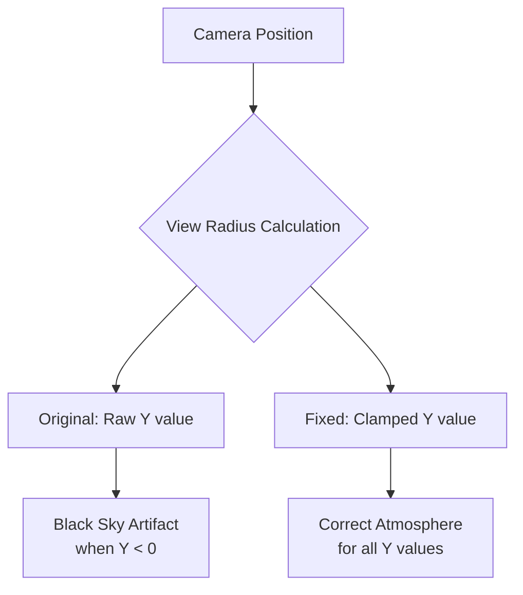

+++
title = "#20769 Allow negative value for camera elevation in atmosphere"
date = "2025-08-26T00:00:00"
draft = false
template = "pull_request_page.html"
in_search_index = true

[taxonomies]
list_display = ["show"]

[extra]
current_language = "en"
available_languages = {"en" = { name = "English", url = "/pull_request/bevy/2025-08/pr-20769-en-20250826" }, "zh-cn" = { name = "中文", url = "/pull_request/bevy/2025-08/pr-20769-zh-cn-20250826" }}
labels = ["A-Rendering", "D-Straightforward"]
+++

# Allow negative value for camera elevation in atmosphere

## Basic Information
- **Title**: Allow negative value for camera elevation in atmosphere
- **PR Link**: https://github.com/bevyengine/bevy/pull/20769
- **Author**: mate-h
- **Status**: MERGED
- **Labels**: A-Rendering, S-Ready-For-Final-Review, D-Straightforward
- **Created**: 2025-08-26T22:38:57Z
- **Merged**: 2025-08-26T23:20:41Z
- **Merged By**: alice-i-cecile

## Description Translation
# Objective

- Fix bug where sky turns black below y = 0
- Fixes #19131 

## Solution

- Allow negative value for camera elevation in atmosphere

## Testing

- Ran atmosphere example, set the camera's Y position to be negative, sky still renders fine.

## Showcase


## The Story of This Pull Request

This PR addresses a specific rendering issue in Bevy's atmospheric scattering system. When the camera's Y position dropped below zero (ground level), the sky would incorrectly render as black instead of maintaining the proper atmospheric appearance.

The root cause was in the `view_radius()` function within the WGSL shader code. This function calculates the effective radius from the planet's center for atmospheric calculations, combining the camera's elevation with the planet's bottom radius. The original implementation directly used the camera's Y position without handling negative values:

```wgsl
return view.world_position.y * settings.scene_units_to_m + atmosphere.bottom_radius;
```

When the camera position went negative, this resulted in a view radius smaller than the planet's bottom radius, which broke the atmospheric scattering calculations and caused the black sky artifact.

The solution implements a simple but effective fix by clamping the elevation component to a minimum positive value using `max(view.world_position.y * settings.scene_units_to_m, EPSILON)`. This ensures the view radius never drops below a reasonable minimum (1 meter in this case) while preserving the ability to use negative camera positions.

The implementation adds a new constant `EPSILON` set to 1.0 meter, which provides a small positive offset that prevents mathematical issues in the atmospheric calculations while maintaining visual consistency. This approach is preferable to absolute value operations because it maintains the directional intent of negative camera positions while ensuring numerical stability.

From an engineering perspective, this change demonstrates good shader programming practices:
1. It avoids division by zero and other mathematical edge cases
2. It maintains physical plausibility in the atmospheric model
3. It uses a minimal, targeted fix rather than overhauling the entire system
4. The epsilon value is clearly documented and physically meaningful (1 meter)

The fix was validated by testing with negative camera positions and confirming the sky renders correctly without the black artifact. The solution maintains backward compatibility and doesn't affect existing functionality for cameras above ground level.

## Visual Representation



## Key Files Changed

### `crates/bevy_pbr/src/atmosphere/functions.wgsl` (+2/-1)

This WGSL shader file contains the atmospheric scattering functions. The changes ensure proper atmospheric rendering when the camera is below ground level (y < 0).

**Key changes:**
1. Added EPSILON constant for minimum elevation clamping
2. Modified view_radius() function to handle negative camera positions

```wgsl
// Before:
fn view_radius() -> f32 {
    return view.world_position.y * settings.scene_units_to_m + atmosphere.bottom_radius;
}

// After:
const EPSILON: f32 = 1.0; // 1 meter

fn view_radius() -> f32 {
    return max(view.world_position.y * settings.scene_units_to_m, EPSILON) + atmosphere.bottom_radius;
}
```

The changes ensure that the view radius never drops below a physically plausible minimum value, preventing mathematical issues in the atmospheric scattering calculations.

## Further Reading

- [Bevy Atmosphere Documentation](https://docs.rs/bevy/latest/bevy/pbr/atmosphere/struct.AtmosphereSettings.html)
- [Atmospheric Scattering Theory](https://developer.nvidia.com/gpugems/gpugems2/part-ii-shading-lighting-and-shadows/chapter-16-accurate-atmospheric-scattering)
- [WGSL Language Specification](https://gpuweb.github.io/gpuweb/wgsl/)
- [Numerical Stability in Shaders](https://developer.nvidia.com/content/understanding-numerical-precision-and-its-effects-shader-development)