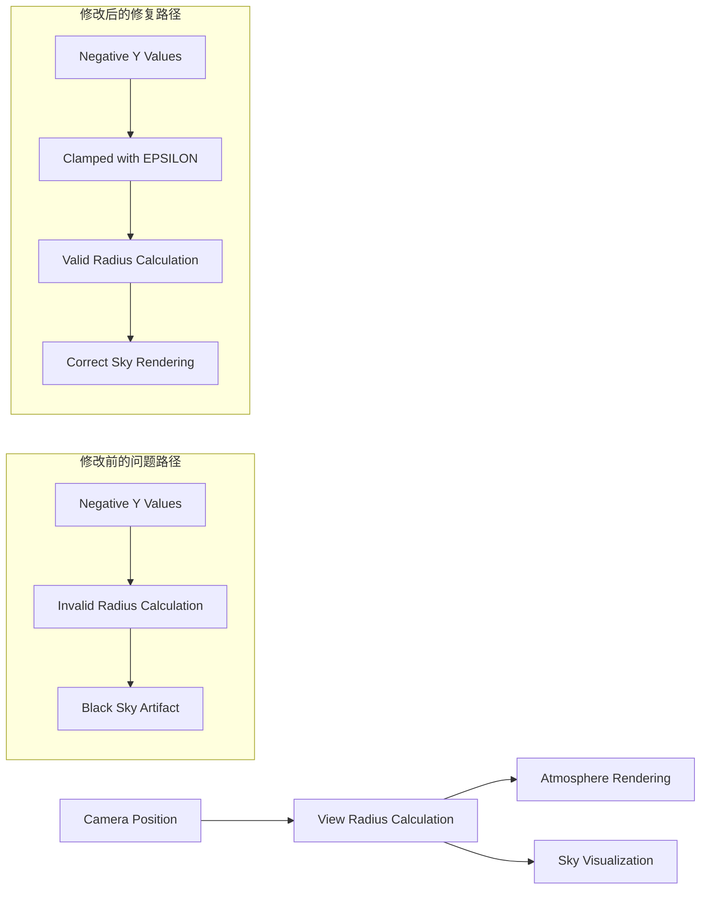

+++
title = "#20769 Allow negative value for camera elevation in atmosphere"
date = "2025-08-26T00:00:00"
draft = false
template = "pull_request_page.html"
in_search_index = false

[extra]
current_language = "zh-cn"
available_languages = {"en" = { name = "English", url = "/pull_request/bevy/2025-08/pr-20769-en-20250826" }, "zh-cn" = { name = "中文", url = "/pull_request/bevy/2025-08/pr-20769-zh-cn-20250826" }}
+++

# Allow negative value for camera elevation in atmosphere

## 基本信息
- **标题**: Allow negative value for camera elevation in atmosphere
- **PR链接**: https://github.com/bevyengine/bevy/pull/20769
- **作者**: mate-h
- **状态**: 已合并
- **标签**: A-Rendering, S-Ready-For-Final-Review, D-Straightforward
- **创建时间**: 2025-08-26T22:38:57Z
- **合并时间**: 2025-08-26T23:20:41Z
- **合并者**: alice-i-cecile

## 描述翻译

# Objective（目标）

- 修复当 y = 0 以下时天空变黑的 bug
- 修复 #19131

## Solution（解决方案）

- 允许大气效果中相机高度（elevation）为负值

## Testing（测试）

- 运行了大气效果示例，将相机的 Y 坐标设置为负值，天空仍然正常渲染。

## Showcase（效果展示）


## 这个PR的故事

这个PR解决了一个在大气渲染系统中的具体技术问题。当相机位置低于地面水平面（y=0）时，天空会异常变黑，而不是继续显示正确的大气效果。

问题的根本原因在于计算视图半径（view radius）的算法。在原始实现中，`view_radius()` 函数直接将相机的世界坐标y值转换为场景单位后加上大气层底部半径。当相机位置低于地面时，这个计算会产生无效的负值或零值，导致后续的大气散射计算失败。

解决方案很直接但有效：在计算视图半径时，确保相机高度不会低于一个最小正值。通过引入一个 `EPSILON` 常量（定义为1米），并使用 `max()` 函数来限制最小高度，确保即使在负高度情况下，计算也能产生有效的正值。

从技术角度来看，这个修改展示了在实时图形编程中处理边界条件的重要性。大气渲染依赖于复杂的物理模拟，而数学计算中的无效输入（如负半径）会导致视觉异常。通过添加简单的保护性检查，避免了更复杂的错误处理逻辑。

这个修改的影响是有限的但重要的：它保持了大气渲染系统的数学完整性，同时扩展了其适用场景到地下或水下视角，为游戏开发者提供了更大的灵活性。

## 可视化表示



## 关键文件变更

- `crates/bevy_pbr/src/atmosphere/functions.wgsl` (+2/-1)

这个文件包含了大气渲染的核心WGSL着色器函数。主要修改是在计算视图半径的函数中添加了对负值的保护。

**修改前:**
```wgsl
/// Assuming y=0 is the planet ground, returns the view radius in meters
fn view_radius() -> f32 {
    return view.world_position.y * settings.scene_units_to_m + atmosphere.bottom_radius;
}
```

**修改后:**
```wgsl
const EPSILON: f32 = 1.0; // 1 meter

/// Assuming y=0 is the planet ground, returns the view radius in meters
fn view_radius() -> f32 {
    return max(view.world_position.y * settings.scene_units_to_m, EPSILON) + atmosphere.bottom_radius;
}
```

这个修改确保了即使相机位置低于地面（y值为负），视图半径计算也不会返回无效值，从而防止大气渲染出现异常。

## 延伸阅读

- [Bevy大气渲染系统文档](https://bevyengine.org/learn/books/rendering/atmosphere/)
- [WGSL语言规范](https://gpuweb.github.io/gpuweb/wgsl/)
- [实时大气渲染技术概述](https://developer.nvidia.com/gpugems/gpugems2/part-ii-shading-lighting-and-shadows/chapter-16-accurate-atmospheric-scattering)
- [计算机图形学中的数值稳定性问题](https://scicomp.stackexchange.com/questions/20373/what-is-numerical-stability)