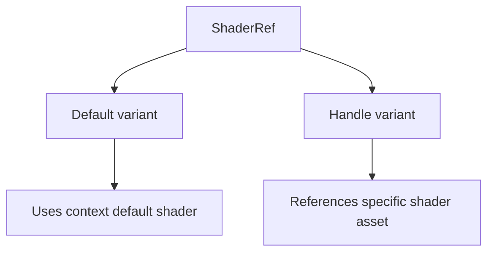

+++
title = "#20779 derive Default on ShaderRef"
date = "2025-08-28T00:00:00"
draft = false
template = "pull_request_page.html"
in_search_index = true

[taxonomies]
list_display = ["show"]

[extra]
current_language = "en"
available_languages = {"en" = { name = "English", url = "/pull_request/bevy/2025-08/pr-20779-en-20250828" }, "zh-cn" = { name = "中文", url = "/pull_request/bevy/2025-08/pr-20779-zh-cn-20250828" }}
labels = ["D-Trivial", "A-Rendering", "C-Usability"]
+++

# Title: derive Default on ShaderRef

## Basic Information
- **Title**: derive Default on ShaderRef
- **PR Link**: https://github.com/bevyengine/bevy/pull/20779
- **Author**: atlv24
- **Status**: MERGED
- **Labels**: D-Trivial, A-Rendering, C-Usability
- **Created**: 2025-08-27T20:29:05Z
- **Merged**: 2025-08-28T00:36:14Z
- **Merged By**: james7132

## Description Translation
# Objective

trivial

## The Story of This Pull Request

This PR addresses a straightforward usability improvement in Bevy's shader system. The core issue was that the `ShaderRef` enum lacked a default implementation, which meant developers couldn't use `ShaderRef::default()` or rely on automatic default initialization in structs that contained this type.

The `ShaderRef` enum serves as a reference to shader assets, with two variants:
- `Default`: Uses the context-appropriate default shader
- `Handle`: References a specific shader asset via handle

Without a `Default` implementation, developers had to explicitly specify shader references even when they wanted to use the default behavior. This added unnecessary boilerplate and reduced code clarity.

The solution was simple but effective: derive the `Default` trait on the `ShaderRef` enum and designate the `Default` variant as the default value. This approach follows Rust's standard patterns for default enum values using the `#[default]` attribute.

The implementation required only two changes:
1. Adding `#[derive(Default)]` to the enum definition
2. Annotating the `Default` variant with `#[default]`

This change maintains backward compatibility while improving developer ergonomics. Now when developers use `ShaderRef::default()`, they get the `ShaderRef::Default` variant, which is the most logical default behavior for shader references.

The impact is primarily on code cleanliness and developer experience. This change reduces boilerplate when initializing components or systems that use shader references, particularly in cases where the default shader is appropriate. It follows the principle of making common patterns easy to implement while maintaining explicit control when needed.

## Visual Representation



## Key Files Changed

### `crates/bevy_shader/src/shader.rs` (+2/-0)

This file contains the definition of the `ShaderRef` enum. The changes add the `Default` trait derivation and specify which variant should be used as the default.

**Before:**
```rust
pub enum ShaderRef {
    /// Use the "default" shader for the current context.
    Default,
    /// A handle to a shader stored in the [`Assets<Shader>`](bevy_asset::Assets) resource
    Handle(Handle<Shader>),
}
```

**After:**
```rust
#[derive(Default)]
pub enum ShaderRef {
    /// Use the "default" shader for the current context.
    #[default]
    Default,
    /// A handle to a shader stored in the [`Assets<Shader>`](bevy_asset::Assets) resource
    Handle(Handle<Shader>),
}
```

## Further Reading

- [Rust Default trait documentation](https://doc.rust-lang.org/std/default/trait.Default.html)
- [Rust #[default] attribute for enums](https://doc.rust-lang.org/std/default/attr.default.html)
- [Bevy Shader System Overview](https://bevyengine.org/learn/book/getting-started/shaders/)