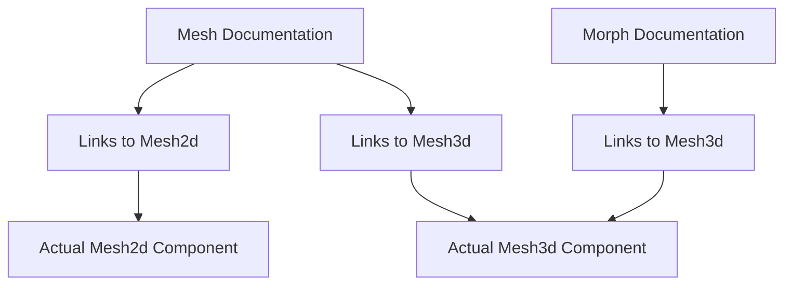

+++
title = "#20780 Fix mesh doc links"
date = "2025-08-27T00:00:00"
draft = false
template = "pull_request_page.html"
in_search_index = true

[taxonomies]
list_display = ["show"]

[extra]
current_language = "en"
available_languages = {"en" = { name = "English", url = "/pull_request/bevy/2025-08/pr-20780-en-20250827" }, "zh-cn" = { name = "中文", url = "/pull_request/bevy/2025-08/pr-20780-zh-cn-20250827" }}
+++

# Fix mesh doc links

## Basic Information
- **Title**: Fix mesh doc links
- **PR Link**: https://github.com/bevyengine/bevy/pull/20780
- **Author**: atlv24
- **Status**: MERGED
- **Labels**: None
- **Created**: 2025-08-27T20:29:21Z
- **Merged**: 2025-08-27T22:20:50Z
- **Merged By**: mockersf

## Description Translation
# Objective

Just fixes a few doc links that were lost in the original bevy_mesh split since it didnt include the Mesh3d/Mesh2d components. Now it does, so lets link again.

## The Story of This Pull Request

This PR addresses a documentation issue that emerged from a previous architectural change in the Bevy engine. When the bevy_mesh module was split into separate components, some documentation links became broken because they referenced components that were no longer in the same module.

The core problem was straightforward: documentation comments contained plain text references to `Mesh3d` and `Mesh2d` components without proper Markdown link syntax. These components were originally part of the mesh module but were moved during the architectural split. While the components themselves were properly relocated, the documentation links weren't updated to reflect the new module structure.

The solution implemented here is a clean, surgical fix: converting plain text component names into proper Rustdoc links using the bracket syntax `[`Component`](crate::Component)`. This approach ensures that:
1. The documentation becomes clickable and navigable
2. IDE tooltips will work correctly with these links
3. The generated documentation will properly cross-reference the components

The changes are minimal but impactful. In `mesh.rs`, the main Mesh struct documentation now properly links to both `Mesh2d` and `Mesh3d` components. In `morph.rs`, multiple documentation comments that reference `Mesh3d` have been updated with proper links.

What's notable about this fix is that it doesn't change any functionality - it purely improves the developer experience by making the documentation more useful and navigable. The links now correctly point to the actual component definitions, allowing developers to quickly jump to the relevant code when reading documentation.

The implementation follows Rust's documentation best practices by using relative paths within the crate (`crate::ComponentName`) rather than absolute paths, making the documentation more resilient to future module reorganizations.

## Visual Representation



## Key Files Changed

### `crates/bevy_mesh/src/mesh.rs` (+3/-3)
This file contains the main Mesh struct definition. The changes fix documentation links to reference Mesh2d and Mesh3d components properly.

**Key changes:**
```rust
// Before:
// Meshes can be rendered with a `Mesh2d` and `MeshMaterial2d`
// or `Mesh3d` and `MeshMaterial3d` for 2D and 3D respectively.

// After:
// Meshes can be rendered with a [`Mesh2d`](crate::Mesh2d) and `MeshMaterial2d`
// or [`Mesh3d`](crate::Mesh3d) and `MeshMaterial3d` for 2D and 3D respectively.
```

```rust
// Before:
// used in a `Mesh3d` with a square bevy logo texture, with added axis, points,

// After:
// used in a [`Mesh3d`](crate::Mesh3d) with a square bevy logo texture, with added axis, points,
```

### `crates/bevy_mesh/src/morph.rs` (+5/-5)
This file handles morph target animation functionality. The changes fix multiple documentation references to Mesh3d.

**Key changes:**
```rust
// Before:
// Controls the [morph targets] for all child `Mesh3d` entities.

// After:
// Controls the [morph targets] for all child [`Mesh3d`](crate::Mesh3d) entities.
```

```rust
// Before:
// synchronized to child `Mesh3d` / [`MeshMorphWeights`]

// After:
// synchronized to child [`Mesh3d`](crate::Mesh3d) / [`MeshMorphWeights`]
```

```rust
// Before:
// Add this to the parent of one or more [`Entities`](`Entity`) with a `Mesh3d`

// After:
// Add this to the parent of one or more [`Entities`](`Entity`) with a [`Mesh3d`](crate::Mesh3d)
```

```rust
// Before:
// The first child `Mesh3d` primitive controlled by these weights.

// After:
// The first child [`Mesh3d`](crate::Mesh3d) primitive controlled by these weights.
```

```rust
// Before:
// Add this to an [`Entity`] with a `Mesh3d` with a [`MorphAttributes`] set

// After:
// Add this to an [`Entity`] with a [`Mesh3d`](crate::Mesh3d) with a [`MorphAttributes`] set
```

## Further Reading

- [Rust Documentation Guide](https://doc.rust-lang.org/rustdoc/how-to-write-documentation.html)
- [Bevy Engine Documentation](https://bevyengine.org/learn/)
- [Rustdoc Link Syntax](https://doc.rust-lang.org/rustdoc/linking-to-items-by-name.html)

## Full Code Diff
```diff
diff --git a/crates/bevy_mesh/src/mesh.rs b/crates/bevy_mesh/src/mesh.rs
index 4d85f568ffd2e..da7f2db305c20 100644
--- a/crates/bevy_mesh/src/mesh.rs
+++ b/crates/bevy_mesh/src/mesh.rs
@@ -33,8 +33,8 @@ pub const VERTEX_ATTRIBUTE_BUFFER_ID: u64 = 10;
 /// or by converting a [primitive](bevy_math::primitives) using [`into`](Into).
 /// It is also possible to create one manually. They can be edited after creation.
 ///
-/// Meshes can be rendered with a `Mesh2d` and `MeshMaterial2d`
-/// or `Mesh3d` and `MeshMaterial3d` for 2D and 3D respectively.
+/// Meshes can be rendered with a [`Mesh2d`](crate::Mesh2d) and `MeshMaterial2d`
+/// or [`Mesh3d`](crate::Mesh3d) and `MeshMaterial3d` for 2D and 3D respectively.
 ///
 /// A [`Mesh`] in Bevy is equivalent to a "primitive" in the glTF format, for a
 /// glTF Mesh representation, see `GltfMesh`.
@@ -78,7 +78,7 @@ pub const VERTEX_ATTRIBUTE_BUFFER_ID: u64 = 10;
 /// ```
 ///
 /// You can see how it looks like [here](https://github.com/bevyengine/bevy/blob/main/assets/docs/Mesh.png),
-/// used in a `Mesh3d` with a square bevy logo texture, with added axis, points,
+/// used in a [`Mesh3d`](crate::Mesh3d) with a square bevy logo texture, with added axis, points,
 /// lines and text for clarity.
 ///
 /// ## Other examples
diff --git a/crates/bevy_mesh/src/morph.rs b/crates/bevy_mesh/src/morph.rs
index fdeeeacc31198..4b6d2f574323d 100644
--- a/crates/bevy_mesh/src/morph.rs
+++ b/crates/bevy_mesh/src/morph.rs
@@ -97,7 +97,7 @@ impl MorphTargetImage {
     }
 }
 
-/// Controls the [morph targets] for all child `Mesh3d` entities. In most cases, [`MorphWeights`] should be considered
+/// Controls the [morph targets] for all child [`Mesh3d`](crate::Mesh3d) entities. In most cases, [`MorphWeights`] should be considered
 /// the "source of truth" when writing morph targets for meshes. However you can choose to write child [`MeshMorphWeights`]
 /// if your situation requires more granularity. Just note that if you set [`MorphWeights`], it will overwrite child
 /// [`MeshMorphWeights`] values.
@@ -105,9 +105,9 @@ impl MorphTargetImage {
 /// This exists because Bevy's [`Mesh`] corresponds to a _single_ surface / material, whereas morph targets
 /// as defined in the GLTF spec exist on "multi-primitive meshes" (where each primitive is its own surface with its own material).
 /// Therefore in Bevy [`MorphWeights`] an a parent entity are the "canonical weights" from a GLTF perspective, which then
-/// synchronized to child `Mesh3d` / [`MeshMorphWeights`] (which correspond to "primitives" / "surfaces" from a GLTF perspective).
+/// synchronized to child [`Mesh3d`](crate::Mesh3d) / [`MeshMorphWeights`] (which correspond to "primitives" / "surfaces" from a GLTF perspective).
 ///
-/// Add this to the parent of one or more [`Entities`](`Entity`) with a `Mesh3d` with a [`MeshMorphWeights`].
+/// Add this to the parent of one or more [`Entities`](`Entity`) with a [`Mesh3d`](crate::Mesh3d) with a [`MeshMorphWeights`].
 ///
 /// [morph targets]: https://en.wikipedia.org/wiki/Morph_target_animation
 #[derive(Reflect, Default, Debug, Clone, Component)]
@@ -132,7 +132,7 @@ impl MorphWeights {
             first_mesh,
         })
     }
-    /// The first child `Mesh3d` primitive controlled by these weights.
+    /// The first child [`Mesh3d`](crate::Mesh3d) primitive controlled by these weights.
     /// This can be used to look up metadata information such as [`Mesh::morph_target_names`].
     pub fn first_mesh(&self) -> Option<&Handle<Mesh>> {
         self.first_mesh.as_ref()
@@ -152,7 +152,7 @@ impl MorphWeights {
 ///
 /// See [`MorphWeights`] for more details on Bevy's morph target implementation.
 ///
-/// Add this to an [`Entity`] with a `Mesh3d` with a [`MorphAttributes`] set
+/// Add this to an [`Entity`] with a [`Mesh3d`](crate::Mesh3d) with a [`MorphAttributes`] set
 /// to control individual weights of each morph target.
 ///
 /// [morph targets]: https://en.wikipedia.org/wiki/Morph_target_animation
```