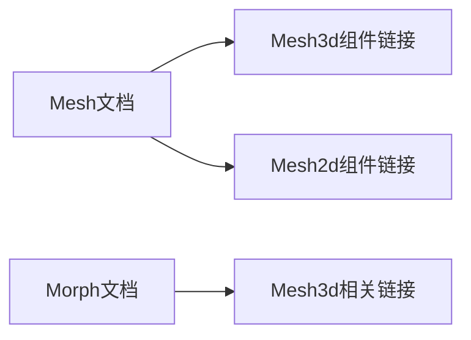

+++
title = "#20780 Fix mesh doc links"
date = "2025-08-27T00:00:00"
draft = false
template = "pull_request_page.html"
in_search_index = false

[extra]
current_language = "zh-cn"
available_languages = {"en" = { name = "English", url = "/pull_request/bevy/2025-08/pr-20780-en-20250827" }, "zh-cn" = { name = "中文", url = "/pull_request/bevy/2025-08/pr-20780-zh-cn-20250827" }}
+++

# Fix mesh doc links

## 基本信息
- **标题**: Fix mesh doc links
- **PR链接**: https://github.com/bevyengine/bevy/pull/20780
- **作者**: atlv24
- **状态**: 已合并
- **标签**: 无
- **创建时间**: 2025-08-27T20:29:21Z
- **合并时间**: 2025-08-27T22:20:50Z
- **合并人**: mockersf

## 描述翻译
### Objective

修复一些在原始 bevy_mesh 拆分时丢失的文档链接，因为当时没有包含 Mesh3d/Mesh2d 组件。现在包含了，所以重新添加这些链接。

## 这个PR的故事

这个PR解决了一个文档维护问题。在Bevy引擎的先前重构中，当`bevy_mesh`模块被拆分时，相关的`Mesh3d`和`Mesh2d`组件没有被正确包含在文档链接中。这导致了一些rustdoc链接失效，影响了开发者在查阅API文档时的体验。

问题出现在两个关键文件中：`mesh.rs`和`morph.rs`。在这些文件的文档注释中，原本应该链接到具体组件类型的文本（如`Mesh3d`）只是以普通代码格式显示，缺少了实际的rustdoc链接标记。

解决方案很直接：在所有提到`Mesh3d`和`Mesh2d`的地方添加正确的rustdoc链接语法。具体来说，就是将简单的`Mesh3d`文本替换为`[Mesh3d](crate::Mesh3d)`格式，这样rustdoc工具就能正确生成跳转到这些组件定义的链接。

这种修改虽然看似简单，但对于维护良好的开发者文档体验很重要。正确的内部链接可以帮助开发者快速导航代码库，理解组件之间的关系，特别是在像Bevy这样的大型游戏引擎中。

从技术实现角度看，这个PR展示了良好的文档维护实践：
1. 保持了文档与实际代码结构的同步
2. 使用了正确的rustdoc链接语法（`[text](crate::path::to::item)`）
3. 确保了API文档的一致性和可用性

修改涉及的具体变化包括将普通的类型提及转换为可点击的链接，这让开发者能够直接从文档跳转到相关组件的定义，提高了代码探索的效率。

## 可视化表示



## 关键文件变更

### `crates/bevy_mesh/src/mesh.rs` (+3/-3)
这个文件包含了Mesh的主要定义和文档。修改主要是将普通的`Mesh3d`和`Mesh2d`文本替换为带有rustdoc链接的格式。

**修改前:**
```rust
// Meshes can be rendered with a `Mesh2d` and `MeshMaterial2d`
// or `Mesh3d` and `MeshMaterial3d` for 2D and 3D respectively.
```

**修改后:**
```rust
// Meshes can be rendered with a [`Mesh2d`](crate::Mesh2d) and `MeshMaterial2d`
// or [`Mesh3d`](crate::Mesh3d) and `MeshMaterial3d` for 2D and 3D respectively.
```

### `crates/bevy_mesh/src/morph.rs` (+5/-5)
这个文件处理形态目标(morph targets)功能。修改同样是将普通的`Mesh3d`提及转换为链接格式。

**修改前:**
```rust
/// Controls the [morph targets] for all child `Mesh3d` entities.
```

**修改后:**
```rust
/// Controls the [morph targets] for all child [`Mesh3d`](crate::Mesh3d) entities.
```

## 进一步阅读

- [Rustdoc链接语法](https://doc.rust-lang.org/rustdoc/linking-to-items-by-name.html)
- [Bevy引擎文档指南](https://github.com/bevyengine/bevy/blob/main/docs/plugins_guidelines.md#documentation)
- [Rust API文档最佳实践](https://rust-lang.github.io/api-guidelines/documentation.html)

# 完整代码差异
```
diff --git a/crates/bevy_mesh/src/mesh.rs b/crates/bevy_mesh/src/mesh.rs
index 4d85f568ffd2e..da7f2db305c20 100644
--- a/crates/bevy_mesh/src/mesh.rs
+++ b/crates/bevy_mesh/src/mesh.rs
@@ -33,8 +33,8 @@ pub const VERTEX_ATTRIBUTE_BUFFER_ID: u64 = 10;
 /// or by converting a [primitive](bevy_math::primitives) using [`into`](Into).
 /// It is also possible to create one manually. They can be edited after creation.
 ///
-/// Meshes can be rendered with a `Mesh2d` and `MeshMaterial2d`
-/// or `Mesh3d` and `MeshMaterial3d` for 2D and 3D respectively.
+/// Meshes can be rendered with a [`Mesh2d`](crate::Mesh2d) and `MeshMaterial2d`
+/// or [`Mesh3d`](crate::Mesh3d) and `MeshMaterial3d` for 2D and 3D respectively.
 ///
 /// A [`Mesh`] in Bevy is equivalent to a "primitive" in the glTF format, for a
 /// glTF Mesh representation, see `GltfMesh`.
@@ -78,7 +78,7 @@ pub const VERTEX_ATTRIBUTE_BUFFER_ID: u64 = 10;
 /// ```
 ///
 /// You can see how it looks like [here](https://github.com/bevyengine/bevy/blob/main/assets/docs/Mesh.png),
-/// used in a `Mesh3d` with a square bevy logo texture, with added axis, points,
+/// used in a [`Mesh3d`](crate::Mesh3d) with a square bevy logo texture, with added axis, points,
 /// lines and text for clarity.
 ///
 /// ## Other examples
diff --git a/crates/bevy_mesh/src/morph.rs b/crates/bevy_mesh/src/morph.rs
index fdeeeacc31198..4b6d2f574323d 100644
--- a/crates/bevy_mesh/src/morph.rs
+++ b/crates/bevy_mesh/src/morph.rs
@@ -97,7 +97,7 @@ impl MorphTargetImage {
     }
 }
 
-/// Controls the [morph targets] for all child `Mesh3d` entities. In most cases, [`MorphWeights`] should be considered
+/// Controls the [morph targets] for all child [`Mesh3d`](crate::Mesh3d) entities. In most cases, [`MorphWeights`] should be considered
 /// the "source of truth" when writing morph targets for meshes. However you can choose to write child [`MeshMorphWeights`]
 /// if your situation requires more granularity. Just note that if you set [`MorphWeights`], it will overwrite child
 /// [`MeshMorphWeights`] values.
@@ -105,9 +105,9 @@ impl MorphTargetImage {
 /// This exists because Bevy's [`Mesh`] corresponds to a _single_ surface / material, whereas morph targets
 /// as defined in the GLTF spec exist on "multi-primitive meshes" (where each primitive is its own surface with its own material).
 /// Therefore in Bevy [`MorphWeights`] an a parent entity are the "canonical weights" from a GLTF perspective, which then
-/// synchronized to child `Mesh3d` / [`MeshMorphWeights`] (which correspond to "primitives" / "surfaces" from a GLTF perspective).
+/// synchronized to child [`Mesh3d`](crate::Mesh3d) / [`MeshMorphWeights`] (which correspond to "primitives" / "surfaces" from a GLTF perspective).
 ///
-/// Add this to the parent of one or more [`Entities`](`Entity`) with a `Mesh3d` with a [`MeshMorphWeights`].
+/// Add this to the parent of one or more [`Entities`](`Entity`) with a [`Mesh3d`](crate::Mesh3d) with a [`MeshMorphWeights`].
 ///
 /// [morph targets]: https://en.wikipedia.org/wiki/Morph_target_animation
 #[derive(Reflect, Default, Debug, Clone, Component)]
@@ -132,7 +132,7 @@ impl MorphWeights {
             first_mesh,
         })
     }
-    /// The first child `Mesh3d` primitive controlled by these weights.
+    /// The first child [`Mesh3d`](crate::Mesh3d) primitive controlled by these weights.
     /// This can be used to look up metadata information such as [`Mesh::morph_target_names`].
     pub fn first_mesh(&self) -> Option<&Handle<Mesh>> {
         self.first_mesh.as_ref()
@@ -152,7 +152,7 @@ impl MorphWeights {
 ///
 /// See [`MorphWeights`] for more details on Bevy's morph target implementation.
 ///
-/// Add this to an [`Entity`] with a `Mesh3d` with a [`MorphAttributes`] set
+/// Add this to an [`Entity`] with a [`Mesh3d`](crate::Mesh3d) with a [`MorphAttributes`] set
 /// to control individual weights of each morph target.
 ///
 /// [morph targets]: https://en.wikipedia.org/wiki/Morph_target_animation
```