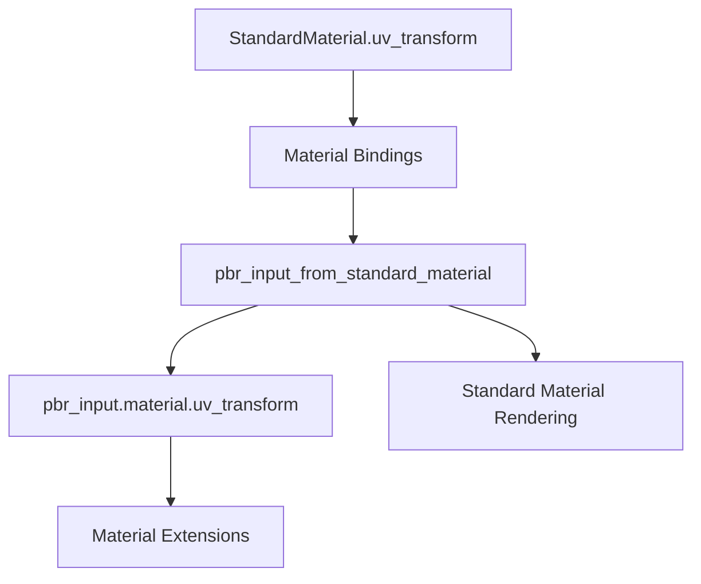

+++
title = "#20783 set uv_transform in pbr_input_from_standard_material"
date = "2025-08-28T00:00:00"
draft = false
template = "pull_request_page.html"
in_search_index = true

[taxonomies]
list_display = ["show"]

[extra]
current_language = "en"
available_languages = {"en" = { name = "English", url = "/pull_request/bevy/2025-08/pr-20783-en-20250828" }, "zh-cn" = { name = "中文", url = "/pull_request/bevy/2025-08/pr-20783-zh-cn-20250828" }}
labels = ["C-Bug", "A-Rendering"]
+++

# Title: set uv_transform in pbr_input_from_standard_material

## Basic Information
- **Title**: set uv_transform in pbr_input_from_standard_material
- **PR Link**: https://github.com/bevyengine/bevy/pull/20783
- **Author**: ChristopherBiscardi
- **Status**: MERGED
- **Labels**: C-Bug, A-Rendering, S-Ready-For-Final-Review
- **Created**: 2025-08-28T13:44:50Z
- **Merged**: 2025-08-28T16:54:05Z
- **Merged By**: alice-i-cecile

## Description Translation
Previously, even though the `uv_transform` was being accessed correctly from the material bindings; that information was not being passed on in the constructed `pbr_input` from `pbr_input_from_standard_material`. This led to a situation where the `StandardMaterial` textures would properly have the `StandardMaterial::uv_transform` applied, but the `pbr_input.material.uv_transform` value was the default instead of the material's. In turn this leads to any textures in a material extension using the wrong uvs, unless the value was accessed from the bindings directly instead of the pbr_input struct.

## Testing

Given an Affine2 supplied to a StandardMaterial in an extension, such as this one from the bevy examples

```rust
MeshMaterial3d(materials.add(ExtendedMaterial {
    base: StandardMaterial {
        uv_transform: Affine2::from_scale(
            Vec2::splat(4.),
        ),
        ..Default::default()
    },
    extension: MyExtension::new(1),
})),
```

Previously, accessing the uv_transform from the pbr_input would result in the default being used, which fills one full cube face.
Accessing from the bindings correctly uses the uv_transform and shows 4 boxes.

```
    // correct
    // let uv = (bevy_pbr::pbr_bindings::material.uv_transform * vec3(in.uv, 1.0)).xy;
    // incorrect
    let uv = (pbr_input.material.uv_transform * vec3(in.uv, 1.0)).xy;

    pbr_input.material.base_color = vec4(uv % 1., 0., 1.);
```


## The Story of This Pull Request

This PR addresses a consistency issue in Bevy's PBR rendering pipeline where material extensions were receiving incorrect UV transformation data. The problem occurred in the `pbr_input_from_standard_material` function within the fragment shader, which constructs the PBR input data structure used throughout the rendering process.

The core issue was that while the material bindings correctly provided the UV transform value from the StandardMaterial, this value wasn't being propagated to the `pbr_input.material.uv_transform` field. This created an inconsistency where StandardMaterial textures would render correctly with the proper UV transformations, but any material extensions relying on `pbr_input.material.uv_transform` would receive default values instead of the actual material transformations.

The solution was straightforward but critical: add a single line of code to copy the UV transform value from the material bindings to the PBR input structure. This ensures that both standard materials and material extensions operate with consistent UV transformation data throughout the rendering pipeline.

The implementation demonstrates an important principle in graphics programming: data consistency across different stages of the rendering pipeline is essential for correct visual output. Even when data is available in one part of the system, it must be properly propagated to all dependent components to maintain coherence.

This fix has significant impact for developers using material extensions in Bevy, as it ensures that UV transformations work consistently across both standard materials and extended materials. The change eliminates the need for workarounds where developers had to directly access material bindings instead of using the provided PBR input structure.

## Visual Representation



## Key Files Changed

### `crates/bevy_pbr/src/render/pbr_fragment.wgsl` (+2/-0)

This WGSL shader file contains the function `pbr_input_from_standard_material` that constructs the PBR input data structure. The change ensures the UV transform value from material bindings is properly assigned to the PBR input structure.

**Key modification:**
```wgsl
// Before:
fn pbr_input_from_standard_material(
    // ... existing code ...
) -> PbrInput {
    // ... existing code ...
#ifdef BINDLESS
    let uv_transform = pbr_bindings::material.uv_transform;
#endif  // BINDLESS

    // UV transform was not being assigned to pbr_input
#ifdef VERTEX_UVS_A
    var uv = (uv_transform * vec3(in.uv, 1.0)).xy;
#endif
    // ... rest of function ...
}

// After:
fn pbr_input_from_standard_material(
    // ... existing code ...
) -> PbrInput {
    // ... existing code ...
#ifdef BINDLESS
    let uv_transform = pbr_bindings::material.uv_transform;
#endif  // BINDLESS

    pbr_input.material.uv_transform = uv_transform;

#ifdef VERTEX_UVS_A
    var uv = (uv_transform * vec3(in.uv, 1.0)).xy;
#endif
    // ... rest of function ...
}
```

The added line `pbr_input.material.uv_transform = uv_transform;` ensures that the UV transform value from the material bindings is properly propagated to the PBR input structure, making it available to material extensions.

## Further Reading

- [Bevy PBR Materials Documentation](https://bevyengine.org/learn/books/introduction/3d-rendering/materials/)
- [WGSL Shader Language Specification](https://gpuweb.github.io/gpuweb/wgsl/)
- [UV Mapping and Transformations in Computer Graphics](https://en.wikipedia.org/wiki/UV_mapping)
- [Bevy Material Extensions Guide](https://bevyengine.org/learn/books/introduction/3d-rendering/material-extensions/)