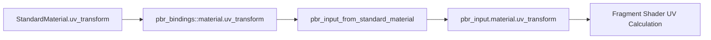

+++
title = "#20783 set uv_transform in pbr_input_from_standard_material"
date = "2025-08-28T00:00:00"
draft = false
template = "pull_request_page.html"
in_search_index = false

[extra]
current_language = "zh-cn"
available_languages = {"en" = { name = "English", url = "/pull_request/bevy/2025-08/pr-20783-en-20250828" }, "zh-cn" = { name = "中文", url = "/pull_request/bevy/2025-08/pr-20783-zh-cn-20250828" }}
+++

# Title

## 基本信息
- **标题**: set uv_transform in pbr_input_from_standard_material
- **PR链接**: https://github.com/bevyengine/bevy/pull/20783
- **作者**: ChristopherBiscardi
- **状态**: 已合并
- **标签**: C-Bug, A-Rendering, S-Ready-For-Final-Review
- **创建时间**: 2025-08-28T13:44:50Z
- **合并时间**: 2025-08-28T16:54:05Z
- **合并者**: alice-i-cecile

## 描述翻译
之前，尽管 `uv_transform` 能够从材质绑定中正确访问，但这些信息在通过 `pbr_input_from_standard_material` 构建的 `pbr_input` 中并未被传递。这导致了一种情况：`StandardMaterial` 纹理会正确应用 `StandardMaterial::uv_transform`，但 `pbr_input.material.uv_transform` 的值却是默认值而不是材质的实际值。这进而导致材质扩展中的任何纹理都会使用错误的 UV，除非该值直接从绑定中访问而不是通过 pbr_input 结构体。

## 测试

给定一个通过扩展提供给 StandardMaterial 的 Affine2，例如来自 bevy 示例的这一个：

```rust
MeshMaterial3d(materials.add(ExtendedMaterial {
    base: StandardMaterial {
        uv_transform: Affine2::from_scale(
            Vec2::splat(4.),
        ),
        ..Default::default()
    },
    extension: MyExtension::new(1),
})),
```

之前，从 pbr_input 访问 uv_transform 会导致使用默认值，这会填满整个立方体面。
从绑定访问则正确地使用了 uv_transform 并显示 4 个方框。

```
    // 正确
    // let uv = (bevy_pbr::pbr_bindings::material.uv_transform * vec3(in.uv, 1.0)).xy;
    // 错误
    let uv = (pbr_input.material.uv_transform * vec3(in.uv, 1.0)).xy;

    pbr_input.material.base_color = vec4(uv % 1., 0., 1.);
```


## 本次 Pull Request 的故事

这个 PR 解决了一个在 Bevy 的 PBR (Physically Based Rendering) 渲染管线中关于 UV 变换数据流不一致的问题。

**问题与背景**
问题的核心在于数据流的不一致性。在 Bevy 的 PBR 着色器中，`StandardMaterial` 的 `uv_transform` 属性可以通过两种方式访问：
1. 直接从材质绑定 (`pbr_bindings::material.uv_transform`)
2. 通过 `pbr_input` 结构体 (`pbr_input.material.uv_transform`)

虽然第一种方式能正确获取材质设置的 UV 变换，但第二种方式却总是返回默认值。这导致了令人困惑的行为：使用不同的访问路径会得到不同的结果，特别是在材质扩展中，开发者很自然地会使用 `pbr_input` 结构体来访问材质属性。

**解决方案**
修复方案直接而有效：在 `pbr_input_from_standard_material` 函数中，将正确获取的 `uv_transform` 值显式地赋值给 `pbr_input.material.uv_transform` 字段。

具体的代码修改很简单但很重要：
```wgsl
+pbr_input.material.uv_transform = uv_transform;
```

这行代码确保了无论通过哪种访问路径，都能获得一致的 UV 变换值。

**技术实现细节**
修改发生在 `crates/bevy_pbr/src/render/pbr_fragment.wgsl` 文件中的 `pbr_input_from_standard_material` 函数。这个函数负责从标准材质构建 PBR 输入数据。

关键修改是在获取了 `uv_transform` 值后，立即将其赋值给 `pbr_input` 结构体的对应字段。这个修改确保了数据流的一致性，消除了之前存在的歧义。

**影响与意义**
这个修复虽然代码量很小，但解决了材质系统中一个重要的数据一致性问题。它确保了：
1. 材质扩展能够正确使用 UV 变换
2. 开发者可以使用统一的 API 访问材质属性
3. 消除了令人困惑的不一致行为

从架构角度看，这个修复强化了 Bevy 渲染管线的数据一致性原则，确保了通过不同路径访问相同数据时得到一致的结果。

## 可视化表示



## 关键文件变更

- `crates/bevy_pbr/src/render/pbr_fragment.wgsl` (+2/-0)

这个文件包含了 PBR 片段着色器的核心逻辑。修改是在 `pbr_input_from_standard_material` 函数中添加了一行代码，确保从材质绑定获取的 `uv_transform` 值正确传递到 `pbr_input` 结构体中。

```wgsl
// 修改前:
#ifdef BINDLESS
    let uv_transform = pbr_bindings::material.uv_transform;
#endif  // BINDLESS

// 修改后:
#ifdef BINDLESS
    let uv_transform = pbr_bindings::material.uv_transform;
#endif  // BINDLESS

+pbr_input.material.uv_transform = uv_transform;
```

这个修改确保了 `pbr_input.material.uv_transform` 包含正确的值，而不是默认值。

## 扩展阅读

- [Bevy PBR 渲染指南](https://bevyengine.org/learn/books/introduction-graphics/pbr)
- [WGSL 着色语言规范](https://www.w3.org/TR/WGSL/)
- [材质系统与着色器集成](https://bevyengine.org/learn/books/introduction-graphics/materials)

# 完整代码差异
```diff
diff --git a/crates/bevy_pbr/src/render/pbr_fragment.wgsl b/crates/bevy_pbr/src/render/pbr_fragment.wgsl
index 3c69c4405f984..a78abcbf52075 100644
--- a/crates/bevy_pbr/src/render/pbr_fragment.wgsl
+++ b/crates/bevy_pbr/src/render/pbr_fragment.wgsl
@@ -120,6 +120,8 @@ fn pbr_input_from_standard_material(
     let uv_transform = pbr_bindings::material.uv_transform;
 #endif  // BINDLESS
 
+pbr_input.material.uv_transform = uv_transform;
+
 #ifdef VERTEX_UVS_A
     var uv = (uv_transform * vec3(in.uv, 1.0)).xy;
 #endif
```