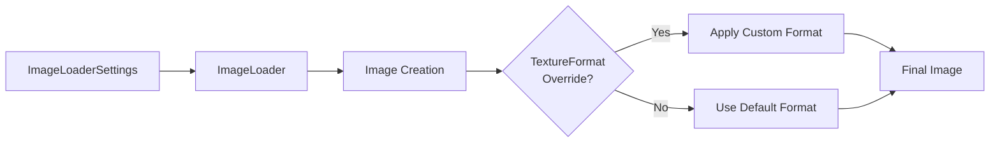

+++
title = "#20788 Enable load_with_settings TextureFormats"
date = "2025-08-31T00:00:00"
draft = false
template = "pull_request_page.html"
in_search_index = true

[taxonomies]
list_display = ["show"]

[extra]
current_language = "en"
available_languages = {"en" = { name = "English", url = "/pull_request/bevy/2025-08/pr-20788-en-20250831" }, "zh-cn" = { name = "中文", url = "/pull_request/bevy/2025-08/pr-20788-zh-cn-20250831" }}
labels = ["A-Rendering"]
+++

# Enable load_with_settings TextureFormats

## Basic Information
- **Title**: Enable load_with_settings TextureFormats
- **PR Link**: https://github.com/bevyengine/bevy/pull/20788
- **Author**: ChristopherBiscardi
- **Status**: MERGED
- **Labels**: A-Rendering, S-Ready-For-Review
- **Created**: 2025-08-29T18:10:59Z
- **Merged**: 2025-08-31T08:23:18Z
- **Merged By**: mockersf

## Description Translation

Previously, loading an image resulted in a hard-coded TextureFormat. When loading images that are meant to be used as the `StandardMaterial::depth_map`, the data can be stored in ways that result in an `R16Uint` TextureFormat. This results in an error because the `depth_map` must be a Float sampler and not a Uint sampler.

2025-08-29T17:15:03.081069Z ERROR bevy_render::erased_render_asset: bevy_pbr::mesh_material::MeshMaterial3d<bevy_pbr::extended_material::ExtendedMaterial<bevy_pbr::pbr_material::StandardMaterial, test_uv_transform::MyExtension>> Bind group construction failed: At binding index 12, the provided image sampler `Uint` does not match the required sampler type(s) `[Float { filterable: true }]`.

Setting the TextureFormat can adjust the way in which the same image data shows up in the shader. For example, an image that would otherwise be `TextureFormat::R16Uint` can be set to `TextureFormat::R16Unorm`, with no other changes, which results in the 16-bit integer data being converted to the 0-1 range for the shader.

```rust
asset_server.load_with_settings(
    "grass_height.png",
    |settings: &mut ImageLoaderSettings| {
        settings.texture_format = Some(TextureFormat::R16Unorm);
    }
),
```

This PR adds the ability to set the texture format with using `load_with_settings`.

Software like Substance Designer outputs height data in what becomes `R16Uint` format, but depth_map requires `R16Unorm`.

--

Additional notes:

- TextureFormat does not have a serde implementation, so is skipped in this PR
- This PR tries to change as little as possible when it comes to Image creation, so does not add a TextureFormat option to Image constructors like `from_buffer` and `from_dynamic`, which is what is used by the ImageLoader. It also ends up relying on a conversion from [`DynamicImage`](https://docs.rs/image/0.25.6/image/enum.DynamicImage.html), which doesn't have enough information to make this judgement afaict.
- Alternative strategies could include using a LoadTransformAndSave sequence to correct the data, but this is not straightforward as the tools to do this are not obvious (specifically the conversion from the Vec<u8> image crate representation + filename guessing when loading the processed image).

## The Story of This Pull Request

This PR addresses a specific rendering issue where depth map images with 16-bit integer data couldn't be properly sampled by shaders. The problem occurred because Bevy's image loader automatically detected certain image formats as `R16Uint`, but the depth map functionality required `R16Unorm` format for proper float sampling.

The core issue was in the texture format mismatch: shaders expected float samplers but received uint samplers when using images from tools like Substance Designer that export height data in 16-bit integer formats. This caused bind group construction failures during rendering.

The solution implements a minimal change to the existing `load_with_settings` infrastructure. Instead of modifying core image creation methods or adding complex format detection logic, the PR adds an optional `texture_format` field to `ImageLoaderSettings`. This allows users to explicitly override the texture format when loading images, providing the flexibility needed for specialized use cases like depth maps.

The implementation follows Bevy's established patterns for asset loading customization. The new field is marked with `#[serde(skip)]` because `TextureFormat` doesn't have serde implementations, which aligns with the PR's goal of minimal changes. After the image is loaded using the existing pipeline, the code conditionally applies the user-specified format override.

This approach maintains backward compatibility while solving the specific rendering issue. The changes are surgical and focused, affecting only the image loading process without disrupting other parts of the rendering pipeline.

## Visual Representation



## Key Files Changed

### `crates/bevy_image/src/image_loader.rs` (+15/-1)

This file contains the main implementation changes:

```rust
// Added field to ImageLoaderSettings struct
pub struct ImageLoaderSettings {
    pub format: ImageFormatSetting,
    #[serde(skip)]
    pub texture_format: Option<wgpu_types::TextureFormat>,
    // ... other fields
}

// Updated Default implementation
impl Default for ImageLoaderSettings {
    fn default() -> Self {
        Self {
            format: ImageFormatSetting::default(),
            texture_format: None,  // New field
            // ... other fields
        }
    }
}

// Modified asset loading logic
.map(|mut image| {
    if let Some(format) = settings.texture_format {
        image.texture_descriptor.format = format;
    }
    image
})
```

### `crates/bevy_image/src/compressed_image_saver.rs` (+1/-0)

This file received a minor update to maintain consistency:

```rust
// Updated when creating ImageLoaderSettings for saving
ImageLoaderSettings {
    // ... other settings
    texture_format: None,  // Added field
}
```

## Further Reading

- [WebGPU Texture Formats](https://gpuweb.github.io/gpuweb/#texture-format-caps)
- [Bevy Asset System](https://bevyengine.org/learn/books/0.13/programming/assets/)
- [Image Loading in Bevy](https://bevyengine.org/learn/books/0.13/programming/assets/image/)
- [WGSL Sampler Types](https://www.w3.org/TR/WGSL/#sampler-types)