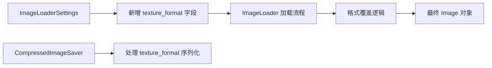

+++
title = "#20788 Enable load_with_settings TextureFormats"
date = "2025-08-31T00:00:00"
draft = false
template = "pull_request_page.html"
in_search_index = false

[extra]
current_language = "zh-cn"
available_languages = {"en" = { name = "English", url = "/pull_request/bevy/2025-08/pr-20788-en-20250831" }, "zh-cn" = { name = "中文", url = "/pull_request/bevy/2025-08/pr-20788-zh-cn-20250831" }}
+++

# Enable load_with_settings TextureFormats

## 基本信息
- **标题**: Enable load_with_settings TextureFormats
- **PR链接**: https://github.com/bevyengine/bevy/pull/20788
- **作者**: ChristopherBiscardi
- **状态**: 已合并
- **标签**: A-Rendering, S-Ready-For-Final-Review
- **创建时间**: 2025-08-29T18:10:59Z
- **合并时间**: 2025-08-31T08:23:18Z
- **合并者**: mockersf

## 描述翻译
之前，加载图像会导致硬编码的 TextureFormat。当加载用作 `StandardMaterial::depth_map` 的图像时，数据可能以导致 `R16Uint` TextureFormat 的方式存储。这会导致错误，因为 `depth_map` 必须是 Float 采样器而不是 Uint 采样器。

2025-08-29T17:15:03.081069Z ERROR bevy_render::erased_render_asset: bevy_pbr::mesh_material::MeshMaterial3d<bevy_pbr::extended_material::ExtendedMaterial<bevy_pbr::pbr_material::StandardMaterial, test_uv_transform::MyExtension>> Bind group construction failed: At binding index 12, the provided image sampler `Uint` does not match the required sampler type(s) `[Float { filterable: true }]`.

设置 TextureFormat 可以调整相同图像数据在着色器中的显示方式。例如，原本是 `TextureFormat::R16Uint` 的图像可以设置为 `TextureFormat::R16Unorm`，无需其他更改，这会导致 16 位整数数据转换为 0-1 范围供着色器使用。

```rust
asset_server.load_with_settings(
    "grass_height.png",
    |settings: &mut ImageLoaderSettings| {
        settings.texture_format = Some(TextureFormat::R16Unorm);
    }
),
```

此 PR 添加了使用 `load_with_settings` 设置纹理格式的能力。

像 Substance Designer 这样的软件会以最终成为 `R16Uint` 格式的方式输出高度数据，但 depth_map 需要 `R16Unorm`。

--

附加说明：

- TextureFormat 没有 serde 实现，因此在此 PR 中被跳过
- 此 PR 尝试在 Image 创建时尽可能少地更改，因此没有向 `from_buffer` 和 `from_dynamic` 等 Image 构造函数添加 TextureFormat 选项，这些构造函数由 ImageLoader 使用。它最终依赖于从 [`DynamicImage`](https://docs.rs/image/0.25.6/image/enum.DynamicImage.html) 的转换，据我所知，这没有足够的信息来做出此判断。
- 替代策略可能包括使用 LoadTransformAndSave 序列来校正数据，但这并不简单，因为执行此操作的工具并不明显（特别是从 Vec<u8> 图像 crate 表示的转换以及在加载处理后的图像时的文件名猜测）。

## 此拉取请求的故事

这个 PR 解决了一个实际的渲染问题：当使用 16 位高度图作为深度贴图时，由于纹理格式不匹配导致着色器错误。

问题的核心在于纹理采样器类型的不兼容。Bevy 的标准材质深度贴图需要浮点型采样器（Float sampler），但某些图像处理软件（如 Substance Designer）输出的 16 位高度数据会被识别为 `R16Uint`（无符号整数）格式，这导致了类型不匹配的错误。

开发者采用了最小侵入性的解决方案：在现有的 `ImageLoaderSettings` 结构中添加了一个可选的 `texture_format` 字段，允许用户在加载图像时显式指定所需的纹理格式。这个方案的优势在于：

1. 保持了向后兼容性 - 现有代码无需任何修改
2. 只在必要时才应用格式覆盖
3. 避免了更复杂的解决方案，如完整的图像处理管道

实现上，代码在图像加载过程的最后阶段检查是否有指定的纹理格式，如果有则覆盖默认的格式推断：

```rust
.map(|mut image| {
    if let Some(format) = settings.texture_format {
        image.texture_descriptor.format = format;
    }
    image
})
```

这种实现方式很巧妙，因为它：
- 在正确的时间点介入（图像数据已解析但最终格式尚未确定）
- 保持了代码的简洁性和可读性
- 不影响现有的图像加载逻辑

对于压缩图像保存器，也做了相应的适配，确保序列化时正确处理新的设置字段：

```rust
texture_format: None,
```

从工程角度看，这个解决方案体现了几个好的实践：
1. **关注点分离**：格式覆盖逻辑与图像加载核心逻辑分离
2. **最小化变更**：只修改必要的部分，减少潜在风险
3. **明确的责任**：用户需要明确知道何时以及为何要覆盖格式

这个改动虽然不大，但解决了实际工作流中的痛点，特别是对于使用专业工具生成高度图的工作流程。它提供了必要的灵活性，同时保持了系统的简洁性。

## 可视化表示



## 关键文件变更

### `crates/bevy_image/src/image_loader.rs` (+15/-1)
这个文件包含了主要的逻辑变更，在 ImageLoaderSettings 中添加了 texture_format 字段，并在图像加载过程中应用格式覆盖。

**关键变更：**
```rust
// 在 ImageLoaderSettings 结构中新增字段
#[serde(skip)]
pub texture_format: Option<wgpu_types::TextureFormat>,

// 在默认实现中初始化
texture_format: None,

// 在加载过程中应用格式覆盖
.map(|mut image| {
    if let Some(format) = settings.texture_format {
        image.texture_descriptor.format = format;
    }
    image
})
```

### `crates/bevy_image/src/compressed_image_saver.rs` (+1/-0)
这个文件确保压缩图像保存器正确处理新的 texture_format 字段。

**关键变更：**
```rust
// 在保存时设置默认的 texture_format
texture_format: None,
```

## 延伸阅读

- [wgpu TextureFormat 文档](https://docs.rs/wgpu/latest/wgpu/enum.TextureFormat.html) - 了解不同的纹理格式及其特性
- [Bevy 资源加载系统](https://bevyengine.org/learn/books/0.14/programming/load-assets/) - 理解 Bevy 的资源加载机制
- [图像采样器类型](https://www.khronos.org/opengl/wiki/Sampler_(GLSL)) - 了解不同的采样器类型及其用途

# 完整代码差异
```diff
diff --git a/crates/bevy_image/src/compressed_image_saver.rs b/crates/bevy_image/src/compressed_image_saver.rs
index c2adc2c029116..bcae2f238060d 100644
--- a/crates/bevy_image/src/compressed_image_saver.rs
+++ b/crates/bevy_image/src/compressed_image_saver.rs
@@ -69,6 +69,7 @@ impl AssetSaver for CompressedImageSaver {
             is_srgb,
             sampler: image.sampler.clone(),
             asset_usage: image.asset_usage,
+            texture_format: None,
         })
     }
 }
diff --git a/crates/bevy_image/src/image_loader.rs b/crates/bevy_image/src/image_loader.rs
index fe086db674a4e..91d03cb9d1116 100644
--- a/crates/bevy_image/src/image_loader.rs
+++ b/crates/bevy_image/src/image_loader.rs
@@ -99,8 +99,15 @@ pub enum ImageFormatSetting {
 /// Settings for loading an [`Image`] using an [`ImageLoader`].
 #[derive(Serialize, Deserialize, Debug, Clone)]
 pub struct ImageLoaderSettings {
-    /// How to determine the image's format.
+    /// How to determine the image's container format.
     pub format: ImageFormatSetting,
+    /// Forcibly use a specific [`wgpu_types::TextureFormat`].
+    /// Useful to control how data is handled when used
+    /// in a shader.
+    /// Ex: data that would be `R16Uint` that needs to
+    /// be sampled as a float using `R16Snorm`.
+    #[serde(skip)]
+    pub texture_format: Option<wgpu_types::TextureFormat>,
     /// Specifies whether image data is linear
     /// or in sRGB space when this is not determined by
     /// the image format.
@@ -117,6 +124,7 @@ impl Default for ImageLoaderSettings {
     fn default() -> Self {
         Self {
             format: ImageFormatSetting::default(),
+            texture_format: None,
             is_srgb: true,
             sampler: ImageSampler::Default,
             asset_usage: RenderAssetUsages::default(),
@@ -176,6 +184,12 @@ impl AssetLoader for ImageLoader {
             settings.sampler.clone(),
             settings.asset_usage,
         )
+        .map(|mut image| {
+            if let Some(format) = settings.texture_format {
+                image.texture_descriptor.format = format;
+            }
+            image
+        })
         .map_err(|err| FileTextureError {
             error: err,
             path: format!("{}", load_context.path().display()),
```