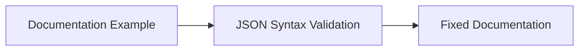

+++
title = "#20789 Fix broken json documentation"
date = "2025-08-29T00:00:00"
draft = false
template = "pull_request_page.html"
in_search_index = true

[taxonomies]
list_display = ["show"]

[extra]
current_language = "en"
available_languages = {"en" = { name = "English", url = "/pull_request/bevy/2025-08/pr-20789-en-20250829" }, "zh-cn" = { name = "中文", url = "/pull_request/bevy/2025-08/pr-20789-zh-cn-20250829" }}
labels = ["C-Docs", "D-Trivial", "A-Dev-Tools"]
+++

# Fix broken json documentation

## Basic Information
- **Title**: Fix broken json documentation
- **PR Link**: https://github.com/bevyengine/bevy/pull/20789
- **Author**: mogambro
- **Status**: MERGED
- **Labels**: C-Docs, D-Trivial, S-Ready-For-Final-Review, A-Dev-Tools
- **Created**: 2025-08-29T22:11:12Z
- **Merged**: 2025-08-29T22:59:28Z
- **Merged By**: alice-i-cecile

## Description Translation
It's pretty self-explanatory. There was simply a missing ' " '

## The Story of This Pull Request

This PR addresses a straightforward but important documentation issue in the Bevy remote module. The problem was a missing double quote character in a JSON documentation example, which would cause the example to be syntactically invalid JSON.

The issue occurred in a code comment demonstrating JSON-RPC protocol usage for the remote world API. JSON syntax requires string values to be properly quoted, and the missing quote made the example incorrect. While seemingly minor, documentation accuracy matters because developers rely on these examples when implementing integrations with Bevy's remote functionality.

The solution was simple but precise: add the missing double quote character to make the JSON valid. The change ensures that developers copying this example won't encounter JSON parsing errors when using the remote API.

This fix demonstrates the importance of attention to detail in documentation, especially for code examples that users might copy directly into their projects. Even small syntax errors can create friction for developers learning how to use a library's APIs.

## Visual Representation



## Key Files Changed

**File: crates/bevy_remote/src/lib.rs**

This file contains documentation for Bevy's remote functionality. The change fixes a JSON syntax error in a documentation example.

**Code Change:**
```rust
// Before:
//! {
//!     "method": world.get_components",

// After:
//! {
//!     "method": "world.get_components",
```

The change adds the missing double quote before `world.get_components`, making it a valid JSON string value.

## Further Reading

- [JSON Syntax Specification](https://www.json.org/json-en.html)
- [Bevy Remote API Documentation](https://docs.rs/bevy_remote/latest/bevy_remote/)
- [JSON-RPC Protocol Specification](https://www.jsonrpc.org/specification)

## Full Code Diff
```diff
diff --git a/crates/bevy_remote/src/lib.rs b/crates/bevy_remote/src/lib.rs
index 68169469df7de..b8e5813177067 100644
--- a/crates/bevy_remote/src/lib.rs
+++ b/crates/bevy_remote/src/lib.rs
@@ -14,7 +14,7 @@
 //!
 //! ```json
 //! {
-//!     "method": world.get_components",
+//!     "method": "world.get_components",
 //!     "id": 0,
 //!     "params": {
 //!         "entity": 4294967298,
```