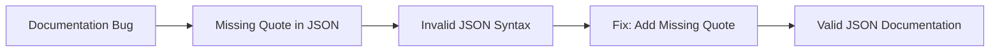

+++
title = "#20789 Fix broken json documentation"
date = "2025-08-29T00:00:00"
draft = false
template = "pull_request_page.html"
in_search_index = false

[extra]
current_language = "zh-cn"
available_languages = {"en" = { name = "English", url = "/pull_request/bevy/2025-08/pr-20789-en-20250829" }, "zh-cn" = { name = "中文", url = "/pull_request/bevy/2025-08/pr-20789-zh-cn-20250829" }}
labels = ["C-Docs", "D-Trivial", "A-Dev-Tools"]
+++

# Fix broken json documentation

## Basic Information
- **Title**: Fix broken json documentation
- **PR Link**: https://github.com/bevyengine/bevy/pull/20789
- **Author**: mogambro
- **Status**: MERGED
- **Labels**: C-Docs, D-Trivial, S-Ready-For-Final-Review, A-Dev-Tools
- **Created**: 2025-08-29T22:11:12Z
- **Merged**: 2025-08-29T22:59:28Z
- **Merged By**: alice-i-cecile

## Description Translation
这个PR的解释相当直接。只是缺少了一个双引号。

## The Story of This Pull Request

这个PR处理的是一个简单但重要的文档问题。在Bevy引擎的`bevy_remote`模块中，JSON文档示例存在语法错误，缺少了一个必要的双引号。

**问题背景**
在`crates/bevy_remote/src/lib.rs`文件的文档注释中，有一个JSON示例用于说明远程调用的格式。这个示例中的`method`字段值缺少了开头的双引号，导致JSON格式无效：

```json
{
    "method": world.get_components",
    "id": 0,
    "params": {
        "entity": 4294967298,
    }
}
```

这种格式错误会导致两个问题：
1. 开发者复制这个示例时会遇到JSON解析错误
2. 文档的可信度受到影响，因为示例代码无法正常运行

**解决方案**
修复方法很简单直接：在`world.get_components`前添加缺失的双引号，使JSON格式正确：

```json
{
    "method": "world.get_components",
    "id": 0,
    "params": {
        "entity": 4294967298,
    }
}
```

**技术意义**
虽然这个修改很小，但它体现了良好的软件工程实践：
- 文档中的代码示例必须准确无误，因为它们经常被开发者直接复制使用
- 即使是小的语法错误也会导致开发者在集成时遇到不必要的障碍
- 维护高质量的文档有助于提升项目的专业性和易用性

**影响**
这个修复确保了：
1. JSON示例可以被正确解析和测试
2. 开发者能够可靠地使用这个示例作为模板
3. 文档保持了技术准确性

## Visual Representation



## Key Files Changed

### `crates/bevy_remote/src/lib.rs` (+1/-1)

这个文件包含了Bevy远程功能模块的主要实现和文档。修改涉及修复JSON文档示例中的语法错误。

**修改前：**
```rust
//! ```json
//! {
//!     "method": world.get_components",
//!     "id": 0,
//!     "params": {
//!         "entity": 4294967298,
//!     }
//! }
//! ```
```

**修改后：**
```rust
//! ```json
//! {
//!     "method": "world.get_components",
//!     "id": 0,
//!     "params": {
//!         "entity": 4294967298,
//!     }
//! }
//! ```
```

这个修改确保了文档中的JSON示例语法正确，可以被开发者直接使用而不会遇到解析错误。

## Further Reading

- [JSON格式规范](https://www.json.org/json-en.html)
- [Rust文档注释指南](https://doc.rust-lang.org/rustdoc/how-to-write-documentation.html)
- [Bevy引擎文档](https://bevyengine.org/learn/)

# Full Code Diff
```diff
diff --git a/crates/bevy_remote/src/lib.rs b/crates/bevy_remote/src/lib.rs
index 68169469df7de..b8e5813177067 100644
--- a/crates/bevy_remote/src/lib.rs
+++ b/crates/bevy_remote/src/lib.rs
@@ -14,7 +14,7 @@
 //!
 //! ```json
 //! {
-//!     "method": world.get_components",
+//!     "method": "world.get_components",
 //!     "id": 0,
 //!     "params": {
 //!         "entity": 4294967298,
```