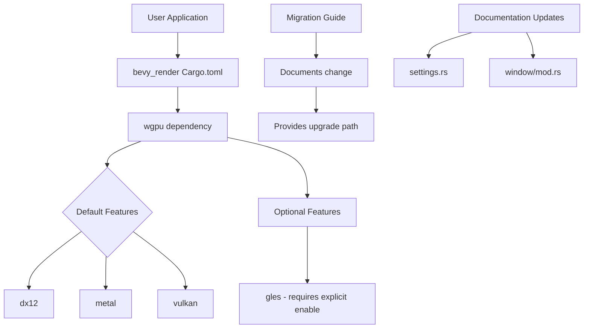

+++
title = "#20793 Demote OpenGL to optional feature"
date = "2025-08-31T00:00:00"
draft = false
template = "pull_request_page.html"
in_search_index = true

[taxonomies]
list_display = ["show"]

[extra]
current_language = "en"
available_languages = {"en" = { name = "English", url = "/pull_request/bevy/2025-08/pr-20793-en-20250831" }, "zh-cn" = { name = "中文", url = "/pull_request/bevy/2025-08/pr-20793-zh-cn-20250831" }}
labels = ["A-Rendering", "X-Contentious"]
+++

# Demote OpenGL to optional feature

## Basic Information
- **Title**: Demote OpenGL to optional feature
- **PR Link**: https://github.com/bevyengine/bevy/pull/20793
- **Author**: tychedelia
- **Status**: MERGED
- **Labels**: A-Rendering, S-Ready-For-Final-Review, X-Contentious
- **Created**: 2025-08-30T04:04:29Z
- **Merged**: 2025-08-31T08:19:42Z
- **Merged By**: mockersf

## Description Translation
# Objective

In practice, we don't test OpenGL support and it's been reported broken for several releases.

## Solution

Make the `gles` feature for `wgpu` optional, reflecting our level of support.

## The Story of This Pull Request

This PR addresses a practical maintenance issue with Bevy's OpenGL support. The core problem was straightforward: OpenGL ES support through wgpu's `gles` feature had been consistently broken across multiple releases, and the Bevy team wasn't actively testing or maintaining it. Rather than continuing to include it as a default feature that users might rely on without realizing its unstable state, the decision was made to demote it to an optional feature.

The solution approach was pragmatic - instead of investing significant effort into fixing and maintaining OpenGL support (which would require ongoing testing resources), the team chose to accurately reflect the current level of support through feature flags. This aligns with common practice in Rust ecosystems where unstable or untested functionality is gated behind optional features.

The implementation involved several coordinated changes. First, the `gles` feature was removed from wgpu's default features in Cargo.toml, making it opt-in rather than opt-out. This was the primary technical change:

```toml
# Before:
wgpu = { version = "26", default-features = false, features = [
  "dx12",
  "metal",
  "vulkan",
  "gles",  # This was included by default
  "naga-ir",
  "fragile-send-sync-non-atomic-wasm",
] }

# After:
wgpu = { version = "26", default-features = false, features = [
  "dx12",
  "metal",
  "vulkan",
  # "gles" removed from default features
  "naga-ir",
  "fragile-send-sync-non-atomic-wasm",
] }
```

Simultaneously, a new optional feature was added to allow users who specifically need OpenGL support to enable it:

```toml
# New optional feature added
gles = ["wgpu/gles"]
```

The changes also included important documentation updates to clarify the new requirements for OpenGL usage. The comments in `settings.rs` and `window/mod.rs` were updated to explicitly mention that the `gles` feature must now be enabled for ANGLE/OpenGL support:

```rust
// In settings.rs - updated documentation
// Before:
// NOTE: If you want to use [`Backends::GL`] in a native app on `Windows` and/or `macOS`, you must
// use [`ANGLE`]. This is because wgpu requires EGL to create a GL context without a window...

// After:
// NOTE: If you want to use [`Backends::GL`] in a native app on `Windows` and/or `macOS`, you must
// use [`ANGLE`] and enable the `gles` feature. This is because wgpu requires EGL to create...
```

A comprehensive migration guide was added to help users understand this change and how to adapt their projects if they still require OpenGL support:

```markdown
---
title: "OpenGL ES `wgpu` backend is no longer supported by default"
pull_requests: [ 20793 ]
---

The `gles` backend for `wgpu` is no longer included as a default feature of `bevy_render`. OpenGL support is still
available, but must be explicitly enabled by adding the `bevy_render/gles` feature to your app. This change reflects the
fact that OpenGL support is not tested and that some features may not work as expected or at all. We welcome
contributions to improve OpenGL support in the future.
```

The technical impact of this change is significant for maintenance burden reduction. By making OpenGL support optional, the Bevy team no longer has to worry about breaking OpenGL functionality with every change, as users who need it must explicitly opt into the potentially unstable feature. This follows the principle of making common cases easy and edge cases possible.

For users, the change is transparent unless they specifically need OpenGL support. Those users can simply add the `gles` feature to their Cargo.toml:

```toml
[dependencies]
bevy = { version = "0.14", features = ["bevy_render/gles"] }
```

This approach demonstrates good software engineering practices around feature management and honest communication about support levels. Rather than silently providing broken functionality, the team is explicit about what works well and what doesn't, allowing users to make informed decisions about their rendering backend choices.

## Visual Representation



## Key Files Changed

### `crates/bevy_render/Cargo.toml` (+1/-1)
**Purpose**: Remove gles from default features and make it optional
```toml
# Key change: removed "gles" from default wgpu features
wgpu = { version = "26", default-features = false, features = [
  "dx12",
  "metal",
  "vulkan",
  # "gles" removed here
  "naga-ir",
  "fragile-send-sync-non-atomic-wasm",
] }

# Added optional feature
gles = ["wgpu/gles"]
```

### `release-content/migration-guides/gles_optional.md` (+9/-0)
**Purpose**: Document the change and provide migration guidance
```markdown
The `gles` backend for `wgpu` is no longer included as a default feature of `bevy_render`. OpenGL support is still
available, but must be explicitly enabled by adding the `bevy_render/gles` feature to your app.
```

### `crates/bevy_render/src/settings.rs` (+2/-2)
**Purpose**: Update documentation to mention the new feature requirement
```rust
// Updated comment to include gles feature requirement
// NOTE: If you want to use [`Backends::GL`] in a native app on `Windows` and/or `macOS`, you must
// use [`ANGLE`] and enable the `gles` feature. This is because wgpu requires EGL to create...
```

### `crates/bevy_render/src/view/window/mod.rs` (+4/-4)
**Purpose**: Update documentation to reflect the new OpenGL support requirements
```rust
// Updated comment to include gles feature requirement
// Another alternative is to try to use [`ANGLE`] and
// [`Backends::GL`] with the `gles` feature enabled if your
// GPU/drivers support `OpenGL 4.3` / `OpenGL ES 3.0` or later.
```

## Further Reading

- [wgpu Backends documentation](https://wgpu.rs/#supported-backends)
- [Cargo Features guide](https://doc.rust-lang.org/cargo/reference/features.html)
- [Bevy Renderer documentation](https://bevyengine.org/learn/books/introduction/3-rendering/3-1-render-architecture/)
- [ANGLE project](https://github.com/google/angle) - OpenGL ES implementation for Windows/macOS