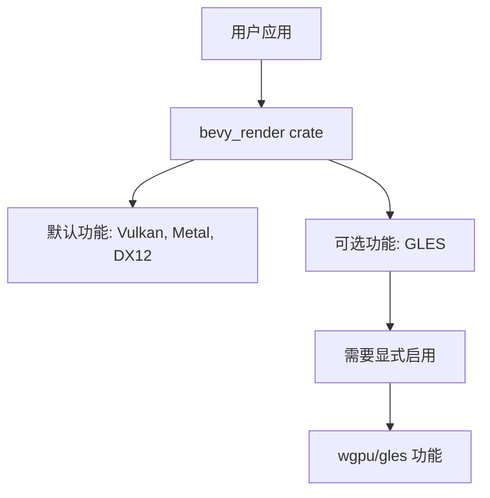

+++
title = "#20793 Demote OpenGL to optional feature"
date = "2025-08-31T00:00:00"
draft = false
template = "pull_request_page.html"
in_search_index = false

[extra]
current_language = "zh-cn"
available_languages = {"en" = { name = "English", url = "/pull_request/bevy/2025-08/pr-20793-en-20250831" }, "zh-cn" = { name = "中文", url = "/pull_request/bevy/2025-08/pr-20793-zh-cn-20250831" }}
+++

# Demote OpenGL to optional feature

## 基本信息
- **标题**: Demote OpenGL to optional feature
- **PR链接**: https://github.com/bevyengine/bevy/pull/20793
- **作者**: tychedelia
- **状态**: 已合并
- **标签**: A-Rendering, S-Ready-For-Final-Review, X-Contentious
- **创建时间**: 2025-08-30T04:04:29Z
- **合并时间**: 2025-08-31T08:19:42Z
- **合并者**: mockersf

## 描述翻译

# 目标

在实践中，我们不测试OpenGL支持，并且有报告称它在多个版本中已经损坏。

## 解决方案

将`wgpu`的`gles`功能设为可选，以反映我们的支持级别。

## 这个Pull Request的故事

这个PR源于Bevy渲染团队面临的一个实际问题：OpenGL ES后端在多个版本中一直存在问题，但团队缺乏资源来持续测试和维护它。问题的核心在于，虽然OpenGL ES被包含为默认功能，但实际上它并没有得到充分的测试和支持，这导致了用户在使用时的困惑和不可预期的行为。

开发团队采取了务实的方法来解决这个问题。他们没有尝试修复所有OpenGL相关问题（这需要大量的工程投入），而是选择将OpenGL支持从默认功能降级为可选功能。这个决策反映了工程实践中的一个重要原则：明确声明软件的实际支持级别，而不是假装支持实际上无法保证的功能。

从技术实现角度看，这个改动相对简单但影响深远。主要的变更集中在几个关键文件中：

首先，在`crates/bevy_render/Cargo.toml`中，团队移除了wgpu依赖中的默认"gles"功能，并添加了一个新的可选功能特性：

```toml
# 修改前：
wgpu = { version = "26", default-features = false, features = [
  "dx12",
  "metal",
  "vulkan",
  "gles",  # 这是被移除的默认功能
  "naga-ir",
  "fragile-send-sync-non-atomic-wasm",
] }

# 修改后：
wgpu = { version = "26", default-features = false, features = [
  "dx12",
  "metal",
  "vulkan",
  # "gles" 被移除，改为可选功能
  "naga-ir",
  "fragile-send-sync-non-atomic-wasm",
] }

# 新增可选功能：
gles = ["wgpu/gles"]
```

这个变更意味着新的Bevy应用默认不会包含OpenGL ES支持，除非开发者显式启用`bevy_render/gles`功能。

其次，团队更新了相关的文档注释，以反映这个变化。在`crates/bevy_render/src/settings.rs`中：

```rust
// 修改前：
// NOTE: If you want to use [`Backends::GL`](Backends::GL) in a native app on `Windows` and/or `macOS`, you must
// use [`ANGLE`](https://github.com/gfx-rs/wgpu#angle). This is because wgpu requires EGL to
// create a GL context without a window and only ANGLE supports that.

// 修改后：
// NOTE: If you want to use [`Backends::GL`](Backends::GL) in a native app on `Windows` and/or `macOS`, you must
// use [`ANGLE`](https://github.com/gfx-rs/wgpu#angle) and enable the `gles` feature. This is
// because wgpu requires EGL to create a GL context without a window and only ANGLE supports that.
```

类似的更新也出现在`crates/bevy_render/src/view/window/mod.rs`中，确保开发者在使用OpenGL相关功能时能够得到正确的指导。

最重要的是，团队添加了一个迁移指南`release-content/migration-guides/gles_optional.md`，明确说明了这一变更：

```markdown
---
title: "OpenGL ES `wgpu` backend is no longer supported by default"
pull_requests: [ 20793 ]
---

The `gles` backend for `wgpu` is no longer included as a default feature of `bevy_render`. OpenGL support is still
available, but must be explicitly enabled by adding the `bevy_render/gles` feature to your app. This change reflects the
fact that OpenGL support is not tested and that some features may not work as expected or at all. We welcome
contributions to improve OpenGL support in the future.
```

这个变更的技术影响是双向的。对于大多数用户来说，它减少了默认的二进制文件大小，因为移除了未使用的OpenGL代码。对于需要OpenGL支持的用户，他们现在需要显式启用该功能，但这同时也意味着团队对这类用户提供了更明确的支持预期。

从工程管理的角度来看，这个PR展示了如何正确处理未充分测试的功能：不是隐藏问题，而是明确声明支持状态，让用户能够基于准确的信息做出决策。这种透明性对于开源项目的长期健康至关重要。

## 可视化表示



## 关键文件变更

### `crates/bevy_render/Cargo.toml` (+1/-1)
**变更描述**: 从wgpu的默认功能中移除gles，并添加为可选功能
```toml
# 关键变更：
- 从默认features中移除 "gles"
+ 添加 gles = ["wgpu/gles"] 可选功能
```

### `release-content/migration-guides/gles_optional.md` (+9/-0)
**变更描述**: 新增迁移指南文档，说明OpenGL ES变为可选功能
```markdown
新增完整文件，说明GLES后端不再默认支持，需要显式启用
```

### `crates/bevy_render/src/settings.rs` (+2/-2)
**变更描述**: 更新文档注释，反映GLES需要显式启用
```rust
// 更新ANGLE使用说明，强调需要启用gles功能
- // use [`ANGLE`](https://github.com/gfx-rs/wgpu#angle). This is because...
+ // use [`ANGLE`](https://github.com/gfx-rs/wgpu#angle) and enable the `gles` feature. This is...
```

### `crates/bevy_render/src/view/window/mod.rs` (+4/-4)
**变更描述**: 更新窗口准备功能的文档，说明GLES可选性
```rust
// 更新后端选择文档，说明GLES需要gles功能
- // [`Backends::GL`](crate::settings::Backends::GL) if your GPU/drivers support...
+ // [`Backends::GL`](crate::settings::Backends::GL) with the `gles` feature enabled if your...
```

## 延伸阅读

- [wgpu图形后端文档](https://github.com/gfx-rs/wgpu#project-gallery)
- [Bevy渲染架构](https://bevyengine.org/learn/architecture/)
- [Cargo功能特性指南](https://doc.rust-lang.org/cargo/reference/features.html)
- [图形API选择策略](https://github.com/bevyengine/bevy/issues/2000)

# 完整代码差异

```diff
diff --git a/crates/bevy_render/Cargo.toml b/crates/bevy_render/Cargo.toml
index c93986f3eab16..ecd28dec39fe2 100644
--- a/crates/bevy_render/Cargo.toml
+++ b/crates/bevy_render/Cargo.toml
@@ -40,6 +40,7 @@ tracing-tracy = ["dep:tracy-client"]
 ci_limits = []
 webgl = ["wgpu/webgl"]
 webgpu = ["wgpu/webgpu"]
+gles = ["wgpu/gles"]
 detailed_trace = []
 ## Adds serialization support through `serde`.
 serialize = ["bevy_mesh/serialize"]
@@ -86,7 +87,6 @@ wgpu = { version = "26", default-features = false, features = [
   "dx12",
   "metal",
   "vulkan",
-  "gles",
   "naga-ir",
   "fragile-send-sync-non-atomic-wasm",
 ] }
diff --git a/crates/bevy_render/src/settings.rs b/crates/bevy_render/src/settings.rs
index 6140d179b1b97..c3b284ecc13b4 100644
--- a/crates/bevy_render/src/settings.rs
+++ b/crates/bevy_render/src/settings.rs
@@ -27,8 +27,8 @@ pub enum WgpuSettingsPriority {
 /// [`Backends::VULKAN`](Backends::VULKAN) are enabled by default for non-web and the best choice
 /// is automatically selected. Web using the `webgl` feature uses [`Backends::GL`](Backends::GL).
 /// NOTE: If you want to use [`Backends::GL`](Backends::GL) in a native app on `Windows` and/or `macOS`, you must
-/// use [`ANGLE`](https://github.com/gfx-rs/wgpu#angle). This is because wgpu requires EGL to
-/// create a GL context without a window and only ANGLE supports that.
+/// use [`ANGLE`](https://github.com/gfx-rs/wgpu#angle) and enable the `gles` feature. This is
+/// because wgpu requires EGL to create a GL context without a window and only ANGLE supports that.
 #[derive(Clone)]
 pub struct WgpuSettings {
     pub device_label: Option<Cow<'static, str>>,
diff --git a/crates/bevy_render/src/view/window/mod.rs b/crates/bevy_render/src/view/window/mod.rs
index e682829bf4a07..ed2367d27b8e9 100644
--- a/crates/bevy_render/src/view/window/mod.rs
+++ b/crates/bevy_render/src/view/window/mod.rs
@@ -205,10 +205,10 @@ impl WindowSurfaces {
 ///   `DirectX 11` is not supported by wgpu 0.12 and so if your GPU/drivers do not support Vulkan,
 ///   it may be that a software renderer called "Microsoft Basic Render Driver" using `DirectX 12`
 ///   will be chosen and performance will be very poor. This is visible in a log message that is
-///   output during renderer initialization. Future versions of wgpu will support `DirectX 11`, but
-///   another alternative is to try to use [`ANGLE`](https://github.com/gfx-rs/wgpu#angle) and
-///   [`Backends::GL`](crate::settings::Backends::GL) if your GPU/drivers support `OpenGL 4.3` / `OpenGL ES 3.0` or
-///   later.
+///   output during renderer initialization.
+///   Another alternative is to try to use [`ANGLE`](https://github.com/gfx-rs/wgpu#angle) and
+///   [`Backends::GL`](crate::settings::Backends::GL) with the `gles` feature enabled if your
+///   GPU/drivers support `OpenGL 4.3` / `OpenGL ES 3.0` or later.
 pub fn prepare_windows(
     mut windows: ResMut<ExtractedWindows>,
     mut window_surfaces: ResMut<WindowSurfaces>,
diff --git a/release-content/migration-guides/gles_optional.md b/release-content/migration-guides/gles_optional.md
new file mode 100644
index 0000000000000..a2276bbbbc647
--- /dev/null
+++ b/release-content/migration-guides/gles_optional.md
@@ -0,0 +1,9 @@
+---
+title: "OpenGL ES `wgpu` backend is no longer supported by default"
+pull_requests: [ 20793 ]
+---
+
+The `gles` backend for `wgpu` is no longer included as a default feature of `bevy_render`. OpenGL support is still
+available, but must be explicitly enabled by adding the `bevy_render/gles` feature to your app. This change reflects the
+fact that OpenGL support is not tested and that some features may not work as expected or at all. We welcome
+contributions to improve OpenGL support in the future.
```