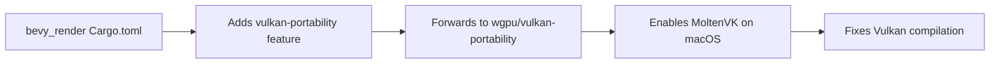

+++
title = "#20794 Add `vulkan-portability` to fix compiling with `--all-features`"
date = "2025-08-31T00:00:00"
draft = false
template = "pull_request_page.html"
in_search_index = true

[taxonomies]
list_display = ["show"]

[extra]
current_language = "en"
available_languages = {"en" = { name = "English", url = "/pull_request/bevy/2025-08/pr-20794-en-20250831" }, "zh-cn" = { name = "中文", url = "/pull_request/bevy/2025-08/pr-20794-zh-cn-20250831" }}
labels = ["D-Trivial", "A-Rendering"]
+++

# Add `vulkan-portability` to fix compiling with `--all-features`

## Basic Information
- **Title**: Add `vulkan-portability` to fix compiling with `--all-features`
- **PR Link**: https://github.com/bevyengine/bevy/pull/20794
- **Author**: tychedelia
- **Status**: MERGED
- **Labels**: D-Trivial, A-Rendering, S-Needs-Review
- **Created**: 2025-08-30T04:17:00Z
- **Merged**: 2025-08-31T16:26:59Z
- **Merged By**: mockersf

## Description Translation
#20565 broke compiling with `--all-features` on macos. Add the `vulkan-portability` feature to `bevy_render` required to make vulkan compile with wgpu on mac.

## The Story of This Pull Request

This PR addresses a build system regression introduced by PR #20565 that broke compilation on macOS when using the `--all-features` flag. The core issue was that the Vulkan backend of wgpu requires additional configuration to work properly on macOS, which wasn't being properly forwarded through Bevy's feature flags.

When PR #20565 modified the rendering infrastructure, it inadvertently created a situation where compiling with all features enabled on macOS would fail because the Vulkan backend dependencies weren't properly configured. macOS doesn't have native Vulkan support, so wgpu relies on the `vulkan-portability` feature to provide Vulkan compatibility through MoltenVK, which implements Vulkan on top of Metal.

The solution was straightforward: add the missing feature flag mapping in `bevy_render`'s Cargo.toml to forward the `vulkan-portability` feature to the underlying wgpu dependency. This ensures that when Vulkan features are enabled on macOS, the necessary portability layer is also included in the build.

The implementation consists of a single line addition to the feature definitions in the Cargo.toml file:

```toml
vulkan-portability = ["wgpu/vulkan-portability"]
```

This change follows the established pattern in Bevy's build system where crate features are used to control backend-specific dependencies and configurations. The `vulkan-portability` feature enables wgpu's corresponding feature, which is essential for Vulkan to work on platforms like macOS that don't have native Vulkan support.

The impact of this change is minimal but important: it restores the ability to compile Bevy with all features enabled on macOS systems. This is particularly valuable for developers who need to test their applications with different rendering backends or who rely on CI systems that build with the `--all-features` flag.

From a technical perspective, this PR demonstrates the importance of properly forwarding feature flags in Rust workspace configurations, especially when dealing with cross-platform graphics APIs that have different implementation requirements on various operating systems.

## Visual Representation



## Key Files Changed

### `crates/bevy_render/Cargo.toml`
This file received a single line addition to define the `vulkan-portability` feature and forward it to the wgpu dependency.

**Change:**
```toml
# Before:
webgl = ["wgpu/webgl"]
webgpu = ["wgpu/webgpu"]
gles = ["wgpu/gles"]

# After:
webgl = ["wgpu/webgl"]
webgpu = ["wgpu/webgpu"]
vulkan-portability = ["wgpu/vulkan-portability"]
gles = ["wgpu/gles"]
```

This change ensures that when the Vulkan backend is used on macOS, the necessary portability layer (MoltenVK) is included in the build, fixing compilation issues when using `--all-features`.

## Further Reading

- [wgpu's vulkan-portability feature documentation](https://github.com/gfx-rs/wgpu?tab=readme-ov-file#vulkan-portability)
- [MoltenVK: Vulkan on macOS and iOS](https://github.com/KhronosGroup/MoltenVK)
- [Rust Cargo features documentation](https://doc.rust-lang.org/cargo/reference/features.html)
- [Bevy's rendering backend system](https://bevyengine.org/learn/quick-start/features/#renderer)

## Full Code Diff
```diff
diff --git a/crates/bevy_render/Cargo.toml b/crates/bevy_render/Cargo.toml
index ecd28dec39fe2..d2f3e1e55cf71 100644
--- a/crates/bevy_render/Cargo.toml
+++ b/crates/bevy_render/Cargo.toml
@@ -40,6 +40,7 @@ tracing-tracy = ["dep:tracy-client"]
 ci_limits = []
 webgl = ["wgpu/webgl"]
 webgpu = ["wgpu/webgpu"]
+vulkan-portability = ["wgpu/vulkan-portability"]
 gles = ["wgpu/gles"]
 detailed_trace = []
 ## Adds serialization support through `serde`.
```