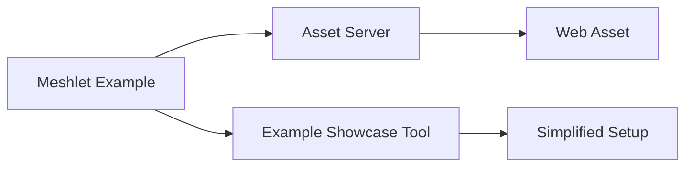

+++
title = "#20795 Use web assets for meshlet example"
date = "2025-08-31T00:00:00"
draft = false
template = "pull_request_page.html"
in_search_index = true

[taxonomies]
list_display = ["show"]

[extra]
current_language = "en"
available_languages = {"en" = { name = "English", url = "/pull_request/bevy/2025-08/pr-20795-en-20250831" }, "zh-cn" = { name = "中文", url = "/pull_request/bevy/2025-08/pr-20795-zh-cn-20250831" }}
labels = ["A-Rendering", "C-Examples"]
+++

# Use web assets for meshlet example

## Basic Information
- **Title**: Use web assets for meshlet example
- **PR Link**: https://github.com/bevyengine/bevy/pull/20795
- **Author**: tychedelia
- **Status**: MERGED
- **Labels**: A-Rendering, C-Examples, S-Needs-Review
- **Created**: 2025-08-30T04:24:12Z
- **Merged**: 2025-08-31T08:00:20Z
- **Merged By**: mockersf

## Description Translation
We have web assets now, let's use them!

## The Story of This Pull Request

The meshlet example in Bevy previously required users to manually download external assets before running the example. This created a suboptimal developer experience where users had to either run setup commands or manually download files from external URLs. The example used a complex setup process involving curl commands and local file checks that could fail and return error codes.

The core problem was that the meshlet example relied on a large 3D model asset (bunny.meshlet_mesh) that wasn't included in the main repository due to size constraints. Previously, this required a multi-step setup process:

1. Create directory structure for external assets
2. Download the file using curl from a GitHub repository
3. Check for file existence at runtime
4. Return error codes if the file was missing

The solution approach was straightforward: leverage Bevy's existing web asset capabilities to load the asset directly from a URL at runtime. This eliminated the need for pre-download steps and simplified the user experience. The implementation required:

1. Adding the "https" feature requirement to the example
2. Updating the asset URL to point to Bevy's official asset repository
3. Removing all the setup and file existence checking code
4. Updating the asset server to load from the URL directly

The technical implementation shows a clean simplification. The main function was transformed from a complex setup with error handling to a simple App initialization:

```rust
// Before:
fn main() -> ExitCode {
    if !Path::new("./assets/external/models/bunny.meshlet_mesh").exists() {
        eprintln!("ERROR: Asset at path <bevy>/assets/external/models/bunny.meshlet_mesh is missing. Please download it from {ASSET_URL}");
        return ExitCode::FAILURE;
    }
    // ... app setup
    ExitCode::SUCCESS
}

// After:
fn main() {
    App::new()
        // ... app setup
        .run();
}
```

The asset loading was also simplified from using a local path to a direct URL:

```rust
// Before:
let meshlet_mesh_handle = asset_server.load("external/models/bunny.meshlet_mesh");

// After:
let meshlet_mesh_handle = asset_server.load(ASSET_URL);
```

The impact of these changes is significant for developer experience. Users can now run the meshlet example with a simple `cargo run --example meshlet` without any setup steps. The example will automatically download the required assets at runtime using Bevy's asset system.

This change also required updates to the example showcase tool, which previously executed setup commands. Since the setup is no longer needed, the tool was simplified by removing the setup command execution and parsing logic.

From an architectural perspective, this change demonstrates Bevy's capability to handle web assets seamlessly and aligns with modern development practices where external resources are loaded on-demand rather than requiring manual setup steps.

## Visual Representation



## Key Files Changed

### `Cargo.toml`
**Changes**: Updated meshlet example requirements and removed setup commands
```toml
# Before:
required-features = ["meshlet"]
setup = [
  [
    "mkdir",
    "-p",
    "assets/external/models",
  ],
  [
    "curl",
    "-o",
    "assets/external/models/bunny.meshlet_mesh",
    "https://raw.githubusercontent.com/JMS55/bevy_meshlet_asset/7a7c14138021f63904b584d5f7b73b695c7f4bbf/bunny.meshlet_mesh",
  ],
]

# After:
required-features = ["meshlet", "https"]
```

### `examples/3d/meshlet.rs`
**Changes**: Simplified main function and switched to web asset loading
```rust
// Before:
const ASSET_URL: &str = "https://raw.githubusercontent.com/atlv24/assets/69bb39164fd35aadf863f6009520d4981eafcea0/bunny.meshlet_mesh";

fn main() -> ExitCode {
    if !Path::new("./assets/external/models/bunny.meshlet_mesh").exists() {
        eprintln!("ERROR: Asset at path <bevy>/assets/external/models/bunny.meshlet_mesh is missing. Please download it from {ASSET_URL}");
        return ExitCode::FAILURE;
    }
    // ... app setup
    ExitCode::SUCCESS
}

// After:
const ASSET_URL: &str = "https://github.com/bevyengine/bevy_asset_files/raw/9bf88c42b9d06a3634eed633d90ce5fab02c31da/meshlet/bunny.meshlet_mesh";

fn main() {
    App::new()
        // ... app setup
        .run();
}
```

### `tools/example-showcase/src/main.rs`
**Changes**: Removed setup command execution and parsing logic
```rust
// Before:
for command in &to_run.setup {
    let exe = &command[0];
    let args = &command[1..];
    cmd!(sh, "{exe} {args...}").run().unwrap();
}

// After:
// Setup command execution completely removed
```

## Further Reading

- [Bevy Asset System Documentation](https://bevyengine.org/learn/books/introduction/assets/)
- [Bevy Web Asset Loading](https://bevyengine.org/news/bevy-0-13/#web-asset-loading)
- [Meshlet Rendering in Bevy](https://bevyengine.org/news/bevy-0-13/#meshlet-rendering-experimental)