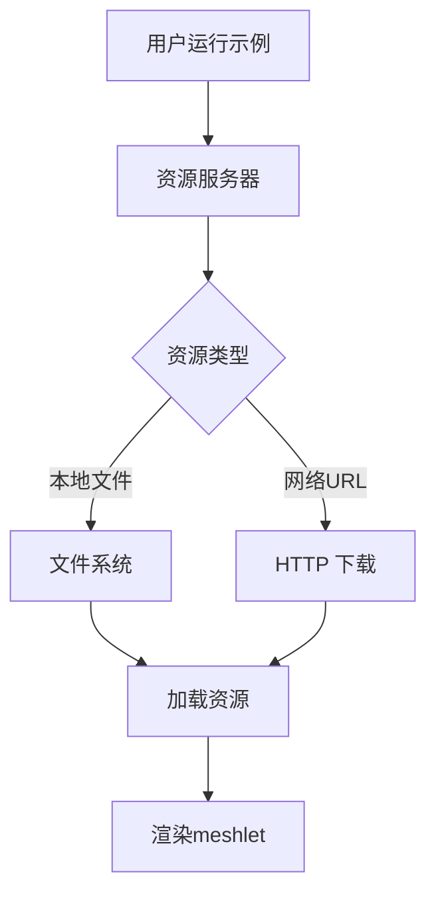

+++
title = "#20795 Use web assets for meshlet example"
date = "2025-08-31T00:00:00"
draft = false
template = "pull_request_page.html"
in_search_index = false

[extra]
current_language = "zh-cn"
available_languages = {"en" = { name = "English", url = "/pull_request/bevy/2025-08/pr-20795-en-20250831" }, "zh-cn" = { name = "中文", url = "/pull_request/bevy/2025-08/pr-20795-zh-cn-20250831" }}
+++

# 使用 Web 资源优化 Meshlet 示例

## 基本信息
- **标题**: Use web assets for meshlet example
- **PR 链接**: https://github.com/bevyengine/bevy/pull/20795
- **作者**: tychedelia
- **状态**: 已合并
- **标签**: A-Rendering, C-Examples, S-Needs-Review
- **创建时间**: 2025-08-30T04:24:12Z
- **合并时间**: 2025-08-31T08:00:20Z
- **合并人**: mockersf

## 描述翻译
我们现在有了 web 资源，让我们使用它们！

## 本次 PR 的故事

这个 PR 解决了 Bevy 引擎中 meshlet 示例的一个实际问题：简化资源管理流程。原本的示例需要用户在运行前手动下载外部模型文件，这增加了使用门槛并可能导致运行失败。

**问题背景**：Meshlet 渲染是 Bevy 的一个实验性功能，用于处理高密度多边形场景。在 PR 之前，运行 `meshlet` 示例需要执行一系列设置命令来下载 bunny.meshlet_mesh 资源文件。这包括创建目录结构和使用 curl 命令从 GitHub 下载文件。如果用户忘记或无法执行这些步骤，示例会失败并返回错误代码。

**解决方案**：开发者采取了直接使用 web 资源的方案。通过 Bevy 资源服务器的能力，直接从 GitHub URL 加载所需资源，完全移除了手动设置步骤的需求。

**实现细节**：主要修改集中在三个文件中：

1. 在 `Cargo.toml` 中，移除了复杂的 setup 脚本配置，只保留了必要的功能标记
2. 在 `examples/3d/meshlet.rs` 中，修改了资源加载方式，使用 URL 而不是本地路径
3. 在 `tools/example-showcase/src/main.rs` 中，移除了处理 setup 命令的逻辑

关键的技术决策是使用 Bevy 资源服务器的网络加载能力：
```rust
// 修改前：使用本地路径
let meshlet_mesh_handle = asset_server.load("external/models/bunny.meshlet_mesh");

// 修改后：使用 URL
let meshlet_mesh_handle = asset_server.load(ASSET_URL);
```

**技术洞察**：这个改动展示了 Bevy 资源系统的强大能力 - 它能够透明地处理本地和远程资源，无需修改核心逻辑。同时，这也体现了良好的用户体验设计原则：减少用户需要执行的手动步骤。

**影响**：这个修改显著简化了示例的运行流程。用户现在可以直接运行示例而不需要任何前置步骤，这降低了学习和测试的门槛。从代码维护角度，移除了复杂的 setup 配置，使项目结构更清晰。

## 视觉表示



## 关键文件变更

### `Cargo.toml`
**变更描述**：移除了 meshlet 示例的 setup 配置，添加了 https 功能要求

```toml
# 修改前：
required-features = ["meshlet"]
setup = [
  [
    "mkdir",
    "-p",
    "assets/external/models",
  ],
  [
    "curl",
    "-o",
    "assets/external/models/bunny.meshlet_mesh",
    "https://raw.githubusercontent.com/JMS55/bevy_meshlet_asset/7a7c14138021f63904b584d5f7b73b695c7f4bbf/bunny.meshlet_mesh",
  ],
]

# 修改后：
required-features = ["meshlet", "https"]
```

### `examples/3d/meshlet.rs`
**变更描述**：移除了文件存在性检查，改为直接使用 URL 加载资源

```rust
// 修改前：
const ASSET_URL: &str = "https://raw.githubusercontent.com/atlv24/assets/69bb39164fd35aadf863f6009520d4981eafcea0/bunny.meshlet_mesh";

fn main() -> ExitCode {
    if !Path::new("./assets/external/models/bunny.meshlet_mesh").exists() {
        eprintln!("ERROR: Asset at path <bevy>/assets/external/models/bunny.meshlet_mesh is missing. Please download it from {ASSET_URL}");
        return ExitCode::FAILURE;
    }
    
    // ... 应用设置代码
    
    ExitCode::SUCCESS
}

// 修改后：
const ASSET_URL: &str = "https://github.com/bevyengine/bevy_asset_files/raw/9bf88c42b9d06a3634eed633d90ce5fab02c31da/meshlet/bunny.meshlet_mesh";

fn main() {
    // ... 直接运行应用设置代码
}
```

### `tools/example-showcase/src/main.rs`
**变更描述**：移除了处理示例 setup 命令的逻辑

```rust
// 移除了 setup 命令执行循环：
for command in &to_run.setup {
    let exe = &command[0];
    let args = &command[1..];
    cmd!(sh, "{exe} {args...}").run().unwrap();
}

// 同时移除了 setup 字段的解析逻辑
```

## 延伸阅读

- [Bevy 资源系统文档](https://bevyengine.org/learn/books/introduction/assets/)
- [Meshlet 渲染技术介绍](https://therealmjp.github.io/posts/mesh-shading-in-dx12/)
- [Bevy 示例系统](https://github.com/bevyengine/bevy/tree/main/examples)