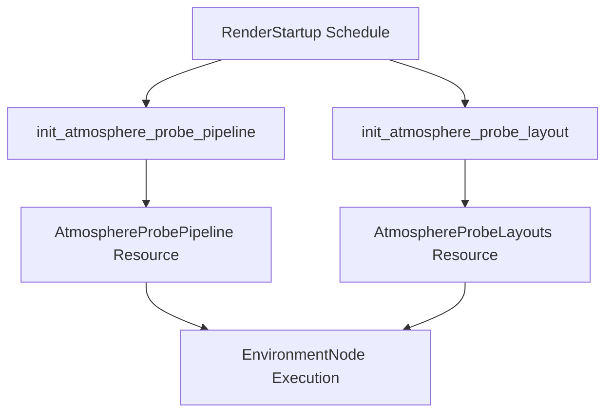

+++
title = "#20806 fix atmospherics memory leak"
date = "2025-08-31T00:00:00"
draft = false
template = "pull_request_page.html"
in_search_index = true

[taxonomies]
list_display = ["show"]

[extra]
current_language = "en"
available_languages = {"en" = { name = "English", url = "/pull_request/bevy/2025-08/pr-20806-en-20250831" }, "zh-cn" = { name = "中文", url = "/pull_request/bevy/2025-08/pr-20806-zh-cn-20250831" }}
labels = ["C-Bug", "A-Rendering"]
+++

# fix atmospherics memory leak

## Basic Information
- **Title**: fix atmospherics memory leak
- **PR Link**: https://github.com/bevyengine/bevy/pull/20806
- **Author**: ecoskey
- **Status**: MERGED
- **Labels**: C-Bug, A-Rendering, S-Ready-For-Final-Review
- **Created**: 2025-08-31T05:29:38Z
- **Merged**: 2025-08-31T16:26:59Z
- **Merged By**: mockersf

## Description Translation
# Objective

Fix #20804

- Pipelines are getting recreated ad infinitum -> memory leak
- result of a bad review comment by me, oops

## Solution

- move the system to `RenderStartup` rather than `queue`

## Testing

- nothing broke

## The Story of This Pull Request

This PR addresses a memory leak in Bevy's atmospheric rendering system where compute pipelines were being recreated every frame instead of being initialized once. The issue was caused by incorrect system scheduling that placed pipeline initialization in the render queue rather than startup initialization.

The problem originated from a review comment that mistakenly placed the `queue_atmosphere_probe_pipelines` system in the `Render` schedule's queue set. This caused the system to run every frame, continuously creating new compute pipeline resources without cleaning up the previous ones. Each frame would add new pipeline objects to memory, leading to unbounded memory growth.

The solution involved two key changes. First, the pipeline initialization was moved from the per-frame `Render` schedule to the one-time `RenderStartup` schedule. Second, the system and resource names were refactored to better reflect their purpose - the plural `AtmosphereProbePipelines` became singular `AtmosphereProbePipeline` to indicate it manages a single pipeline resource, and `queue_atmosphere_probe_pipelines` was renamed to `init_atmosphere_probe_pipeline` to clarify its initialization role.

The technical implementation demonstrates proper resource lifecycle management in Bevy's ECS architecture. Compute pipelines are expensive to create and should be treated as long-lived resources initialized once at startup rather than recreated frequently. This change follows Bevy's established patterns where pipeline creation occurs in startup systems while per-frame systems focus on binding and execution.

The fix eliminates the memory leak while maintaining identical functionality. No behavioral changes were introduced beyond the memory management correction, which explains why testing revealed "nothing broke" - the rendering behavior remained consistent while the resource leakage was eliminated.

## Visual Representation



## Key Files Changed

### `crates/bevy_pbr/src/atmosphere/environment.rs`
**Changes**: Renamed struct and function to reflect single pipeline management, updated resource type usage
**Purpose**: Clarify that the system manages a single pipeline resource and should only initialize once

```rust
// Before:
#[derive(Resource)]
pub struct AtmosphereProbePipelines {
    pub environment: CachedComputePipelineId,
}

pub fn queue_atmosphere_probe_pipelines(
    // ... parameters
) {
    commands.insert_resource(AtmosphereProbePipelines { environment });
}

// After:
#[derive(Resource)]
pub struct AtmosphereProbePipeline {
    pub environment: CachedComputePipelineId,
}

pub fn init_atmosphere_probe_pipeline(
    // ... parameters
) {
    commands.insert_resource(AtmosphereProbePipeline { environment });
}
```

### `crates/bevy_pbr/src/atmosphere/mod.rs`
**Changes**: Moved system from Render to RenderStartup schedule, updated imports
**Purpose**: Ensure pipeline initialization occurs once at startup rather than every frame

```rust
// Before:
.add_systems(
    Render,
    (
        // ... other systems
        queue_atmosphere_probe_pipelines
            .in_set(RenderSystems::Queue)
            .after(init_atmosphere_probe_layout),
    ),
)

// After:
.add_systems(
    RenderStartup,
    (init_atmosphere_probe_layout, init_atmosphere_probe_pipeline).chain(),
)
```

## Further Reading

- [Bevy Schedules and Stages Documentation](https://bevyengine.org/learn/book/getting-started/schedules/)
- [Bevy ECS Resource Management](https://bevyengine.org/learn/book/getting-started/resources/)
- [WGSL Compute Pipelines](https://gpuweb.github.io/gpuweb/#compute-pipeline)