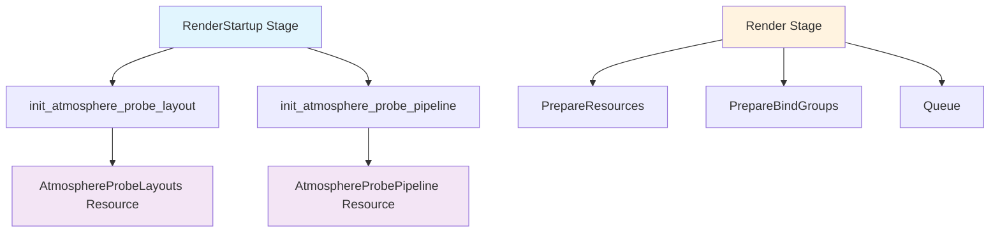

+++
title = "#20806 fix atmospherics memory leak"
date = "2025-08-31T00:00:00"
draft = false
template = "pull_request_page.html"
in_search_index = false

[extra]
current_language = "zh-cn"
available_languages = {"en" = { name = "English", url = "/pull_request/bevy/2025-08/pr-20806-en-20250831" }, "zh-cn" = { name = "中文", url = "/pull_request/bevy/2025-08/pr-20806-zh-cn-20250831" }}
labels = ["C-Bug", "A-Rendering"]
+++

# Title
修复大气效果内存泄漏问题

## Basic Information
- **Title**: fix atmospherics memory leak
- **PR Link**: https://github.com/bevyengine/bevy/pull/20806
- **Author**: ecoskey
- **Status**: MERGED
- **Labels**: C-Bug, A-Rendering, S-Ready-For-Final-Review
- **Created**: 2025-08-31T05:29:38Z
- **Merged**: 2025-08-31T16:26:59Z
- **Merged By**: mockersf

## Description Translation
# Objective

修复 #20804

- 管道被无限重新创建 -> 内存泄漏
- 这是我（作者）在代码审查时给出的错误建议导致的，抱歉

## Solution

- 将系统从 `queue` 阶段移动到 `RenderStartup` 阶段

## Testing

- 没有破坏现有功能

## The Story of This Pull Request

这个PR解决了一个由架构设计错误导致的内存泄漏问题。问题的核心在于大气探针管道的初始化逻辑被错误地放置在错误的执行阶段。

在Bevy的渲染架构中，系统执行分为多个阶段：
- `RenderStartup`：渲染启动阶段，用于一次性初始化操作
- `Render`：渲染阶段，包含多个子系统集如 `PrepareResources`、`Queue` 等
- `Queue` 子系统集专门用于每帧的队列操作

原代码将 `queue_atmosphere_probe_pipelines` 系统放在 `Render` 阶段的 `Queue` 子系统集中：

```rust
// 之前的问题代码：
queue_atmosphere_probe_pipelines
    .in_set(RenderSystems::Queue)
    .after(init_atmosphere_probe_layout),
```

这意味着每次渲染帧都会执行管道创建操作，导致 `AtmosphereProbePipelines` 资源被反复创建，而旧资源没有被正确释放，从而产生内存泄漏。

问题的根本原因是架构理解错误。管道初始化应该是一次性操作，而不是每帧执行的队列操作。作者在代码审查时错误地建议将管道初始化放在队列阶段，这直接导致了内存泄漏。

解决方案很直接：将管道初始化从 `Render` 阶段移动到 `RenderStartup` 阶段：

```rust
// 修复后的代码：
.add_systems(
    RenderStartup,
    (init_atmosphere_probe_layout, init_atmosphere_probe_pipeline).chain(),
)
```

这个改动确保了管道只在渲染启动时初始化一次，避免了重复创建。同时，作者还将资源名从复数 `AtmosphereProbePipelines` 改为单数 `AtmosphereProbePipeline`，这更准确地反映了该资源只包含单个管道的事实。

从技术角度看，这个修复展示了Bevy ECS系统中阶段划分的重要性。不同的执行阶段有明确的职责划分：
- `Startup` 阶段用于一次性初始化
- `Update` 阶段用于游戏逻辑更新  
- `Render` 阶段用于渲染相关操作
- `Render` 阶段内的 `Queue` 子系统集专门处理需要每帧提交的渲染命令

正确理解和使用这些阶段对于避免性能问题和资源管理错误至关重要。

## Visual Representation



## Key Files Changed

### `crates/bevy_pbr/src/atmosphere/environment.rs` (+7/-7)

这个文件包含了大气探针管道的核心实现。主要更改包括：

1. 资源重命名和函数重构：

```rust
// Before:
#[derive(Resource)]
pub struct AtmosphereProbePipelines {
    pub environment: CachedComputePipelineId,
}

pub fn queue_atmosphere_probe_pipelines(...) {
    // ...
    commands.insert_resource(AtmosphereProbePipelines { environment });
}

// After:  
#[derive(Resource)]
pub struct AtmosphereProbePipeline {
    pub environment: CachedComputePipelineId,
}

pub fn init_atmosphere_probe_pipeline(...) {
    // ...
    commands.insert_resource(AtmosphereProbePipeline { environment });
}
```

2. 使用站点更新：

```rust
// Before:
let pipelines = world.resource::<AtmosphereProbePipelines>();

// After:
let pipelines = world.resource::<AtmosphereProbePipeline>();
```

### `crates/bevy_pbr/src/atmosphere/mod.rs` (+4/-4)

这个文件负责大气系统的插件注册和系统调度：

```rust
// Before:
use environment::{
    init_atmosphere_probe_layout, prepare_atmosphere_probe_bind_groups,
    prepare_atmosphere_probe_components, prepare_probe_textures, queue_atmosphere_probe_pipelines,
    AtmosphereEnvironmentMap, EnvironmentNode,
};

// After:
use environment::{
    init_atmosphere_probe_layout, init_atmosphere_probe_pipeline,
    prepare_atmosphere_probe_bind_groups, prepare_atmosphere_probe_components,
    prepare_probe_textures, AtmosphereEnvironmentMap, EnvironmentNode,
};
```

系统调度更改：

```rust
// Before:
.add_systems(RenderStartup, init_atmosphere_probe_layout)
.add_systems(
    Render,
    (
        // ... 其他系统
        queue_atmosphere_probe_pipelines
            .in_set(RenderSystems::Queue)
            .after(init_atmosphere_probe_layout),
    ),
)

// After:
.add_systems(
    RenderStartup,
    (init_atmosphere_probe_layout, init_atmosphere_probe_pipeline).chain(),
)
// 移除了 queue_atmosphere_probe_pipelines 系统
```

## Further Reading

1. [Bevy Render Stages Documentation](https://bevyengine.org/learn/advanced-topics/render-stages/) - 详细了解Bevy渲染阶段架构
2. [ECS System Scheduling](https://bevyengine.org/learn/advanced-topics/system-scheduling/) - Bevy系统调度原理
3. [WGSL Shader Language](https://gpuweb.github.io/gpuweb/wgsl/) - WebGPU着色器语言规范
4. [Memory Management in Game Engines](https://gameprogrammingpatterns.com/object-pool.html) - 游戏引擎中的内存管理模式