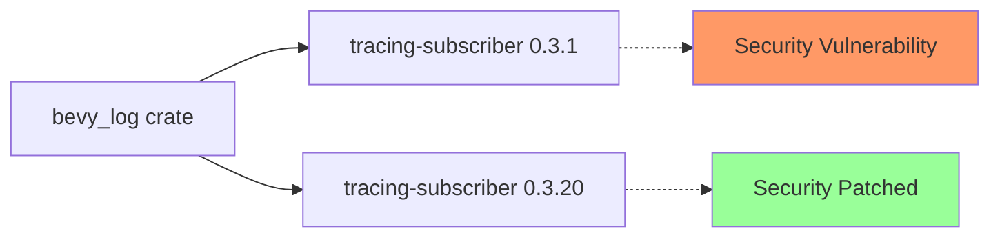

+++
title = "#20812 bump tracing-subscriber to fix dependabot alert"
date = "2025-08-31T00:00:00"
draft = false
template = "pull_request_page.html"
in_search_index = true

[taxonomies]
list_display = ["show"]

[extra]
current_language = "en"
available_languages = {"en" = { name = "English", url = "/pull_request/bevy/2025-08/pr-20812-en-20250831" }, "zh-cn" = { name = "中文", url = "/pull_request/bevy/2025-08/pr-20812-zh-cn-20250831" }}
+++

# Title
bump tracing-subscriber to fix dependabot alert

## Basic Information
- **Title**: bump tracing-subscriber to fix dependabot alert
- **PR Link**: https://github.com/bevyengine/bevy/pull/20812
- **Author**: futile
- **Status**: MERGED
- **Labels**: None
- **Created**: 2025-08-31T20:33:04Z
- **Merged**: 2025-08-31T22:17:35Z
- **Merged By**: mockersf

## Description Translation
Cheers!

This mini-PR fixes a security advisory by updating the minimum tracing-subscriber version to 0.3.20: https://github.com/advisories/GHSA-xwfj-jgwm-7wp5

# Objective

The security advisory linked above reports a low-impact vulnerability in tracing-subscriber versions <0.3.20.

Dependabot will alert downstream users of bevy that are using tracing-subscriber locked to an older version.

## Solution

Update the minimum supported version of tracing-subscriber to 0.3.20.

## Open Questions/Alternatives

If somebody (for some reason) is pinned to tracing-subscriber <0.3.20, this will cause a conflict for them.
Instead, we could leave resolving this alert up to downstream users, who could also choose to ignore it, based on their usage of the library.
However, by upping the version requirement for tracing-subscriber in bevy, we increase "security by default" for downstream projects, which is the better trade-off imo.
But in the end this is up to maintainers/project policy.

## Testing

Leaving testing up to CI.

## The Story of This Pull Request

This PR addresses a security vulnerability identified in the `tracing-subscriber` dependency used by Bevy's logging infrastructure. The vulnerability, documented in GitHub Security Advisory GHSA-xwfj-jgwm-7wp5, affects versions of `tracing-subscriber` prior to 0.3.20. While classified as low-impact, the vulnerability could potentially expose sensitive information in specific configurations.

The core issue was that Bevy's `bevy_log` crate specified a minimum version of `tracing-subscriber` at 0.3.1, which fell within the vulnerable version range. This meant that downstream users of Bevy who hadn't explicitly updated their `tracing-subscriber` dependency would remain vulnerable to this security issue.

The solution implemented was straightforward: update the minimum version requirement in `Cargo.toml` from 0.3.1 to 0.3.20. This change ensures that any project using Bevy will automatically receive a patched version of `tracing-subscriber` that addresses the security vulnerability.

The author considered alternative approaches, including leaving the version bump to downstream users or allowing them to ignore the alert if they determined the vulnerability didn't affect their specific use case. However, the decision was made to prioritize "security by default" - ensuring that Bevy users automatically benefit from security patches without requiring additional action on their part.

This approach follows standard security best practices for dependency management, where library maintainers proactively update vulnerable dependencies to protect their users. The change was minimal and low-risk, affecting only the version constraint without modifying any functional code.

## Visual Representation



## Key Files Changed

**File: `crates/bevy_log/Cargo.toml`**

This file contains the dependency specifications for Bevy's logging crate. The change updates the minimum version requirement for the `tracing-subscriber` dependency from a vulnerable version to a patched one.

**Code Change:**
```toml
# Before:
tracing-subscriber = { version = "0.3.1", features = [
  "registry",
  "env-filter",
] }

# After:
tracing-subscriber = { version = "0.3.20", features = [
  "registry",
  "env-filter",
] }
```

This single-line change addresses the security vulnerability by ensuring that only patched versions of `tracing-subscriber` are used with Bevy.

## Further Reading

- [GitHub Security Advisory GHSA-xwfj-jgwm-7wp5](https://github.com/advisories/GHSA-xwfj-jgwm-7wp5) - Details about the specific vulnerability addressed
- [tracing-subscriber crate documentation](https://docs.rs/tracing-subscriber/) - Official documentation for the updated dependency
- [Rust Security Advisory Database](https://rustsec.org/) - General resource for Rust security advisories
- [Cargo Book: Specifying Dependencies](https://doc.rust-lang.org/cargo/reference/specifying-dependencies.html) - Reference for version specification in Cargo.toml files