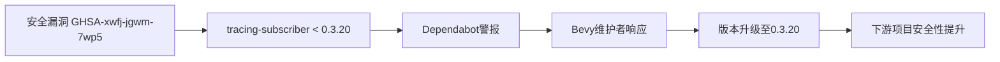

+++
title = "#20812 bump tracing-subscriber to fix dependabot alert"
date = "2025-08-31T00:00:00"
draft = false
template = "pull_request_page.html"
in_search_index = false

[extra]
current_language = "zh-cn"
available_languages = {"en" = { name = "English", url = "/pull_request/bevy/2025-08/pr-20812-en-20250831" }, "zh-cn" = { name = "中文", url = "/pull_request/bevy/2025-08/pr-20812-zh-cn-20250831" }}
+++

# Title
## 基本信息
- **标题**: bump tracing-subscriber to fix dependabot alert
- **PR链接**: https://github.com/bevyengine/bevy/pull/20812  
- **作者**: futile
- **状态**: 已合并
- **标签**: 无
- **创建时间**: 2025-08-31T20:33:04Z
- **合并时间**: 2025-08-31T22:17:35Z
- **合并者**: mockersf

## 描述翻译
干杯！

这个小型PR通过将tracing-subscriber的最低版本更新到0.3.20来修复一个安全公告：https://github.com/advisories/GHSA-xwfj-jgwm-7wp5

# 目标

上面链接的安全公告报告了tracing-subscriber版本<0.3.20中的一个低影响漏洞。

Dependabot会提醒使用锁定到旧版本tracing-subscriber的bevy下游用户。

## 解决方案

将tracing-subscriber的最低支持版本更新到0.3.20。

## 开放问题/替代方案

如果有人（出于某种原因）被固定在tracing-subscriber <0.3.20，这将导致冲突。
或者，我们可以让下游用户自行解决此警报，他们也可以根据库的使用情况选择忽略它。
但是，通过提高bevy中对tracing-subscriber的版本要求，我们为下游项目增加了"默认安全性"，这是更好的权衡。
但最终这取决于维护者/项目政策。

## 测试

将测试留给CI。

## 本次PR的故事

这个PR解决了一个直接的安全问题：tracing-subscriber库中存在一个已披露的漏洞（CVE编号未提供，但可通过GHSA-xwfj-jgwm-7wp5查看）。作为Bevy游戏引擎的维护者，作者futile需要确保依赖项的安全性是项目优先考虑的事项。

问题本质上很简单但重要：tracing-subscriber 0.3.20之前的版本存在一个安全漏洞，虽然被归类为"低影响"，但仍然需要解决。Dependabot（GitHub的依赖项扫描工具）会向使用受影响版本的下游项目发出警报，因此作为上游依赖项，Bevy有责任确保其用户不会面临不必要的风险。

解决方案非常直接：更新Cargo.toml文件中的版本要求。从工程角度来看，这里有几个考虑因素。首先，这种更新是破坏性的，因为任何被锁定在旧版本的用户现在都会遇到冲突。然而，安全修复通常被认为比向后兼容性更重要，特别是对于低级别工具库如tracing-subscriber。

作者考虑了替代方案：可以让下游用户自行决定是否升级，或者完全忽略这个漏洞。但从工程最佳实践来看，强制使用安全版本是更负责任的做法，这确保了所有Bevy用户都能默认获得安全修复，而不需要额外操作。

从技术实现角度看，这个更改极其简单但有效。版本号从0.3.1变为0.3.20，跳过了多个中间版本，这表明维护者选择直接跳到包含安全修复的最新稳定版本，而不是逐步升级。

测试策略也很合理：依赖CI系统来验证更改不会破坏现有功能。对于这种简单的依赖项版本升级，完整的CI测试套件足以确保兼容性。

## 可视化表示



## 关键文件更改

**crates/bevy_log/Cargo.toml** (+1/-1)

这个文件是Rust项目的依赖项清单文件。更改非常简单但重要：更新了tracing-subscriber依赖项的最低版本要求。

```toml
# 文件: crates/bevy_log/Cargo.toml
# 之前:
tracing-subscriber = { version = "0.3.1", features = [
  "registry",
  "env-filter",
] }

# 之后:
tracing-subscriber = { version = "0.3.20", features = [
  "registry",
  "env-filter",
] }
```

这个更改直接解决了PR中提到的安全漏洞，确保所有Bevy用户都会使用包含安全修复的tracing-subscriber版本。

## 延伸阅读

- [Rust安全公告GHSA-xwfj-jgwm-7wp5](https://github.com/advisories/GHSA-xwfj-jgwm-7wp5)
- [Cargo语义版本控制](https://doc.rust-lang.org/cargo/reference/semver.html)
- [Rust安全实践指南](https://rustsec.org/)
- [Dependabot安全更新文档](https://docs.github.com/en/code-security/dependabot/dependabot-security-updates/about-dependabot-security-updates)