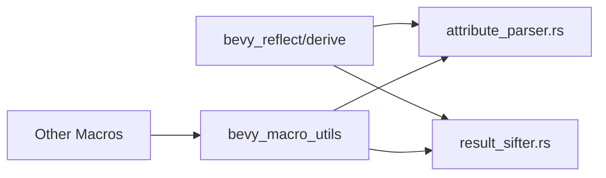

+++
title = "#18204 move utilities from bevy_reflect/derive to bevy_macro_utils"
date = "2025-09-11T00:00:00"
draft = false
template = "pull_request_page.html"
in_search_index = true

[taxonomies]
list_display = ["show"]

[extra]
current_language = "en"
available_languages = {"en" = { name = "English", url = "/pull_request/bevy/2025-09/pr-18204-en-20250911" }, "zh-cn" = { name = "中文", url = "/pull_request/bevy/2025-09/pr-18204-zh-cn-20250911" }}
labels = ["C-Code-Quality", "A-Utils", "D-Straightforward"]
+++

# move utilities from bevy_reflect/derive to bevy_macro_utils

## Basic Information
- **Title**: move utilities from bevy_reflect/derive to bevy_macro_utils
- **PR Link**: https://github.com/bevyengine/bevy/pull/18204
- **Author**: Bleachfuel
- **Status**: MERGED
- **Labels**: C-Code-Quality, S-Ready-For-Final-Review, A-Utils, D-Straightforward
- **Created**: 2025-03-09T01:09:54Z
- **Merged**: 2025-09-11T19:44:08Z
- **Merged By**: alice-i-cecile

## Description Translation
Some things in bevy_reflect/derive are better of in bevy_macro_utils, as every macro can use these.

## The Story of This Pull Request

This PR addresses a code organization issue in Bevy's macro infrastructure. The problem was that several utility modules in `bevy_reflect/derive` contained functionality that could be useful to other macros throughout the codebase, but they were only accessible within the reflection derive context.

The developer identified two key utility modules that had broader applicability:
1. `attribute_parser.rs` - containing a terminated parser function
2. `result_sifter.rs` - containing a result aggregation helper

The solution approach was straightforward: move these utilities to `bevy_macro_utils`, a shared crate designed specifically for macro utilities. This involved:
- Physically moving the files to the new location
- Changing their visibility from `pub(crate)` to `pub` to make them accessible to other crates
- Updating all references in the reflection derive code to use the new location
- Adding the modules to `bevy_macro_utils`'s public exports

The implementation required careful attention to import statements and visibility modifiers. In `container_attributes.rs` and `field_attributes.rs`, the `terminated_parser` import was updated from the local crate to `bevy_macro_utils`. Similarly, `derive_data.rs` was updated to import `ResultSifter` from the shared utils crate instead of locally.

This change demonstrates good software engineering practices by promoting code reuse and reducing duplication. The utilities are now available to any macro in the Bevy ecosystem, not just reflection macros. The impact is improved maintainability - future changes to these utilities only need to be made in one place, and other macro crates can leverage these well-tested components without reinventing them.

From a technical perspective, this change highlights the importance of proper crate organization in large Rust projects. The `bevy_macro_utils` crate serves as a central repository for shared macro functionality, following the principle of separation of concerns. The change also shows how visibility modifiers (`pub` vs `pub(crate)`) control access to functionality across crate boundaries.

## Visual Representation



## Key Files Changed

### `crates/bevy_macro_utils/src/lib.rs`
Added exports for the new parser and result_sifter modules:
```rust
// Added these modules to the crate
mod parser;
mod result_sifter;

// Added these to the public exports
pub use parser::*;
pub use result_sifter::*;
```

### `crates/bevy_macro_utils/src/parser.rs` (renamed from attribute_parser.rs)
Changed function visibility from crate-private to public:
```rust
// Before:
pub(crate) fn terminated_parser<T, P, F: FnMut(ParseStream) -> syn::Result<T>>(

// After:
pub fn terminated_parser<T, P, F: FnMut(ParseStream) -> syn::Result<T>>(
```

### `crates/bevy_macro_utils/src/result_sifter.rs`
Changed struct visibility from crate-private to public:
```rust
// Before:
pub(crate) struct ResultSifter<T> {

// After:
pub struct ResultSifter<T> {
```

### `crates/bevy_reflect/derive/src/container_attributes.rs`
Updated imports to use the moved utilities:
```rust
// Before:
use crate::{
    attribute_parser::terminated_parser, custom_attributes::CustomAttributes,
    derive_data::ReflectTraitToImpl,
};
use bevy_macro_utils::fq_std::{FQAny, FQClone, FQOption, FQResult};

// After:
use crate::{custom_attributes::CustomAttributes, derive_data::ReflectTraitToImpl};
use bevy_macro_utils::{
    fq_std::{FQAny, FQClone, FQOption, FQResult},
    terminated_parser,
};
```

### `crates/bevy_reflect/derive/src/field_attributes.rs`
Updated imports to use the moved utility:
```rust
// Before:
use crate::{
    attribute_parser::terminated_parser, custom_attributes::CustomAttributes,
    REFLECT_ATTRIBUTE_NAME,
};

// After:
use crate::{custom_attributes::CustomAttributes, REFLECT_ATTRIBUTE_NAME};
use bevy_macro_utils::terminated_parser;
```

### `crates/bevy_reflect/derive/src/derive_data.rs`
Updated imports to use the moved utility:
```rust
// Before:
use crate::{
    // ... other imports ...
    result_sifter::ResultSifter,
    // ... other imports ...
};

// After:
use crate::{
    // ... other imports ...
};
use bevy_macro_utils::ResultSifter;
```

### `crates/bevy_reflect/derive/src/lib.rs`
Removed the moved modules from the reflection derive crate:
```rust
// These modules were removed:
// mod attribute_parser;
// mod result_sifter;
```

## Further Reading

- [Rust Modules and Visibility](https://doc.rust-lang.org/book/ch07-02-defining-modules-to-control-scope-and-privacy.html)
- [Bevy Engine Macro Utilities](https://github.com/bevyengine/bevy/tree/main/crates/bevy_macro_utils)
- [Syn crate for procedural macros](https://docs.rs/syn/latest/syn/)
- [Rust Procedural Macros Guide](https://doc.rust-lang.org/reference/procedural-macros.html)