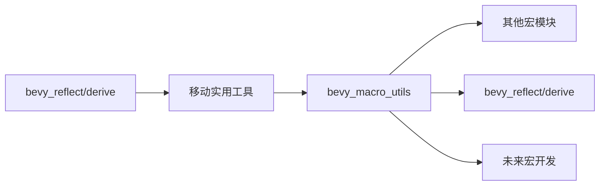

+++
title = "#18204 move utilities from bevy_reflect/derive to bevy_macro_utils"
date = "2025-09-11T00:00:00"
draft = false
template = "pull_request_page.html"
in_search_index = false

[extra]
current_language = "zh-cn"
available_languages = {"en" = { name = "English", url = "/pull_request/bevy/2025-09/pr-18204-en-20250911" }, "zh-cn" = { name = "中文", url = "/pull_request/bevy/2025-09/pr-18204-zh-cn-20250911" }}
+++

# move utilities from bevy_reflect/derive to bevy_macro_utils

## 基本信息
- **标题**: move utilities from bevy_reflect/derive to bevy_macro_utils
- **PR链接**: https://github.com/bevyengine/bevy/pull/18204
- **作者**: Bleachfuel
- **状态**: 已合并
- **标签**: C-Code-Quality, S-Ready-For-Final-Review, A-Utils, D-Straightforward
- **创建时间**: 2025-03-09T01:09:54Z
- **合并时间**: 2025-09-11T19:44:08Z
- **合并者**: alice-i-cecile

## 描述翻译
将 bevy_reflect/derive 中的一些工具函数移动到 bevy_macro_utils 中，这样所有宏都可以使用这些工具。

## 本次PR的技术故事

这个PR的核心是一个代码重构任务，目的是将一些通用的宏工具函数从特定的bevy_reflect派生模块中提取出来，放到更通用的bevy_macro_utils工具库中。

### 问题与背景

在Bevy引擎的代码库中，`bevy_reflect/derive`模块包含了一些用于处理属性解析和结果处理的实用工具函数。这些函数虽然最初是为了反射系统的派生宏而开发的，但实际上具有更广泛的适用性。问题在于这些有用的工具被限制在反射模块内部，其他地方的宏无法重用这些功能。

具体来说，`terminated_parser`和`ResultSifter`这两个实用工具：
- `terminated_parser`: 提供终止符解析功能，类似于`Punctuated::parse_terminated`但接受闭包而不是函数指针
- `ResultSifter`: 帮助处理`Result<Vec<T>, syn::Error>`迭代器，能够将多个错误合并为一个

这些工具在其他宏开发场景中也会很有用，但之前由于位置限制无法被其他模块使用。

### 解决方案方法

开发者采取了直接且有效的解决方案：将这两个通用工具函数从`bevy_reflect/derive`移动到`bevy_macro_utils`模块中。这个方案的选择很合理，因为：

1. `bevy_macro_utils`本身就是为共享宏工具而设计的模块
2. 移动而不是复制避免了代码重复
3. 只需调整导入路径，不需要修改核心逻辑

### 具体实现

实现过程主要涉及以下几个步骤：

1. **文件移动和重命名**: 将`attribute_parser.rs`重命名为`parser.rs`并移动到新位置
2. **可见性调整**: 将工具函数从`pub(crate)`改为`pub`，使其可以被外部模块使用
3. **导入路径更新**: 在原来使用这些工具的地方更新导入语句

关键的技术细节包括：

```rust
// 在 bevy_macro_utils/src/lib.rs 中导出新模块
pub use parser::*;
pub use result_sifter::*;
```

```rust
// 在 bevy_macro_utils/src/parser.rs 中修改可见性
pub fn terminated_parser<T, P, F: FnMut(ParseStream) -> syn::Result<T>>(
    terminator: P,
    mut parser: F,
) -> impl FnOnce(ParseStream) -> syn::Result<Punctuated<T, P::Token>>
```

```rust
// 在 bevy_macro_utils/src/result_sifter.rs 中修改可见性
pub struct ResultSifter<T> {
    items: Vec<T>,
    errors: Option<syn::Error>,
}
```

### 技术洞察

这个重构展示了几个重要的软件工程原则：

1. **关注点分离**: 将通用工具与特定功能分离，提高代码的模块化程度
2. **代码重用**: 通过将工具移动到共享位置，避免了未来可能的代码重复
3. **API设计**: 适当调整可见性修饰符来暴露有用的功能，同时保持封装性

从技术角度看，`terminated_parser`函数提供了一个更灵活的解析接口，允许使用闭包而不是函数指针，这在Rust中提供了更大的表达能力和更好的捕获上下文能力。

### 影响与价值

这个改动虽然看似简单，但对代码库有几个积极影响：

1. **提高代码可维护性**: 通用工具现在位于适当的位置，减少了特殊用例的代码
2. **促进代码重用**: 其他宏现在可以方便地使用这些经过验证的工具函数
3. **保持一致性**: 整个代码库的宏开发可以使用相同的工具集，提高一致性
4. **无破坏性更改**: 由于只是移动代码和调整导入，不会影响现有功能

## 可视化表示



## 关键文件变更

### `crates/bevy_macro_utils/src/lib.rs`
增加了对新模块的导出：
```rust
// 新增导出
pub use parser::*;
pub use result_sifter::*;
```

### `crates/bevy_macro_utils/src/parser.rs` (从 bevy_reflect/derive 移动而来)
修改了函数可见性：
```rust
// 之前: 
pub(crate) fn terminated_parser<T, P, F: FnMut(ParseStream) -> syn::Result<T>>(

// 之后:
pub fn terminated_parser<T, P, F: FnMut(ParseStream) -> syn::Result<T>>(
```

### `crates/bevy_macro_utils/src/result_sifter.rs` (从 bevy_reflect/derive 移动而来)
修改了结构体可见性：
```rust
// 之前:
pub(crate) struct ResultSifter<T> {

// 之后:
pub struct ResultSifter<T> {
```

### `crates/bevy_reflect/derive/src/container_attributes.rs`
更新了导入路径：
```rust
// 之前:
use crate::{
    attribute_parser::terminated_parser, custom_attributes::CustomAttributes,
    derive_data::ReflectTraitToImpl,
};
use bevy_macro_utils::fq_std::{FQAny, FQClone, FQOption, FQResult};

// 之后:
use crate::{custom_attributes::CustomAttributes, derive_data::ReflectTraitToImpl};
use bevy_macro_utils::{
    fq_std::{FQAny, FQClone, FQOption, FQResult},
    terminated_parser,
};
```

### `crates/bevy_reflect/derive/src/field_attributes.rs`
更新了导入路径：
```rust
// 之前:
use crate::{
    attribute_parser::terminated_parser, custom_attributes::CustomAttributes,
    REFLECT_ATTRIBUTE_NAME,
};

// 之后:
use crate::{custom_attributes::CustomAttributes, REFLECT_ATTRIBUTE_NAME};
use bevy_macro_utils::terminated_parser;
```

### `crates/bevy_reflect/derive/src/derive_data.rs`
更新了导入路径：
```rust
// 之前:
use crate::{
    // ...
    result_sifter::ResultSifter,
    // ...
};

// 之后:
use bevy_macro_utils::ResultSifter;
```

### `crates/bevy_reflect/derive/src/lib.rs`
移除了不再需要的模块声明：
```rust
// 移除了这两个模块
-mod attribute_parser;
-mod result_sifter;
```

## 扩展阅读

- [Rust模块系统文档](https://doc.rust-lang.org/book/ch07-02-defining-modules-to-control-scope-and-privacy.html)
- [Syn库解析文档](https://docs.rs/syn/latest/syn/) - 用于解析Rust代码的库
- [Bevy宏工具指南](https://github.com/bevyengine/bevy/blob/main/CRATE_GUIDELINES.md#macros)