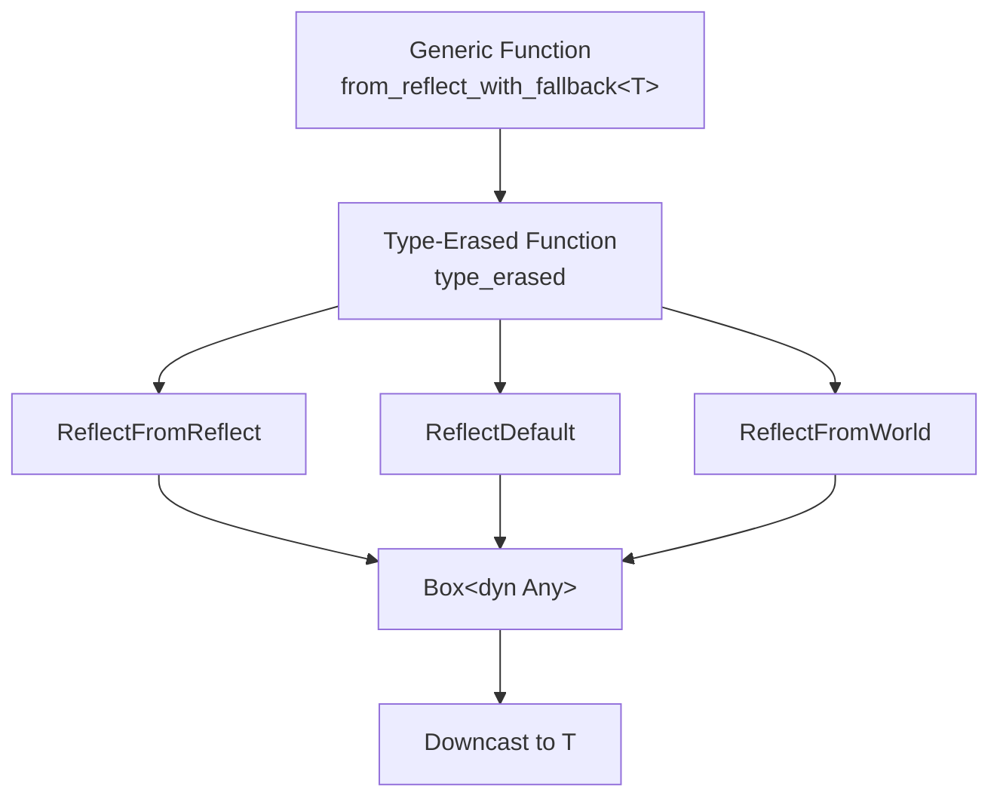

+++
title = "#18296 Shrink from_reflect_with_fallback"
date = "2025-09-01T00:00:00"
draft = false
template = "pull_request_page.html"
in_search_index = true

[taxonomies]
list_display = ["show"]

[extra]
current_language = "en"
available_languages = {"en" = { name = "English", url = "/pull_request/bevy/2025-09/pr-18296-en-20250901" }, "zh-cn" = { name = "中文", url = "/pull_request/bevy/2025-09/pr-18296-zh-cn-20250901" }}
labels = ["C-Performance", "A-Reflection", "D-Straightforward"]
+++

# Title
Shrink from_reflect_with_fallback

## Basic Information
- **Title**: Shrink from_reflect_with_fallback
- **PR Link**: https://github.com/bevyengine/bevy/pull/18296
- **Author**: SpecificProtagonist
- **Status**: MERGED
- **Labels**: C-Performance, S-Ready-For-Final-Review, A-Reflection, D-Straightforward
- **Created**: 2025-03-13T13:45:44Z
- **Merged**: 2025-09-01T22:55:32Z
- **Merged By**: alice-i-cecile

## Description Translation
# Objective

Reduce duplicate code generated by `from_reflect_with_fallback`.

## Solution

Polymorphize part of the function.

In a binary with `#[reflect(Component)]` for 100 types (and nothing else), this reduces the size of the release binary by 3.8% in my testing.

The impact on a normal Bevy app will be almost nothing, but I'm hoping to make more PRs like this.

## The Story of This Pull Request

The PR addresses a common issue in Rust's monomorphization system where generic functions generate duplicate machine code for each concrete type they're instantiated with. The `from_reflect_with_fallback` function in Bevy's reflection system was particularly affected by this, as it was used extensively with many different types through the `#[reflect(Component)]` attribute.

The core problem was straightforward: every time `from_reflect_with_fallback` was used with a different type `T`, the Rust compiler would generate a complete copy of the function's machine code specialized for that type. This led to significant binary bloat, especially in applications using many reflected components.

The solution implemented a technique called polymorphization - extracting the type-generic logic into a separate function that uses dynamic dispatch via trait objects (`dyn PartialReflect`) and `TypeId` instead of static generics. The key insight was that most of the function's logic didn't actually depend on the concrete type `T`, but rather on type-erased reflection data that could be handled uniformly.

The implementation creates a new `type_erased` function that:
1. Takes type-erased parameters (`dyn PartialReflect`, `TypeId`, etc.)
2. Handles all three fallback strategies (FromReflect, Default, FromWorld) uniformly
3. Returns a boxed `dyn Any` that can be downcast to the concrete type

The original generic function now serves as a thin wrapper that calls this type-erased implementation and performs the final downcast. The `#[inline(never)]` attribute ensures the type-erased function isn't inlined and duplicated across call sites.

This approach demonstrates a practical application of Rust's type erasure patterns to combat code bloat from monomorphization, while maintaining the same API and functionality for callers.

## Visual Representation



## Key Files Changed

### `crates/bevy_ecs/src/reflect/mod.rs` (+48/-46)

This file contains the reflection utilities for Bevy's ECS system. The changes focus on optimizing the `from_reflect_with_fallback` function to reduce code duplication through polymorphization.

**Before:**
```rust
pub fn from_reflect_with_fallback<T: Reflect + TypePath>(
    reflected: &dyn Reflect,
    world: &mut World,
    registry: &TypeRegistry,
) -> T {
    fn different_type_error<T: TypePath>(reflected: &str) -> ! {
        panic!(
            "The registration for the reflected `{}` trait for the type `{}` produced \
            a value of a different type",
            reflected,
            T::type_path(),
        );
    }

    // First, try `FromReflect`. This is handled differently from the others because
    // it doesn't need a subsequent `apply` and may fail.
    if let Some(reflect_from_reflect) =
        registry.get_type_data::<ReflectFromReflect>(TypeId::of::<T>())
    {
        // If it fails it's ok, we can continue checking `Default` and `FromWorld`.
        if let Some(value) = reflect_from_reflect.from_reflect(reflected) {
            return value
                .take::<T>()
                .unwrap_or_else(|_| different_type_error::<T>("FromReflect"));
        }
    }

    // Create an instance of `T` using either the reflected `Default` or `FromWorld`.
    let mut value = if let Some(reflect_default) =
        registry.get_type_data::<ReflectDefault>(TypeId::of::<T>())
    {
        reflect_default
            .default()
            .take::<T>()
            .unwrap_or_else(|_| different_type_error::<T>("Default"))
    } else if let Some(reflect_from_world) =
        registry.get_type_data::<ReflectFromWorld>(TypeId::of::<T>())
    {
        reflect_from_world
            .from_world(world)
            .take::<T>()
            .unwrap_or_else(|_| different_type_error::<T>("FromWorld"))
    } else {
        panic!(
            "Couldn't create an instance of `{}` using the reflected `FromReflect`, \
            `Default` or `FromWorld` traits. Are you perhaps missing a `#[reflect(Default)]` \
            or `#[reflect(FromWorld)]`?",
            // FIXME: once we have unique reflect, use `TypePath`.
            DebugName::type_name::<T>(),
        );
    };

    value.apply(reflected);
    value
}
```

**After:**
```rust
pub fn from_reflect_with_fallback<T: Reflect + TypePath>(
    reflected: &dyn Reflect,
    world: &mut World,
    registry: &TypeRegistry,
) -> T {
    #[inline(never)]
    fn type_erased(
        reflected: &dyn PartialReflect,
        world: &mut World,
        registry: &TypeRegistry,
        id: TypeId,
        name: DebugName,
    ) -> alloc::boxed::Box<dyn core::any::Any> {
        // First, try `FromReflect`. This is handled differently from the others because
        // it doesn't need a subsequent `apply` and may fail.
        // If it fails it's ok, we can continue checking `Default` and `FromWorld`.
        let (value, source) = if let Some(value) = registry
            .get_type_data::<ReflectFromReflect>(id)
            .and_then(|reflect_from_reflect| reflect_from_reflect.from_reflect(reflected))
        {
            (value, "FromReflect")
        }
        // Create an instance of `T` using either the reflected `Default` or `FromWorld`.
        else if let Some(reflect_default) = registry.get_type_data::<ReflectDefault>(id) {
            let mut value = reflect_default.default();
            value.apply(reflected);
            (value, "Default")
        } else if let Some(reflect_from_world) = registry.get_type_data::<ReflectFromWorld>(id) {
            let mut value = reflect_from_world.from_world(world);
            value.apply(reflected);
            (value, "FromWorld")
        } else {
            panic!(
                "Couldn't create an instance of `{name}` using the reflected `FromReflect`, \
                `Default` or `FromWorld` traits. Are you perhaps missing a `#[reflect(Default)]` \
                or `#[reflect(FromWorld)]`?",
            );
        };
        assert_eq!(
            value.as_any().type_id(),
            id,
            "The registration for the reflected `{source}` trait for the type `{name}` produced \
            a value of a different type",
        );
        value
    }
    *type_erased(
        reflected,
        world,
        registry,
        TypeId::of::<T>(),
        // FIXME: once we have unique reflect, use `TypePath`.
        DebugName::type_name::<T>(),
    )
    .downcast::<T>()
    .unwrap()
}
```

## Further Reading

- [Rust Performance Book: Monomorphization](https://nnethercote.github.io/perf-book/compile-times.html#monomorphization)
- [Rust Blog: Polymorphization](https://blog.rust-lang.org/inside-rust/2020/02/25/polymorphisation.html)
- [Bevy Reflection Documentation](https://docs.rs/bevy_reflect/latest/bevy_reflect/)
- [Rust Type Erasure Patterns](https://www.codeproject.com/Articles/1250465/Type-Erasure-in-Rust)