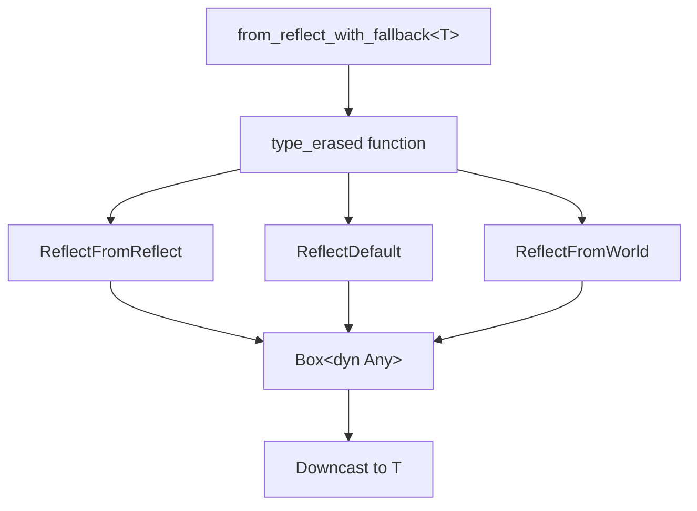

+++
title = "#18296 Shrink from_reflect_with_fallback"
date = "2025-09-01T00:00:00"
draft = false
template = "pull_request_page.html"
in_search_index = false

[extra]
current_language = "zh-cn"
available_languages = {"en" = { name = "English", url = "/pull_request/bevy/2025-09/pr-18296-en-20250901" }, "zh-cn" = { name = "中文", url = "/pull_request/bevy/2025-09/pr-18296-zh-cn-20250901" }}
labels = ["C-Performance", "A-Reflection", "D-Straightforward"]
+++

# Title
Shrink from_reflect_with_fallback

## Basic Information
- **Title**: Shrink from_reflect_with_fallback
- **PR Link**: https://github.com/bevyengine/bevy/pull/18296
- **Author**: SpecificProtagonist
- **Status**: MERGED
- **Labels**: C-Performance, S-Ready-For-Final-Review, A-Reflection, D-Straightforward
- **Created**: 2025-03-13T13:45:44Z
- **Merged**: 2025-09-01T22:55:32Z
- **Merged By**: alice-i-cecile

## Description Translation
# Objective

减少 `from_reflect_with_fallback` 生成的重复代码。

## Solution

对函数的一部分进行多态化处理。

在一个包含 100 个类型使用 `#[reflect(Component)]`（且没有其他内容）的二进制文件中，此更改使发布版本二进制文件大小减少了 3.8%。

对普通 Bevy 应用的影响几乎为零，但我希望制作更多类似的 PR。

## The Story of This Pull Request

这个 PR 解决了 Bevy 反射系统中一个具体的代码膨胀问题。`from_reflect_with_fallback` 函数负责从反射数据回退创建具体类型实例，由于 Rust 的单态化机制，每个使用该函数的类型都会生成一份独立的机器码副本。

问题的核心在于，原始实现完全依赖于泛型类型参数 T，导致编译器为每个不同的 T 生成完全独立的函数实例。即使这些函数的逻辑几乎完全相同，只是操作的类型不同，也会产生大量的代码重复。

解决方案采用了类型擦除技术，将核心逻辑提取到一个独立的 `type_erased` 函数中。这个新函数通过 `TypeId` 和类型名称来标识具体类型，而不是直接使用泛型参数。这样，无论有多少种类型使用这个功能，`type_erased` 函数只需要编译一次，显著减少了生成的机器码体积。

具体实现上，`type_erased` 函数处理三种创建实例的途径：
1. 首先尝试使用 `ReflectFromReflect`（如果可用）
2. 然后回退到 `ReflectDefault`（如果可用）
3. 最后尝试 `ReflectFromWorld`（如果可用）

每种途径都返回装箱的 `dyn Any` 值，外部函数再将其向下转换为具体类型。错误处理也进行了统一，使用运行时类型检查确保类型一致性。

`#[inline(never)]` 属性确保编译器不会内联这个函数，避免内联可能带来的代码膨胀，这是保持优化效果的关键。

性能影响可以忽略不计，因为类型检查和向下转换的开销很小，而代码体积的减少可能反而改善缓存利用率。测试显示在包含 100 个反射类型的场景中，二进制大小减少了 3.8%，这对于大型项目或资源受限环境是有意义的优化。

## Visual Representation



## Key Files Changed

### `crates/bevy_ecs/src/reflect/mod.rs` (+48/-46)

这个文件包含了反射系统的核心实现。主要更改是将 `from_reflect_with_fallback` 函数重构为使用类型擦除的实现方式。

**修改前:**
```rust
pub fn from_reflect_with_fallback<T: Reflect + TypePath>(
    reflected: &dyn Reflect,
    world: &mut World,
    registry: &TypeRegistry,
) -> T {
    fn different_type_error<T: TypePath>(reflected: &str) -> ! {
        panic!(
            "The registration for the reflected `{}` trait for the type `{}` produced \
            a value of a different type",
            reflected,
            T::type_path(),
        );
    }

    // First, try `FromReflect`. This is handled differently from the others because
    // it doesn't need a subsequent `apply` and may fail.
    if let Some(reflect_from_reflect) =
        registry.get_type_data::<ReflectFromReflect>(TypeId::of::<T>())
    {
        // If it fails it's ok, we can continue checking `Default` and `FromWorld`.
        if let Some(value) = reflect_from_reflect.from_reflect(reflected) {
            return value
                .take::<T>()
                .unwrap_or_else(|_| different_type_error::<T>("FromReflect"));
        }
    }

    // Create an instance of `T` using either the reflected `Default` or `FromWorld`.
    let mut value = if let Some(reflect_default) =
        registry.get_type_data::<ReflectDefault>(TypeId::of::<T>())
    {
        reflect_default
            .default()
            .take::<T>()
            .unwrap_or_else(|_| different_type_error::<T>("Default"))
    } else if let Some(reflect_from_world) =
        registry.get_type_data::<ReflectFromWorld>(TypeId::of::<T>())
    {
        reflect_from_world
            .from_world(world)
            .take::<T>()
            .unwrap_or_else(|_| different_type_error::<T>("FromWorld"))
    } else {
        panic!(
            "Couldn't create an instance of `{}` using the reflected `FromReflect`, \
            `Default` or `FromWorld` traits. Are you perhaps missing a `#[reflect(Default)]` \
            or `#[reflect(FromWorld)]`?",
            // FIXME: once we have unique reflect, use `TypePath`.
            DebugName::type_name::<T>(),
        );
    };

    value.apply(reflected);
    value
}
```

**修改后:**
```rust
pub fn from_reflect_with_fallback<T: Reflect + TypePath>(
    reflected: &dyn Reflect,
    world: &mut World,
    registry: &TypeRegistry,
) -> T {
    #[inline(never)]
    fn type_erased(
        reflected: &dyn Reflect,
        world: &mut World,
        registry: &TypeRegistry,
        id: TypeId,
        name: DebugName,
    ) -> alloc::boxed::Box<dyn core::any::Any> {
        // First, try `FromReflect`. This is handled differently from the others because
        // it doesn't need a subsequent `apply` and may fail.
        // If it fails it's ok, we can continue checking `Default` and `FromWorld`.
        let (value, source) = if let Some(value) = registry
            .get_type_data::<ReflectFromReflect>(id)
            .and_then(|reflect_from_reflect| reflect_from_reflect.from_reflect(reflected))
        {
            (value, "FromReflect")
        }
        // Create an instance of `T` using either the reflected `Default` or `FromWorld`.
        else if let Some(reflect_default) = registry.get_type_data::<ReflectDefault>(id) {
            let mut value = reflect_default.default();
            value.apply(reflected);
            (value, "Default")
        } else if let Some(reflect_from_world) = registry.get_type_data::<ReflectFromWorld>(id) {
            let mut value = reflect_from_world.from_world(world);
            value.apply(reflected);
            (value, "FromWorld")
        } else {
            panic!(
                "Couldn't create an instance of `{name}` using the reflected `FromReflect`, \
                `Default` or `FromWorld` traits. Are you perhaps missing a `#[reflect(Default)]` \
                or `#[reflect(FromWorld)]`?",
            );
        };
        assert_eq!(
            value.as_any().type_id(),
            id,
            "The registration for the reflected `{source}` trait for the type `{name}` produced \
            a value of a different type",
        );
        value
    }
    *type_erased(
        reflected,
        world,
        registry,
        TypeId::of::<T>(),
        // FIXME: once we have unique reflect, use `TypePath`.
        DebugName::type_name::<T>(),
    )
    .downcast::<T>()
    .unwrap()
}
```

## Further Reading

- [Rust 单态化与代码膨胀](https://doc.rust-lang.org/book/ch10-01-syntax.html#performance-of-code-using-generics)
- [Bevy 反射系统文档](https://bevyengine.org/learn/quick-start/reflection/)
- [类型擦除技术在 Rust 中的应用](https://lukasatkinson.de/2018/type-erasure-in-rust/)
- [Rust 中的动态分发与静态分发](https://blog.logrocket.com/rust-traits-a-deep-dive/)