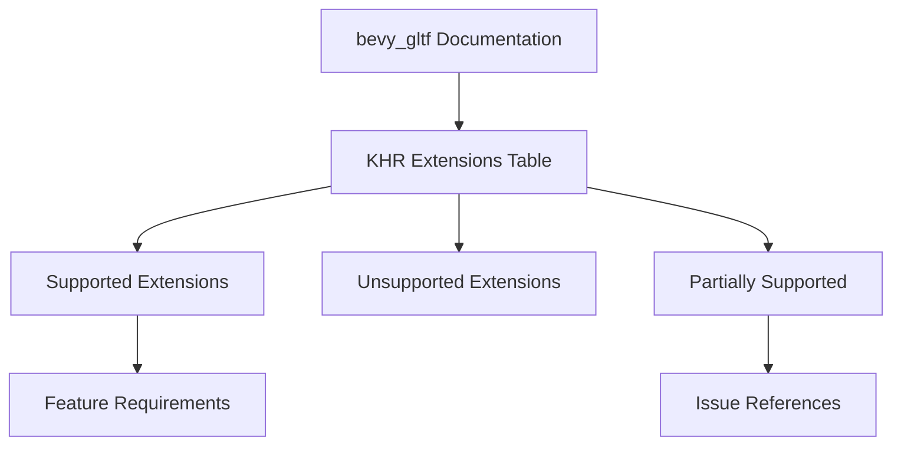

+++
title = "#19100 Add list of supported KHR extensions to bevy_gltf's docs"
date = "2025-09-29T00:00:00"
draft = false
template = "pull_request_page.html"
in_search_index = true

[taxonomies]
list_display = ["show"]

[extra]
current_language = "en"
available_languages = {"en" = { name = "English", url = "/pull_request/bevy/2025-09/pr-19100-en-20250929" }, "zh-cn" = { name = "中文", url = "/pull_request/bevy/2025-09/pr-19100-zh-cn-20250929" }}
labels = ["C-Docs", "D-Straightforward", "A-glTF"]
+++

# Title
Add list of supported KHR extensions to bevy_gltf's docs

## Basic Information
- **Title**: Add list of supported KHR extensions to bevy_gltf's docs
- **PR Link**: https://github.com/bevyengine/bevy/pull/19100
- **Author**: jf908
- **Status**: MERGED
- **Labels**: C-Docs, S-Ready-For-Final-Review, D-Straightforward, A-glTF
- **Created**: 2025-05-06T14:30:47Z
- **Merged**: 2025-09-29T22:37:53Z
- **Merged By**: alice-i-cecile

## Description Translation
# Objective

- Fixes #15068

## Solution

- Docs!

## Testing

I created this list by browsing Bevy's source code rather than testing gltf files so its possible there is some partial/wonky support I didn't uncover.

## The Story of This Pull Request

This PR addresses a documentation gap in the bevy_gltf module. The problem was straightforward: users had no clear reference for which glTF KHR extensions were supported by Bevy, making it difficult to determine if their glTF assets would load correctly or what features they could rely on.

The developer took a practical approach to solving this by adding comprehensive documentation directly to the bevy_gltf module's lib.rs file. Rather than implementing new functionality, this change focuses on making existing capabilities discoverable. The solution involved creating a detailed table that clearly indicates support status for each ratified Khronos extension.

The implementation consists of a well-structured markdown table that shows:
- Extension names
- Support status (✅ or ❌)
- Required Bevy features where applicable
- Important notes about partial support

What makes this documentation particularly valuable is the inclusion of nuanced details. For example, the table notes that while Bevy supports ktx2 and webp formats, it doesn't support the extension's syntax, and provides a link to the relevant issue (#19104). Similarly, it clarifies that KHR_texture_transform is only partially supported on base_color_texture, with a reference to issue #15310.

The technical insight here is that good documentation saves developers time by providing clear, authoritative information about supported features. Without this table, developers would need to either test each extension manually or search through Bevy's source code to determine support - both time-consuming processes.

This change has immediate practical impact by giving Bevy users a reliable reference for planning their 3D asset pipelines. The documentation follows established patterns in the Rust ecosystem by providing feature-specific information, helping users understand which cargo features they need to enable for particular extension support.

## Visual Representation



## Key Files Changed

**File: `crates/bevy_gltf/src/lib.rs`** (+37/-0)

This file received a documentation-only change that adds a comprehensive table of supported KHR extensions to the module-level documentation.

**Key Changes:**
```rust
// File: crates/bevy_gltf/src/lib.rs
// Before: Documentation ended after the GltfAssetLabel section

// After: Added new section with extension support table
//! # Supported KHR Extensions
//!
//! glTF files may use functionality beyond the base glTF specification, specified as a list of
//! required extensions. The table below shows which of the ratified Khronos extensions are
//! supported by Bevy.
//!
//! | Extension                         | Supported | Requires feature                    |
//! | --------------------------------- | --------- | ----------------------------------- |
//! | `KHR_animation_pointer`           | ❌        |                                     |
//! | `KHR_draco_mesh_compression`      | ❌        |                                     |
//! | `KHR_lights_punctual`             | ✅        |                                     |
//! | `KHR_materials_anisotropy`        | ✅        | `pbr_anisotropy_texture`            |
//! | `KHR_materials_clearcoat`         | ✅        | `pbr_multi_layer_material_textures` |
//! | ... (additional rows) ...
//!
//! \*Bevy supports ktx2 and webp formats but doesn't support the extension's syntax, see [#19104](https://github.com/bevyengine/bevy/issues/19104).
//!
//! \**`KHR_texture_transform` is only supported on `base_color_texture`, see [#15310](https://github.com/bevyengine/bevy/issues/15310).
//!
//! See the [glTF Extension Registry](https://github.com/KhronosGroup/glTF/blob/main/extensions/README.md) for more information on extensions.
```

The changes provide:
1. A clear overview of extension support status
2. Feature requirement information for enabled extensions
3. References to relevant GitHub issues for partial support cases
4. Links to external documentation for further reading

## Further Reading

- [glTF Extension Registry](https://github.com/KhronosGroup/glTF/blob/main/extensions/README.md) - Official list of all glTF extensions
- [Bevy glTF Loading Documentation](https://bevyengine.org/learn/quick-start/assets/gltf/) - Bevy's official glTF loading guide
- [Issue #15068](https://github.com/bevyengine/bevy/issues/15068) - The original issue requesting this documentation
- [glTF 2.0 Specification](https://www.khronos.org/gltf/) - Official glTF specification

# Full Code Diff
```diff
diff --git a/crates/bevy_gltf/src/lib.rs b/crates/bevy_gltf/src/lib.rs
index 02c14f4197117..cca4e96f4b7e1 100644
--- a/crates/bevy_gltf/src/lib.rs
+++ b/crates/bevy_gltf/src/lib.rs
@@ -89,6 +89,43 @@
 //! Be careful when using this feature, if you misspell a label it will simply ignore it without warning.
 //!
 //! You can use [`GltfAssetLabel`] to ensure you are using the correct label.
+//!
+//! # Supported KHR Extensions
+//!
+//! glTF files may use functionality beyond the base glTF specification, specified as a list of
+//! required extensions. The table below shows which of the ratified Khronos extensions are
+//! supported by Bevy.
+//!
+//! | Extension                         | Supported | Requires feature                    |
+//! | --------------------------------- | --------- | ----------------------------------- |
+//! | `KHR_animation_pointer`           | ❌        |                                     |
+//! | `KHR_draco_mesh_compression`      | ❌        |                                     |
+//! | `KHR_lights_punctual`             | ✅        |                                     |
+//! | `KHR_materials_anisotropy`        | ✅        | `pbr_anisotropy_texture`            |
+//! | `KHR_materials_clearcoat`         | ✅        | `pbr_multi_layer_material_textures` |
+//! | `KHR_materials_dispersion`        | ❌        |                                     |
+//! | `KHR_materials_emissive_strength` | ✅        |                                     |
+//! | `KHR_materials_ior`               | ✅        |                                     |
+//! | `KHR_materials_iridescence`       | ❌        |                                     |
+//! | `KHR_materials_sheen`             | ❌        |                                     |
+//! | `KHR_materials_specular`          | ✅        | `pbr_specular_textures`             |
+//! | `KHR_materials_transmission`      | ✅        | `pbr_transmission_textures`         |
+//! | `KHR_materials_unlit`             | ✅        |                                     |
+//! | `KHR_materials_variants`          | ❌        |                                     |
+//! | `KHR_materials_volume`            | ✅        |                                     |
+//! | `KHR_mesh_quantization`           | ❌        |                                     |
+//! | `KHR_texture_basisu`              | ❌\*      |                                     |
+//! | `KHR_texture_transform`           | ✅\**     |                                     |
+//! | `KHR_xmp_json_ld`                 | ❌        |                                     |
+//! | `EXT_mesh_gpu_instancing`         | ❌        |                                     |
+//! | `EXT_meshopt_compression`         | ❌        |                                     |
+//! | `EXT_texture_webp`                | ❌\*      |                                     |
+//!
+//! \*Bevy supports ktx2 and webp formats but doesn't support the extension's syntax, see [#19104](https://github.com/bevyengine/bevy/issues/19104).
+//!
+//! \**`KHR_texture_transform` is only supported on `base_color_texture`, see [#15310](https://github.com/bevyengine/bevy/issues/15310).
+//!
+//! See the [glTF Extension Registry](https://github.com/KhronosGroup/glTF/blob/main/extensions/README.md) for more information on extensions.
 
 mod assets;
 mod label;
```