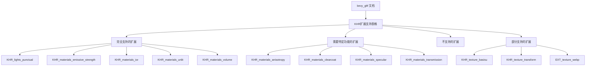

+++
title = "#19100 Add list of supported KHR extensions to bevy_gltf's docs"
date = "2025-09-29T00:00:00"
draft = false
template = "pull_request_page.html"
in_search_index = false

[extra]
current_language = "zh-cn"
available_languages = {"en" = { name = "English", url = "/pull_request/bevy/2025-09/pr-19100-en-20250929" }, "zh-cn" = { name = "中文", url = "/pull_request/bevy/2025-09/pr-19100-zh-cn-20250929" }}
+++

# Add list of supported KHR extensions to bevy_gltf's docs

## 基本信息
- **标题**: Add list of supported KHR extensions to bevy_gltf's docs
- **PR链接**: https://github.com/bevyengine/bevy/pull/19100
- **作者**: jf908
- **状态**: 已合并
- **标签**: C-Docs, S-Ready-For-Final-Review, D-Straightforward, A-glTF
- **创建时间**: 2025-05-06T14:30:47Z
- **合并时间**: 2025-09-29T22:37:53Z
- **合并者**: alice-i-cecile

## 描述翻译
# 目标

- 修复 #15068

## 解决方案

- 文档！

## 测试

我通过浏览Bevy的源代码创建了这个列表，而不是通过测试gltf文件，因此可能有一些部分支持或异常的支持我没有发现。

## 这个Pull Request的故事

这个PR的故事始于一个常见的开发者痛点：缺乏清晰的扩展支持文档。当开发者使用bevy_gltf模块处理glTF文件时，他们经常遇到一个问题：不清楚哪些Khronos (KHR) 扩展被支持，哪些需要特定的功能标志，以及哪些完全不受支持。

问题#15068记录了这种信息缺失的情况。在3D图形开发中，glTF文件经常使用各种扩展来提供超出基础规范的功能，比如高级材质属性、压缩格式或动画功能。没有明确的文档，开发者只能通过试错或深入阅读源代码来了解支持情况，这显著降低了开发效率。

开发者jf908采取了直接而实用的解决方案：在bevy_gltf的模块级文档中添加一个全面的支持表格。这个解决方案虽然简单，但对用户体验的改善是显著的。通过系统性地浏览Bevy的源代码，作者整理出了当前支持的所有KHR扩展，并标注了每个扩展的支持状态和任何必要的功能依赖。

这个实现展示了良好的技术文档实践。表格设计清晰，使用emoji图标（✅和❌）直观地表示支持状态，并在脚注中提供了重要的限定条件说明。特别值得注意的是，作者诚实地指出了某些扩展的部分支持情况，比如`KHR_texture_basisu`和`KHR_texture_transform`，并链接到相关的issue进行详细说明。

从技术角度看，这个文档更新体现了几个重要的工程原则：

1. **透明性**：明确告知用户系统的能力和限制
2. **可维护性**：当扩展支持状态改变时，这个表格可以轻松更新
3. **用户体验**：开发者可以快速查找信息而无需深入代码

作者在测试说明中表现出了工程严谨性，明确指出这个列表是通过代码审查而非实际文件测试创建的，这为未来的验证和改进留下了空间。

这个PR的影响虽然不涉及代码功能改变，但对开发者体验的改善是实质性的。它减少了开发者的不确定性，提供了明确的期望管理，并为社区贡献者提供了清晰的路线图，展示了哪些扩展还有待实现。

## 可视化表示



## 关键文件变更

**crates/bevy_gltf/src/lib.rs** (+37/-0)

这个文件包含了bevy_gltf模块的主要文档。变更在现有的模块级文档中添加了一个完整的KHR扩展支持表格。

### 关键修改：

```rust
// File: crates/bevy_gltf/src/lib.rs
// 新增的文档内容：
//! # Supported KHR Extensions
//!
//! glTF files may use functionality beyond the base glTF specification, specified as a list of
//! required extensions. The table below shows which of the ratified Khronos extensions are
//! supported by Bevy.
//!
//! | Extension                         | Supported | Requires feature                    |
//! | --------------------------------- | --------- | ----------------------------------- |
//! | `KHR_animation_pointer`           | ❌        |                                     |
//! | `KHR_draco_mesh_compression`      | ❌        |                                     |
//! | `KHR_lights_punctual`             | ✅        |                                     |
//! | `KHR_materials_anisotropy`        | ✅        | `pbr_anisotropy_texture`            |
//! | `KHR_materials_clearcoat`         | ✅        | `pbr_multi_layer_material_textures` |
//! | `KHR_materials_dispersion`        | ❌        |                                     |
//! | `KHR_materials_emissive_strength` | ✅        |                                     |
//! | `KHR_materials_ior`               | ✅        |                                     |
//! | `KHR_materials_iridescence`       | ❌        |                                     |
//! | `KHR_materials_sheen`             | ❌        |                                     |
//! | `KHR_materials_specular`          | ✅        | `pbr_specular_textures`             |
//! | `KHR_materials_transmission`      | ✅        | `pbr_transmission_textures`         |
//! | `KHR_materials_unlit`             | ✅        |                                     |
//! | `KHR_materials_variants`          | ❌        |                                     |
//! | `KHR_materials_volume`            | ✅        |                                     |
//! | `KHR_mesh_quantization`           | ❌        |                                     |
//! | `KHR_texture_basisu`              | ❌\*      |                                     |
//! | `KHR_texture_transform`           | ✅\**     |                                     |
//! | `KHR_xmp_json_ld`                 | ❌        |                                     |
//! | `EXT_mesh_gpu_instancing`         | ❌        |                                     |
//! | `EXT_meshopt_compression`         | ❌        |                                     |
//! | `EXT_texture_webp`                | ❌\*      |                                     |
//!
//! \*Bevy supports ktx2 and webp formats but doesn't support the extension's syntax, see [#19104](https://github.com/bevyengine/bevy/issues/19104).
//!
//! \**`KHR_texture_transform` is only supported on `base_color_texture`, see [#15310](https://github.com/bevyengine/bevy/issues/15310).
//!
//! See the [glTF Extension Registry](https://github.com/KhronosGroup/glTF/blob/main/extensions/README.md) for more information on extensions.
```

这些变更直接解决了PR的目标，为开发者提供了清晰的扩展支持参考。表格结构清晰，包含了扩展名称、支持状态和必要的功能依赖信息。脚注提供了重要的限定条件说明，避免了用户的误解。

## 进一步阅读

对于想要了解更多相关概念的读者，建议参考以下资源：

- [glTF Extension Registry](https://github.com/KhronosGroup/glTF/blob/main/extensions/README.md) - 官方的glTF扩展注册表
- [Bevy glTF Loading Documentation](https://bevyengine.org/learn/quick-start/assets/gltf/) - Bevy官方的glTF加载文档
- [Khronos glTF Specification](https://github.com/KhronosGroup/glTF/tree/main/specification/2.0) - 完整的glTF 2.0规范
- [Rust Documentation Best Practices](https://doc.rust-lang.org/rustdoc/how-to-write-documentation.html) - Rust文档编写最佳实践

# 完整代码差异
```diff
diff --git a/crates/bevy_gltf/src/lib.rs b/crates/bevy_gltf/src/lib.rs
index 02c14f4197117..cca4e96f4b7e1 100644
--- a/crates/bevy_gltf/src/lib.rs
+++ b/crates/bevy_gltf/src/lib.rs
@@ -89,6 +89,43 @@
 //! Be careful when using this feature, if you misspell a label it will simply ignore it without warning.
 //!
 //! You can use [`GltfAssetLabel`] to ensure you are using the correct label.
+//!
+//! # Supported KHR Extensions
+//!
+//! glTF files may use functionality beyond the base glTF specification, specified as a list of
+//! required extensions. The table below shows which of the ratified Khronos extensions are
+//! supported by Bevy.
+//!
+//! | Extension                         | Supported | Requires feature                    |
+//! | --------------------------------- | --------- | ----------------------------------- |
+//! | `KHR_animation_pointer`           | ❌        |                                     |
+//! | `KHR_draco_mesh_compression`      | ❌        |                                     |
+//! | `KHR_lights_punctual`             | ✅        |                                     |
+//! | `KHR_materials_anisotropy`        | ✅        | `pbr_anisotropy_texture`            |
+//! | `KHR_materials_clearcoat`         | ✅        | `pbr_multi_layer_material_textures` |
+//! | `KHR_materials_dispersion`        | ❌        |                                     |
+//! | `KHR_materials_emissive_strength` | ✅        |                                     |
+//! | `KHR_materials_ior`               | ✅        |                                     |
+//! | `KHR_materials_iridescence`       | ❌        |                                     |
+//! | `KHR_materials_sheen`             | ❌        |                                     |
+//! | `KHR_materials_specular`          | ✅        | `pbr_specular_textures`             |
+//! | `KHR_materials_transmission`      | ✅        | `pbr_transmission_textures`         |
+//! | `KHR_materials_unlit`             | ✅        |                                     |
+//! | `KHR_materials_variants`          | ❌        |                                     |
+//! | `KHR_materials_volume`            | ✅        |                                     |
+//! | `KHR_mesh_quantization`           | ❌        |                                     |
+//! | `KHR_texture_basisu`              | ❌\*      |                                     |
+//! | `KHR_texture_transform`           | ✅\**     |                                     |
+//! | `KHR_xmp_json_ld`                 | ❌        |                                     |
+//! | `EXT_mesh_gpu_instancing`         | ❌        |                                     |
+//! | `EXT_meshopt_compression`         | ❌        |                                     |
+//! | `EXT_texture_webp`                | ❌\*      |                                     |
+//!
+//! \*Bevy supports ktx2 and webp formats but doesn't support the extension's syntax, see [#19104](https://github.com/bevyengine/bevy/issues/19104).
+//!
+//! \**`KHR_texture_transform` is only supported on `base_color_texture`, see [#15310](https://github.com/bevyengine/bevy/issues/15310).
+//!
+//! See the [glTF Extension Registry](https://github.com/KhronosGroup/glTF/blob/main/extensions/README.md) for more information on extensions.
 
 mod assets;
 mod label;
```