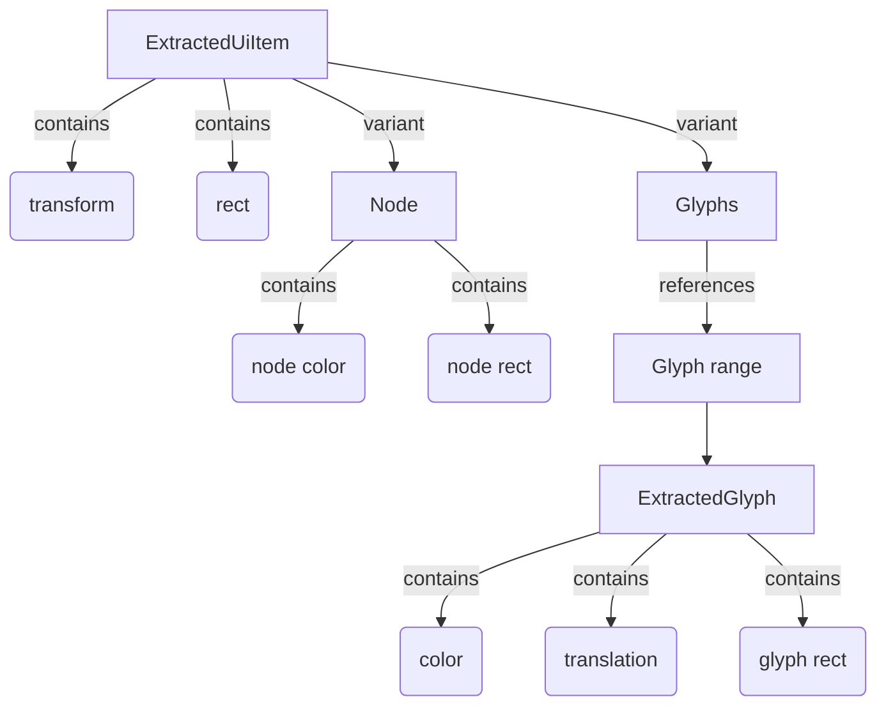

+++
title = "#20245 Extract text colors per glyph"
date = "2025-09-01T00:00:00"
draft = false
template = "pull_request_page.html"
in_search_index = true

[taxonomies]
list_display = ["show"]

[extra]
current_language = "en"
available_languages = {"en" = { name = "English", url = "/pull_request/bevy/2025-09/pr-20245-en-20250901" }, "zh-cn" = { name = "中文", url = "/pull_request/bevy/2025-09/pr-20245-zh-cn-20250901" }}
labels = ["A-Rendering", "C-Performance", "A-UI", "C-Usability", "A-Text", "D-Modest"]
+++

# Extract text colors per glyph

## Basic Information
- **Title**: Extract text colors per glyph
- **PR Link**: https://github.com/bevyengine/bevy/pull/20245
- **Author**: ickshonpe
- **Status**: MERGED
- **Labels**: A-Rendering, C-Performance, A-UI, C-Usability, S-Ready-For-Final-Review, M-Needs-Migration-Guide, A-Text, D-Modest
- **Created**: 2025-07-22T15:28:25Z
- **Merged**: 2025-09-01T23:07:47Z
- **Merged By**: alice-i-cecile

## Description Translation
# Objective

Colors are extracted per text section, transforms per glyph.
This makes it awkward to set colors for individual glyphs as they have to be extracted separately.

## Solution
* Add `color: LinearRgba` and `translation: Vec2` fields to `ExtractedGlyph`.
* Move the  `transform` fields from `ExtractedGlyph` and `ExtractedUiNode` to `ExtractedUiItem`.
* Move the `rect` field from `ExtractedUiNode` to `ExtractedUiItem`.

`ExtractedUiNode`s are smaller by 16 bytes, from 208 to 192 bytes in size.
`ExtractedGlyph`s are smaller by 8 bytes, from 48 to 40 bytes in size.

Also adds another micro-optimisation, `TextColor` has been added to the extracted `uinode_query`. This means that there is no need to do a `TextColor` look up for the main `Text` entity, only for the child text sections.

## Testing

Output from the UI examples should be unchanged, main ones to check are `testbed_ui`, `testbed_full_ui`, `text_debug`, `text_wrap_debug` and `ui_transform`.

Not a performance motivated change but this should show a marginal improvement over main, YMMV:
```
cargo run --example many_glyphs --release -- --no-text2d
```

## The Story of This Pull Request

This PR addresses a structural inconsistency in Bevy's UI rendering system where text colors were extracted per text section while transforms were applied per glyph. This mismatch made it difficult to set individual colors for specific glyphs since they had to be extracted separately from their transforms.

The core problem was in the data organization. The `ExtractedGlyph` struct only contained transform information, while color data was stored at the text section level in `ExtractedUiNode`. This meant that all glyphs in a text section shared the same color, and individual glyph coloring required complex workarounds.

The solution restructures the data flow by moving color extraction to the glyph level. Key changes include:

1. Adding `color: LinearRgba` and `translation: Vec2` fields to `ExtractedGlyph`
2. Moving the `transform` field from both `ExtractedGlyph` and `ExtractedUiNode` to `ExtractedUiItem`
3. Moving the `rect` field from `ExtractedUiNode` to `ExtractedUiItem`

This reorganization creates a more logical separation of concerns: `ExtractedUiItem` now handles the shared transform and rect information, while `ExtractedGlyph` contains per-glyph specific data like color and position.

The implementation required updates across multiple extraction systems. In `extract_text_sections`, the code now:
```rust
extracted_uinodes.glyphs.push(ExtractedGlyph {
    color,
    translation: *position,
    rect,
});
```

And during rendering in `prepare_uinodes`, the glyph transformation is now computed as:
```rust
extracted_uinode
    .transform
    .transform_point2(glyph.translation + pos * glyph_rect.size())
```

A secondary optimization was adding `TextColor` to the extracted `uinode_query`, eliminating the need for separate `TextColor` lookups for the main `Text` entity.

The changes result in memory savings: `ExtractedUiNode` structs are reduced by 16 bytes (208 → 192 bytes) and `ExtractedGlyph` structs by 8 bytes (48 → 40 bytes). While not primarily performance-focused, these optimizations contribute to marginal performance improvements in text-heavy UI scenarios.

## Visual Representation



## Key Files Changed

### `crates/bevy_ui_render/src/lib.rs` (+61/-51)
This is the main file containing the structural changes to the extracted data types and their usage throughout the extraction systems.

**Key structural changes:**
```rust
// Before:
pub struct ExtractedGlyph {
    pub transform: Affine2,
    pub rect: Rect,
}

// After:
pub struct ExtractedGlyph {
    pub color: LinearRgba,
    pub translation: Vec2,
    pub rect: Rect,
}
```

**Extraction logic update:**
```rust
// Text section extraction now handles per-glyph colors
extracted_uinodes.glyphs.push(ExtractedGlyph {
    color,
    translation: *position,
    rect,
});
```

### `crates/bevy_ui_render/src/debug_overlay.rs` (+6/-6)
Updated to match the new `ExtractedUiNode` structure, moving color and rect into the `ExtractedUiItem::Node` variant.

### `crates/bevy_ui_render/src/gradient.rs` (+6/-6)
Similarly updated to conform to the new data structure organization.

### `release-content/migration-guides/extract_ui_text_colors_per_glyph.md` (+9/-0)
Added migration guide documenting the changes to the extracted data structures.

## Further Reading

- [Bevy UI Rendering Architecture](https://bevyengine.org/learn/advanced-topics/rendering/ui/) - Official documentation on Bevy's UI rendering system
- [Affine Transformations](https://en.wikipedia.org/wiki/Affine_transformation) - Mathematical background on affine transformations used in UI rendering
- [Data-Oriented Design](https://gameprogrammingpatterns.com/data-locality.html) - Principles behind the memory layout optimizations in this PR