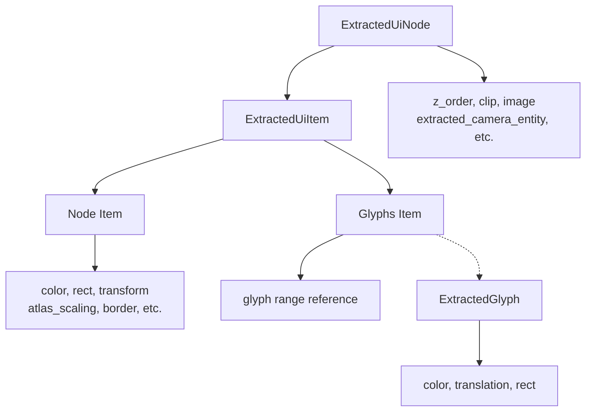

+++
title = "#20245 Extract text colors per glyph"
date = "2025-09-01T00:00:00"
draft = false
template = "pull_request_page.html"
in_search_index = false

[extra]
current_language = "zh-cn"
available_languages = {"en" = { name = "English", url = "/pull_request/bevy/2025-09/pr-20245-en-20250901" }, "zh-cn" = { name = "中文", url = "/pull_request/bevy/2025-09/pr-20245-zh-cn-20250901" }}
labels = ["A-Rendering", "C-Performance", "A-UI", "C-Usability", "A-Text", "D-Modest"]
+++

# Title

## Basic Information
- **Title**: Extract text colors per glyph
- **PR Link**: https://github.com/bevyengine/bevy/pull/20245
- **Author**: ickshonpe
- **Status**: MERGED
- **Labels**: A-Rendering, C-Performance, A-UI, C-Usability, S-Ready-For-Final-Review, M-Needs-Migration-Guide, A-Text, D-Modest
- **Created**: 2025-07-22T15:28:25Z
- **Merged**: 2025-09-01T23:07:47Z
- **Merged By**: alice-i-cecile

## Description Translation
**目标**

颜色按文本段(text section)提取，变换(transform)按字形(glyph)提取。
这使得为单个字形设置颜色变得很麻烦，因为它们必须单独提取。

**解决方案**
* 向 `ExtractedGlyph` 添加 `color: LinearRgba` 和 `translation: Vec2` 字段。
* 将 `transform` 字段从 `ExtractedGlyph` 和 `ExtractedUiNode` 移动到 `ExtractedUiItem`。
* 将 `rect` 字段从 `ExtractedUiNode` 移动到 `ExtractedUiItem`。

`ExtractedUiNode` 的大小减少了 16 字节，从 208 字节降至 192 字节。
`ExtractedGlyph` 的大小减少了 8 字节，从 48 字节降至 40 字节。

还添加了另一个微优化，将 `TextColor` 添加到提取的 `uinode_query` 中。这意味着无需为主 `Text` 实体进行 `TextColor` 查找，只需为子文本段查找。

**测试**

UI 示例的输出应保持不变，主要需要检查的是 `testbed_ui`、`testbed_full_ui`、`text_debug`、`text_wrap_debug` 和 `ui_transform`。

这不是一个以性能为动机的更改，但这应该显示出相对于 main 分支的边际改进，效果可能因人而异 (YMMV)：
```
cargo run --example many_glyphs --release -- --no-text2d
```

## The Story of This Pull Request

这个 PR 解决了一个 Bevy UI 文本渲染系统中的数据提取粒度不一致问题。在原有的实现中，颜色信息是按文本段（text section）级别提取的，而变换信息却是按字形（glyph）级别提取的。这种不一致性使得开发者难以对单个字形设置不同的颜色，因为颜色数据没有与字形一一对应。

问题的核心在于 `ExtractedGlyph` 结构体缺乏颜色信息，而 `ExtractedUiNode` 结构体包含了本应属于其内部项（item）的数据。这种设计导致了数据冗余和不必要的内存使用。

开发者采取了重构数据结构的解决方案，主要进行了三个关键改动：

1. 在 `ExtractedGlyph` 中添加了 `color` 和 `translation` 字段，使每个字形都能独立存储颜色和位置信息
2. 将 `transform` 字段从 `ExtractedGlyph` 和 `ExtractedUiNode` 移动到 `ExtractedUiItem` 中
3. 将 `rect` 字段从 `ExtractedUiNode` 移动到 `ExtractedUiItem` 中

这些改动不仅仅是字段的简单移动，而是对数据关系的重新设计。现在，`ExtractedUiNode` 作为一个容器，主要处理渲染顺序(z-order)、裁剪(clip)和相机映射等高层概念，而具体的渲染项（如节点或字形组）则通过 `ExtractedUiItem` 枚举来管理各自的渲染数据。

从技术实现角度看，这个重构带来了显著的内存优化。`ExtractedUiNode` 的大小从 208 字节减少到 192 字节，减少了 16 字节；`ExtractedGlyph` 从 48 字节减少到 40 字节，减少了 8 字节。虽然单个实例的节省看似微小，但在包含大量 UI 元素和文本的复杂场景中，这种优化会累积成显著的内存节省。

此外，PR 还引入了一个微优化：将 `TextColor` 组件添加到提取查询中。这意味着对于主文本实体，系统不再需要额外查找 `TextColor` 组件，因为查询已经包含了这个信息。只有子文本段才需要进行额外的查找，这减少了不必要的组件访问开销。

在代码架构方面，这个改动使得数据层次更加清晰。`ExtractedUiItem::Node` 现在包含了所有节点特有的渲染数据（颜色、矩形、变换等），而 `ExtractedUiItem::Glyphs` 则通过范围索引引用一组字形。这种分离使得代码更加模块化，不同类型的渲染项可以独立管理自己的数据。

从工程角度看，这是一个典型的数据结构优化案例。开发者没有改变任何功能逻辑，而是通过重新组织数据来获得性能提升和更好的架构。这种优化方式的风险相对较低，因为功能行为保持不变，只是内部数据表示发生了变化。

## Visual Representation



## Key Files Changed

### `crates/bevy_ui_render/src/lib.rs` (+61/-51)
这是主要的改动文件，包含了数据结构的重构和相应的提取逻辑更新。

**关键变更：**
```rust
// 重构前的结构
pub struct ExtractedUiNode {
    pub z_order: f32,
    pub color: LinearRgba,    // 将被移动到 ExtractedUiItem
    pub rect: Rect,           // 将被移动到 ExtractedUiItem
    // ... 其他字段
    pub item: ExtractedUiItem,
}

pub struct ExtractedGlyph {
    pub transform: Affine2,   // 将被替换为 translation
    pub rect: Rect,
}

// 重构后的结构
pub struct ExtractedUiNode {
    pub z_order: f32,
    // color 和 rect 被移除
    // ... 其他字段
    pub item: ExtractedUiItem,
    pub transform: Affine2,   // 新增字段
}

pub struct ExtractedGlyph {
    pub color: LinearRgba,    // 新增字段
    pub translation: Vec2,    // 替换 transform
    pub rect: Rect,
}

// ExtractedUiItem 枚举现在包含具体渲染数据
pub enum ExtractedUiItem {
    Node {
        color: LinearRgba,    // 从 ExtractedUiNode 移动而来
        rect: Rect,           // 从 ExtractedUiNode 移动而来
        atlas_scaling: Option<Vec2>,
        // ... 其他字段
        node_type: NodeType,
        // transform 被移动到 ExtractedUiNode 级别
    },
    Glyphs {
        range: Range<usize>,
    },
}
```

### `crates/bevy_ui_render/src/debug_overlay.rs` (+6/-6)
调试覆盖层的提取逻辑更新，适应新的数据结构。

```rust
// 更新后的调试覆盖层提取
extracted_uinodes.uinodes.push(ExtractedUiNode {
    render_entity: commands.spawn(TemporaryRenderEntity).id(),
    z_order: (ui_stack.uinodes.len() as u32 + uinode.stack_index()) as f32,
    clip: maybe_clip.filter(|_| !debug_options.show_clipped).map(|clip| clip.clip),
    image: AssetId::default(),
    extracted_camera_entity,
    transform: transform.into(),  // 变换现在在节点级别
    item: ExtractedUiItem::Node {
        color: Hsla::sequential_dispersed(entity.index()).into(),  // 颜色在 item 中
        rect: Rect { min: Vec2::ZERO, max: uinode.size },  // 矩形在 item 中
        atlas_scaling: None,
        flip_x: false,
        flip_y: false,
        border: BorderRect::all(debug_options.line_width / uinode.inverse_scale_factor()),
        border_radius: BorderRadius::ZERO,
        node_type: NodeType::Rect,
    },
    main_entity: entity.into(),
});
```

### `crates/bevy_ui_render/src/gradient.rs` (+6/-6)
渐变渲染的提取逻辑更新，同样适应新的数据结构。

### `release-content/migration-guides/extract_ui_text_colors_per_glyph.md` (+9/-0)
新增的迁移指南，说明了对用户代码的影响。

```markdown
---
title: Extract UI text colors per glyph
pull_requests: [20245]
---

UI 渲染器现在按字形提取文本颜色，按文本段提取变换。
`color: LinearRgba` 和 `translation: Vec2` 已添加到 `ExtractedGlyph`。
`transform` 字段已从 `ExtractedGlyph` 和 `ExtractedUiNode` 移动到 `ExtractedUiItem`。
`rect` 字段已从 `ExtractedUiNode` 移动到 `ExtractedUiItem`。
```

## Further Reading

- [Bevy UI 渲染系统文档](https://bevyengine.org/learn/books/rendering-in-bevy/ui-rendering)
- [ECS 数据布局优化技巧](https://bevyengine.org/learn/books/rendering-in-bevy/ecs-data-layout)
- [Affine2 变换在图形编程中的应用](https://en.wikipedia.org/wiki/Affine_transformation)
- [字形渲染和文本处理最佳实践](https://learnopengl.com/In-Practice/Text-Rendering)