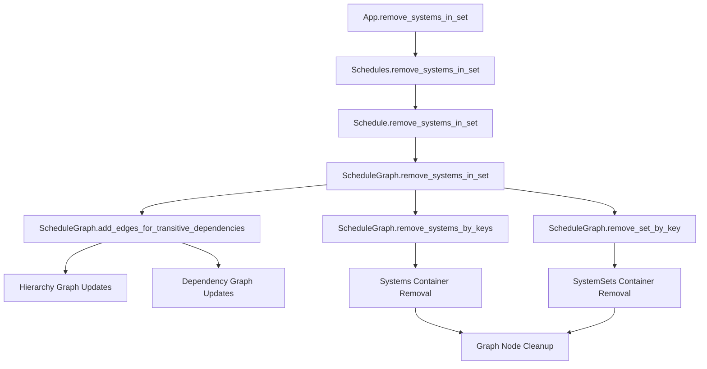

+++
title = "#20298 Remove systems from schedule"
date = "2025-09-29T00:00:00"
draft = false
template = "pull_request_page.html"
in_search_index = true

[taxonomies]
list_display = ["show"]

[extra]
current_language = "en"
available_languages = {"en" = { name = "English", url = "/pull_request/bevy/2025-09/pr-20298-en-20250929" }, "zh-cn" = { name = "中文", url = "/pull_request/bevy/2025-09/pr-20298-zh-cn-20250929" }}
labels = ["C-Feature", "A-ECS", "X-Contentious"]
+++

# Remove systems from schedule

## Basic Information
- **Title**: Remove systems from schedule
- **PR Link**: https://github.com/bevyengine/bevy/pull/20298
- **Author**: hymm
- **Status**: MERGED
- **Labels**: C-Feature, A-ECS, S-Ready-For-Final-Review, M-Needs-Release-Note, X-Contentious
- **Created**: 2025-07-26T20:21:00Z
- **Merged**: 2025-09-29T22:44:45Z
- **Merged By**: alice-i-cecile

## Description Translation
# Objective

- Add ability to remove systems from a schedule.
- Fixes #279.

## Solution

- add `remove_systems_in_set` method which removes all the systems by their set name. In most cases systems are added to a schedule once, so just passing the system (which is an implicit set by it's type name) will just remove the one system. If a system is added multiple times such as `apply_deferred`, then you may need to give the system a unique set, if you just want to remove just one system.
- The method also tries to remove all the configuration for the set and the systems found.
- We need to pass world to the method because user build passes are allowed to write to the world.

## Testing

- Added some unit tests.

## Future work

- In the future of systems as entities this will probably look much different. We'd probably store all the edges as relationships, so hopefully cleanup would be easier.
- It'd be better if remove_systems_in_set could take a tuple of system sets. I looked into using IntoScheduleConfigs, but that won't work since the system set version of it errors if you try to pass a system type set. This would allow for less rebuilding of the schedule. The schedule needs to be rebuilt to each call to be able to find the system set.

## The Story of This Pull Request

This PR addresses a long-standing gap in Bevy's ECS scheduling system - the inability to remove systems from a schedule after they've been added. The problem was tracked in issue #279, which remained open for years, indicating both the complexity of the feature and its importance to the community.

The core challenge was that Bevy's schedule system represents systems and their relationships as complex graph structures. Removing nodes from these graphs while maintaining correct ordering dependencies required careful engineering. Previously, developers had to use run conditions to skip systems, but this still incurred the overhead of condition checking every frame.

The solution centers around a new `remove_systems_in_set` method that operates on system sets. Since individual systems are implicitly placed in sets based on their type name, this approach can target both individual systems and groups of systems. The implementation needed to handle several technical challenges:

1. **Graph Maintenance**: When removing systems, the schedule's dependency graph must be updated to preserve ordering constraints between remaining systems
2. **Multiple Removal Policies**: Different use cases require different cleanup strategies, from simple removal to maintaining transitive dependencies
3. **API Design**: The method needed to be accessible from multiple entry points (App, SubApp, Schedule) while maintaining consistency

The implementation introduces a `ScheduleCleanupPolicy` enum with four variants that control how aggressively systems and sets are removed and whether transitive dependencies are maintained:

```rust
pub enum ScheduleCleanupPolicy {
    RemoveSetAndSystems,
    RemoveSystemsOnly,
    RemoveSetAndSystemsAllowBreakages,
    RemoveSystemsOnlyAllowBreakages,
}
```

The most sophisticated part of the implementation is the graph manipulation logic in `add_edges_for_transitive_dependencies`. When removing a node (system or set), this method analyzes the incoming and outgoing edges and creates new direct edges between the predecessors and successors, effectively bypassing the removed node while preserving the overall ordering.

One key insight was that systems added multiple times (like `apply_deferred`) would need unique sets if developers want to remove individual instances. The implementation handles this by tracking systems in a `set_systems` HashMap that maps system set keys to their contained system keys.

The changes required modifications across multiple layers of the scheduling system, from high-level App methods down to low-level graph manipulation. Each layer needed to expose the removal functionality while properly handling errors and state changes.

## Visual Representation



## Key Files Changed

### `crates/bevy_ecs/src/schedule/schedule.rs` (+395/-6)
This file contains the core implementation of system removal functionality. The key additions include:

- `remove_systems_in_set` method for `Schedule` and `Schedules`
- `systems_in_set` method to query systems belonging to a set
- `add_edges_for_transitive_dependencies` for graph maintenance
- `ScheduleCleanupPolicy` enum defining removal strategies

```rust
// Key addition: System removal with dependency preservation
pub fn remove_systems_in_set<M>(
    &mut self,
    set: impl IntoSystemSet<M>,
    world: &mut World,
    policy: ScheduleCleanupPolicy,
) -> Result<usize, ScheduleError> {
    if self.graph.changed {
        self.initialize(world)?;
    }
    self.graph.remove_systems_in_set(set, policy)
}
```

### `crates/bevy_ecs/src/schedule/node.rs` (+36/-8)
This file manages the internal node storage for systems and system sets. Key changes include:

- Added removal methods for both systems and system sets
- Modified `node_mut` to return `Option` instead of panicking
- Added `get_key` method for system set lookup

```rust
// Before: Panic on missing node
pub(crate) fn node_mut(&mut self, key: SystemKey) -> &mut SystemNode {
    &mut self.nodes[key]
}

// After: Safe lookup
pub(crate) fn node_mut(&mut self, key: SystemKey) -> Option<&mut SystemNode> {
    self.nodes.get_mut(key)
}
```

### `crates/bevy_app/src/app.rs` (+36/-1)
This file adds the public API for system removal at the application level:

```rust
pub fn remove_systems_in_set<M>(
    &mut self,
    schedule: impl ScheduleLabel,
    set: impl IntoSystemSet<M>,
    policy: ScheduleCleanupPolicy,
) -> Result<usize, ScheduleError> {
    self.main_mut().remove_systems_in_set(schedule, set, policy)
}
```

### `crates/bevy_ecs/src/schedule/error.rs` (+23/-0)
Added new error types for schedule operations:

```rust
pub enum ScheduleError {
    Uninitialized,
    SetNotFound,
    ScheduleNotFound,
    ScheduleBuildError(ScheduleBuildError),
}
```

### `release-content/release-notes/remove_systems.md` (+22/-0)
Added documentation explaining the new feature and its usage patterns.

## Further Reading

- [Bevy ECS Scheduling Documentation](https://bevyengine.org/learn/quick-start/ecs/schedules/)
- [System Sets in Bevy](https://bevyengine.org/learn/quick-start/ecs/system-sets/)
- [Original Issue #279](https://github.com/bevyengine/bevy/issues/279)

# Full Code Diff
*(Provided in the original request)*