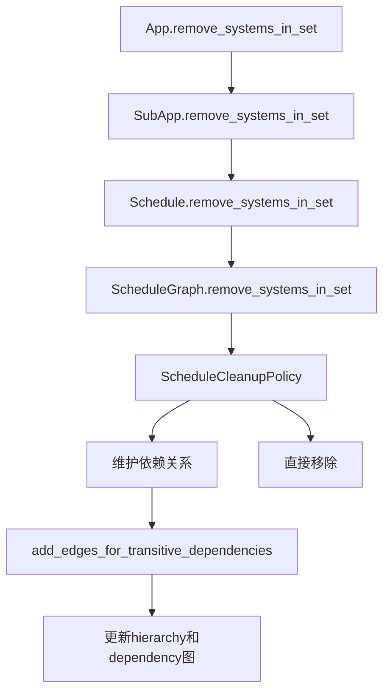

+++
title = "#20298 Remove systems from schedule"
date = "2025-09-29T00:00:00"
draft = false
template = "pull_request_page.html"
in_search_index = false

[extra]
current_language = "zh-cn"
available_languages = {"en" = { name = "English", url = "/pull_request/bevy/2025-09/pr-20298-en-20250929" }, "zh-cn" = { name = "中文", url = "/pull_request/bevy/2025-09/pr-20298-zh-cn-20250929" }}
labels = ["C-Feature", "A-ECS", "X-Contentious"]
+++

# Remove systems from schedule

## Basic Information
- **Title**: Remove systems from schedule
- **PR Link**: https://github.com/bevyengine/bevy/pull/20298
- **Author**: hymm
- **Status**: MERGED
- **Labels**: C-Feature, A-ECS, S-Ready-For-Final-Review, M-Needs-Release-Note, X-Contentious
- **Created**: 2025-07-26T20:21:00Z
- **Merged**: 2025-09-29T22:44:45Z
- **Merged By**: alice-i-cecile

## Description Translation
**目标**

- 添加从调度(schedule)中移除系统的能力
- 修复 #279

**解决方案**

- 添加 `remove_systems_in_set` 方法，通过集合名称移除所有系统。在大多数情况下，系统只被添加到调度中一次，因此只需传递系统（通过其类型名称隐式创建的集合）即可移除单个系统。如果一个系统被多次添加（如 `apply_deferred`），那么如果只想移除其中一个系统，可能需要给该系统一个唯一的集合。
- 该方法还会尝试移除找到的集合和系统的所有配置。
- 我们需要将 world 传递给该方法，因为用户构建过程允许写入 world。

**测试**

- 添加了一些单元测试。

**未来工作**

- 在系统作为实体的未来版本中，这可能会看起来非常不同。我们可能会将所有边作为关系存储，因此清理工作应该会更容易。
- 如果 `remove_systems_in_set` 能够接受一个系统集合的元组会更好。我研究过使用 `IntoScheduleConfigs`，但如果你尝试传递一个系统类型集合，它的系统集合版本会出错。这将减少调度的重建。每次调用都需要重建调度才能找到系统集合。

## The Story of This Pull Request

这个PR解决了一个长期存在的需求：从Bevy的调度系统中动态移除系统。在之前的版本中，一旦系统被添加到调度中，就无法在运行时移除，这限制了系统的动态管理能力。

**问题背景**

在游戏开发和模拟系统中，经常需要在运行时根据不同的游戏状态或配置动态启用或禁用系统。虽然之前可以通过RunCondition来实现类似效果，但这仍然会在每个调度周期检查条件，带来不必要的性能开销。有些情况下，用户希望完全移除系统以释放资源或避免不必要的处理。

**解决方案设计**

开发者选择实现一个基于系统集合的移除方法，这有几个技术优势：
1. 系统在Bevy中本身就属于隐式集合（基于系统类型）
2. 可以批量移除多个相关系统
3. 与现有的调度架构保持一致

方法设计需要处理几个关键问题：
- 调度依赖关系的维护
- 系统配置的清理
- 避免破坏现有的依赖链

**实现细节**

核心实现位于 `ScheduleGraph` 结构体中，新增了 `remove_systems_in_set` 方法。这个方法需要处理四种不同的清理策略：

```rust
pub enum ScheduleCleanupPolicy {
    RemoveSetAndSystems,
    RemoveSystemsOnly,
    RemoveSetAndSystemsAllowBreakages,
    RemoveSystemsOnlyAllowBreakages,
}
```

这些策略允许用户在维护依赖关系完整性和性能之间做出权衡。`RemoveSetAndSystems` 和 `RemoveSystemsOnly` 会通过添加传递性依赖来维持顺序，而 `AllowBreakages` 版本则直接移除，可能破坏依赖链。

**关键技术挑战**

一个重要的技术挑战是如何在移除系统后维护正确的依赖关系。解决方案是 `add_edges_for_transitive_dependencies` 方法，它会在移除节点前，在层次结构图(hierarchy graph)和依赖图(dependency graph)中为传入和传出节点之间添加新的边：

```rust
fn add_edges_for_transitive_dependencies(&mut self, node: NodeId) {
    let in_nodes: Vec<_> = self.hierarchy.graph.neighbors_directed(node, Incoming).collect();
    let out_nodes: Vec<_> = self.hierarchy.graph.neighbors_directed(node, Outgoing).collect();
    
    for &in_node in &in_nodes {
        for &out_node in &out_nodes {
            self.hierarchy.graph.add_edge(in_node, out_node);
        }
    }
    // 类似处理 dependency graph...
}
```

这种方法确保了当系统或集合被移除时，原本依赖于它们的其他系统仍然能够保持正确的执行顺序。

**架构影响**

这个功能影响了Bevy ECS架构的多个层面：
- 在应用级别提供了便捷的API
- 在调度级别实现了核心逻辑
- 在图形数据结构级别处理依赖关系维护

新的API通过 `App`、`SubApp` 和 `Schedule` 结构体暴露给用户，保持了API的一致性。

**性能考虑**

开发者明确指出了这个功能的性能影响：每次移除系统都会导致调度重建，这是一个相对昂贵的操作。因此，这个功能更适合在配置阶段使用，而不是在每帧都需要调用的高性能路径中。

## Visual Representation



## Key Files Changed

### `crates/bevy_ecs/src/schedule/schedule.rs` (+395/-6)
这是核心实现文件，包含了主要的移除逻辑。

**关键变更：**
- 新增 `remove_systems_in_set` 方法实现
- 添加 `ScheduleCleanupPolicy` 枚举定义清理策略
- 实现依赖关系维护逻辑

```rust
// 新增的清理策略枚举
pub enum ScheduleCleanupPolicy {
    RemoveSetAndSystems,
    RemoveSystemsOnly,
    RemoveSetAndSystemsAllowBreakages,
    RemoveSystemsOnlyAllowBreakages,
}

// 核心移除方法
pub fn remove_systems_in_set<M>(
    &mut self,
    set: impl IntoSystemSet<M>,
    world: &mut World,
    policy: ScheduleCleanupPolicy,
) -> Result<usize, ScheduleError> {
    if self.graph.changed {
        self.initialize(world)?;
    }
    self.graph.remove_systems_in_set(set, policy)
}
```

### `crates/bevy_ecs/src/schedule/node.rs` (+36/-8)
这个文件处理系统和系统集合的节点管理。

**关键变更：**
- 为 `Systems` 和 `SystemSets` 添加移除方法
- 改进节点访问方法以支持安全移除

```rust
// Systems 容器的移除方法
pub(crate) fn remove(&mut self, key: SystemKey) -> bool {
    let mut found = false;
    if self.nodes.remove(key).is_some() {
        found = true;
    }
    // 同时移除条件和未初始化状态
    // ...
}

// SystemSets 容器的移除方法  
pub(crate) fn remove(&mut self, key: SystemSetKey) -> bool {
    self.sets.remove(key);
    self.conditions.remove(key);
    self.uninit.retain(|uninit| uninit.key != key);
    true
}
```

### `crates/bevy_app/src/app.rs` (+36/-1)
在应用级别暴露API。

**关键变更：**
- 添加 `App::remove_systems_in_set` 方法
- 提供使用示例和文档

```rust
pub fn remove_systems_in_set<M>(
    &mut self,
    schedule: impl ScheduleLabel,
    set: impl IntoSystemSet<M>,
    policy: ScheduleCleanupPolicy,
) -> Result<usize, ScheduleError> {
    self.main_mut().remove_systems_in_set(schedule, set, policy)
}
```

### `crates/bevy_ecs/src/schedule/error.rs` (+23/-0)
新增错误类型处理。

**关键变更：**
- 定义 `ScheduleError` 枚举处理各种错误情况

```rust
pub enum ScheduleError {
    Uninitialized,
    SetNotFound,
    ScheduleNotFound,
    ScheduleBuildError(ScheduleBuildError),
}
```

### `release-content/release-notes/remove_systems.md` (+22/-0)
新增发布说明文档。

**关键变更：**
- 解释新功能的使用场景和优势
- 提供代码示例

## Further Reading

- [Bevy ECS 调度系统文档](https://bevyengine.org/learn/book/ecs/schedules/)
- [系统集合和依赖管理](https://bevyengine.org/learn/book/ecs/system-sets/)
- [GitHub Issue #279 - 移除系统的原始需求](https://github.com/bevyengine/bevy/issues/279)

这个PR展示了在复杂的数据结构中实现动态修改功能时需要考虑的架构决策，特别是在维护数据完整性和依赖关系方面的挑战。