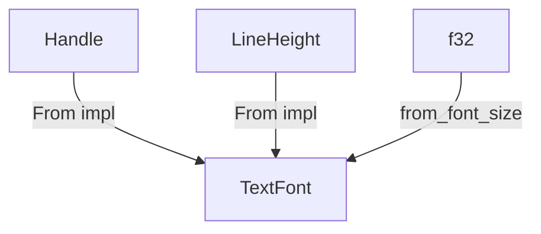

+++
title = "#20450 from_ constructors on `TextFont` with `From` impls"
date = "2025-09-04T00:00:00"
draft = false
template = "pull_request_page.html"
in_search_index = false

[extra]
current_language = "zh-cn"
available_languages = {"en" = { name = "English", url = "/pull_request/bevy/2025-09/pr-20450-en-20250904" }, "zh-cn" = { name = "中文", url = "/pull_request/bevy/2025-09/pr-20450-zh-cn-20250904" }}
labels = ["D-Trivial", "A-UI", "C-Code-Quality", "C-Usability", "A-Text"]
+++

# Title
TextFont 构造器方法向 From trait 实现的迁移

## Basic Information
- **Title**: from_ constructors on `TextFont` with `From` impls
- **PR Link**: https://github.com/bevyengine/bevy/pull/20450
- **Author**: amedoeyes
- **Status**: MERGED
- **Labels**: D-Trivial, A-UI, C-Code-Quality, C-Usability, S-Ready-For-Final-Review, M-Needs-Migration-Guide, A-Text
- **Created**: 2025-08-07T09:16:13Z
- **Merged**: 2025-09-04T20:24:27Z
- **Merged By**: alice-i-cecile

## Description Translation
# Objective

- 关闭 #20353

## Solution

- 移除了 `TextFont::from_font` 和 `TextFont::from_line_height`。
- 更新了 `examples/testbed/2d.rs` 以使用 `From` impl。
- 添加了迁移指南。

## The Story of This Pull Request

这个 PR 解决了一个 API 设计的一致性问题。在 Bevy 的文本系统中，`TextFont` 结构体提供了多个构造器方法，但其中一些方法的命名和使用模式与 Rust 的标准惯例不一致。

问题的核心在于 `TextFont::from_font` 和 `TextFont::from_line_height` 这两个构造器方法。在 Rust 的惯用做法中，当类型可以从另一种类型直接转换时，通常会实现 `From` trait 而不是提供自定义的 `from_` 方法。这样可以让 API 更加一致，也符合开发者的预期。

开发者采用了直接但有效的方法：移除这两个自定义构造器方法，并为 `Handle<Font>` 和 `LineHeight` 类型实现 `From` trait。这样，原有的构造方式：

```rust
let text_font = TextFont::from_font(font_handle);
```

现在可以改为：

```rust
let text_font = TextFont::from(font_handle);
```

这种变化虽然看似微小，但带来了几个好处。首先，它使 API 更加符合 Rust 的标准惯例，降低了学习成本。其次，它提供了更一致的接口，开发者只需要记住使用 `From::from` 或 `into()` 方法，而不需要记忆特定类型的构造器名称。

值得注意的是，`TextFont::from_font_size` 方法被保留了下来，这是因为 `f32` 是一个基本类型，为所有基本类型实现 `From` trait 可能会造成命名冲突或不可预期的行为。

在实现方面，这个 PR 做了三处关键修改：
1. 移除了 `TextFont` 中的两个构造器方法
2. 更新了测试用例以使用新的 API
3. 添加了详细的迁移指南

这种重构属于代码质量改进，不会影响运行时性能，但能提高代码的可维护性和开发者体验。

## Visual Representation



## Key Files Changed

### `crates/bevy_text/src/text.rs` (+0/-10)
移除了两个构造器方法，保留了 `from_font_size` 方法。

```rust
// 移除的部分：
pub fn from_font(font: Handle<Font>) -> Self {
    Self::default().with_font(font)
}

pub fn from_line_height(line_height: LineHeight) -> Self {
    Self::default().with_line_height(line_height)
}
```

### `examples/testbed/2d.rs` (+1/-1)
更新了示例代码以使用新的 API 风格。

```rust
// 之前：
let sans_serif = TextFont::from_font(asset_server.load("fonts/FiraSans-Bold.ttf"));

// 之后：
let sans_serif = TextFont::from(asset_server.load("fonts/FiraSans-Bold.ttf"));
```

### `release-content/migration-guides/remove_text_font_from_constructor_methods.md` (+16/-0)
添加了详细的迁移指南，帮助开发者从旧 API 迁移到新 API。

```markdown
---
title: `TextFont` constructor methods replaced with `From` impls
pull_requests: [20335, 20450]
---

The `TextFont::from_font` and `TextFont::from_line_height` constructor methods have been removed in favor of `From` trait implementations.

```rust
// 0.16
let text_font = TextFont::from_font(font_handle);
let text_font = TextFont::from_line_height(line_height);

// 0.17
let text_font = TextFont::from(font_handle);
let text_font = TextFont::from(line_height);
```
```

## Further Reading

- [Rust API Guidelines: Conversions should use standard traits](https://rust-lang.github.io/api-guidelines/interoperability.html#conversions-use-the-standard-traits-from-asref-etc-c-conv)
- [Bevy Engine Text System Documentation](https://docs.rs/bevy_text/latest/bevy_text/)
- [Rust From and Into Traits](https://doc.rust-lang.org/std/convert/trait.From.html)

# Full Code Diff
```diff
diff --git a/crates/bevy_text/src/text.rs b/crates/bevy_text/src/text.rs
index d4c144983aa55..5a5c3652bfa93 100644
--- a/crates/bevy_text/src/text.rs
+++ b/crates/bevy_text/src/text.rs
@@ -305,21 +305,11 @@ pub struct TextFont {
 }
 
 impl TextFont {
-    /// Returns a new [`TextFont`] with the specified font face handle.
-    pub fn from_font(font: Handle<Font>) -> Self {
-        Self::default().with_font(font)
-    }
-
     /// Returns a new [`TextFont`] with the specified font size.
     pub fn from_font_size(font_size: f32) -> Self {
         Self::default().with_font_size(font_size)
     }
 
-    /// Returns a new [`TextFont`] with the specified line height.
-    pub fn from_line_height(line_height: LineHeight) -> Self {
-        Self::default().with_line_height(line_height)
-    }
-
     /// Returns this [`TextFont`] with the specified font face handle.
     pub fn with_font(mut self, font: Handle<Font>) -> Self {
         self.font = font;
diff --git a/examples/testbed/2d.rs b/examples/testbed/2d.rs
index e4d46fd1c6849..e353cdabde7c1 100644
--- a/examples/testbed/2d.rs
+++ b/examples/testbed/2d.rs
@@ -169,7 +169,7 @@ mod text {
             );
         }
 
-        let sans_serif = TextFont::from_font(asset_server.load("fonts/FiraSans-Bold.ttf"));
+        let sans_serif = TextFont::from(asset_server.load("fonts/FiraSans-Bold.ttf"));
 
         const NUM_ITERATIONS: usize = 10;
         for i in 0..NUM_ITERATIONS {
diff --git a/release-content/migration-guides/remove_text_font_from_constructor_methods.md b/release-content/migration-guides/remove_text_font_from_constructor_methods.md
new file mode 100644
index 0000000000000..29abdae87a6ef
--- /dev/null
+++ b/release-content/migration-guides/remove_text_font_from_constructor_methods.md
@@ -0,0 +1,16 @@
+---
+title: `TextFont` constructor methods replaced with `From` impls
+pull_requests: [20335, 20450]
+---
+
+The `TextFont::from_font` and `TextFont::from_line_height` constructor methods have been removed in favor of `From` trait implementations.
+
+```rust
+// 0.16
+let text_font = TextFont::from_font(font_handle);
+let text_font = TextFont::from_line_height(line_height);
+
+// 0.17
+let text_font = TextFont::from(font_handle);
+let text_font = TextFont::from(line_height);
+```
```