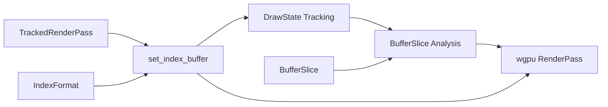

+++
title = "#20468 Remove `offset` argument from `TrackedRenderPass::set_index_buffer`"
date = "2025-09-30T00:00:00"
draft = false
template = "pull_request_page.html"
in_search_index = true

[taxonomies]
list_display = ["show"]

[extra]
current_language = "en"
available_languages = {"en" = { name = "English", url = "/pull_request/bevy/2025-09/pr-20468-en-20250930" }, "zh-cn" = { name = "中文", url = "/pull_request/bevy/2025-09/pr-20468-zh-cn-20250930" }}
labels = ["D-Trivial", "A-Rendering", "C-Code-Quality", "C-Usability"]
+++

# Title
Remove `offset` argument from `TrackedRenderPass::set_index_buffer`

## Basic Information
- **Title**: Remove `offset` argument from `TrackedRenderPass::set_index_buffer`
- **PR Link**: https://github.com/bevyengine/bevy/pull/20468
- **Author**: akimakinai
- **Status**: MERGED
- **Labels**: D-Trivial, A-Rendering, C-Code-Quality, C-Usability, M-Needs-Migration-Guide
- **Created**: 2025-08-09T03:05:09Z
- **Merged**: 2025-09-30T03:20:20Z
- **Merged By**: james7132

## Description Translation
# Objective

- `offset` argument is misleading as the argument is not actually passed to wgpu (used only for memoization and logging). `BufferSlice` already contains an offset.
    - wgpu's `set_index_buffer` [sets the offset according to BufferSlice::offset](https://github.com/gfx-rs/wgpu/blob/e990388af98e4b4dff9f7fcc09a4eb5d2f71d227/wgpu/src/api/render_pass.rs#L98-L105)
- `TrackedRenderPass::set_vertex_buffer` was made aware of slice size (#14916) but missed `set_index_buffer` counterpart

## Solution

- Removed `offset` argument from `TrackedRenderPass::set_index_buffer`
- Apply fix from #14916 to `TrackedRenderPass::is_index_buffer_set`
- ~~Cleanup code by using the newly added `BufferSlice` getters~~  split out to https://github.com/bevyengine/bevy/pull/21289

## Testing

- Ran a few examples

## The Story of This Pull Request

This PR addresses a consistency issue in Bevy's rendering API where the `set_index_buffer` method had a redundant `offset` parameter. The core problem was that the API design didn't align with how the underlying graphics API actually worked.

The issue stemmed from how `BufferSlice` objects already contain offset information internally. When you create a buffer slice using methods like `buffer.slice(1..)`, the slice tracks its starting position within the original buffer. However, the `TrackedRenderPass::set_index_buffer` method was asking for this offset twice - once implicitly through the `BufferSlice` and once explicitly as a separate `offset` parameter.

Looking at the underlying wgpu implementation, it became clear that only the offset from the `BufferSlice` was actually being used when setting the index buffer on the GPU. The explicit `offset` parameter in Bevy's API was only used for internal state tracking and logging purposes, creating a misleading API that suggested both offsets were meaningful.

The fix was straightforward: remove the redundant `offset` parameter and update the internal state tracking to properly use the offset information from the `BufferSlice`. This brought `set_index_buffer` in line with `set_vertex_buffer`, which had already received similar treatment in PR #14916.

The implementation involved modifying the `DrawState` struct to track index buffers using a `BufferSliceKey` (a tuple of buffer ID, offset, and size) instead of just the buffer ID and explicit offset. This ensured that the state tracking would correctly identify when the same buffer was being used with different slice ranges.

```rust
// Before:
fn set_index_buffer(&mut self, buffer: BufferId, offset: u64, index_format: IndexFormat) {
    self.index_buffer = Some((buffer, offset, index_format));
}

// After:
fn set_index_buffer(&mut self, buffer_slice: &BufferSlice, index_format: IndexFormat) {
    self.index_buffer = Some((self.buffer_slice_key(buffer_slice), index_format));
}
```

The changes propagated throughout the codebase, requiring updates to all call sites. In practice, most calls were already passing `0` as the offset since developers were using `BufferSlice` to specify the desired range, making the migration straightforward.

The PR also included comprehensive updates to the debugging and tracing output, ensuring that when the "detailed_trace" feature is enabled, the logs would show both the offset and size information from the actual `BufferSlice` being used.

This change improves API consistency and eliminates potential confusion where developers might think they need to specify the offset in two different places. It also ensures that the internal state tracking correctly handles cases where the same buffer is used with different slice ranges.

## Visual Representation



## Key Files Changed

**crates/bevy_render/src/render_phase/draw_state.rs** (+21/-35)
- Core changes to state tracking for index buffers
- Introduced `BufferSliceKey` type alias for consistent buffer tracking
- Updated `set_index_buffer` and `is_index_buffer_set` to use `BufferSlice` information

```rust
// Before:
pub fn set_index_buffer(
    &mut self,
    buffer_slice: BufferSlice<'a>,
    offset: u64,
    index_format: IndexFormat,
) {
    if self.state.is_index_buffer_set(buffer_slice.id(), offset, index_format) {
        return;
    }
    self.pass.set_index_buffer(*buffer_slice, index_format);
    self.state.set_index_buffer(buffer_slice.id(), offset, index_format);
}

// After:
pub fn set_index_buffer(&mut self, buffer_slice: BufferSlice<'a>, index_format: IndexFormat) {
    let already_set = self.state.is_index_buffer_set(&buffer_slice, index_format);
    if already_set {
        return;
    }
    self.pass.set_index_buffer(*buffer_slice, index_format);
    self.state.set_index_buffer(&buffer_slice, index_format);
}
```

**release-content/migration-guides/set_index_buffer.md** (+13/-0)
- New migration guide explaining the API change
- Clear before/after examples showing how to update code

**crates/bevy_pbr/src/render/mesh.rs** (+1/-1)
- Updated mesh rendering to use new API signature

```rust
// Before:
pass.set_index_buffer(index_buffer_slice.buffer.slice(..), 0, *index_format);

// After:
pass.set_index_buffer(index_buffer_slice.buffer.slice(..), *index_format);
```

**crates/bevy_sprite_render/src/mesh2d/mesh.rs** (+1/-1)
- Updated 2D mesh rendering with new API

**crates/bevy_ui_render/src/box_shadow.rs** (+1/-1)
- Updated UI box shadow rendering

## Further Reading

- [wgpu RenderPass::set_index_buffer documentation](https://docs.rs/wgpu/latest/wgpu/struct.RenderPass.html#method.set_index_buffer)
- [Bevy BufferSlice documentation](https://docs.rs/bevy_render/latest/bevy_render/render_resource/struct.BufferSlice.html)
- [PR #14916: Vertex buffer tracking improvements](https://github.com/bevyengine/bevy/pull/14916)