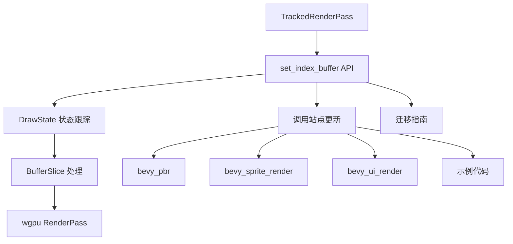

+++
title = "#20468 Remove `offset` argument from `TrackedRenderPass::set_index_buffer`"
date = "2025-09-30T00:00:00"
draft = false
template = "pull_request_page.html"
in_search_index = false

[extra]
current_language = "zh-cn"
available_languages = {"en" = { name = "English", url = "/pull_request/bevy/2025-09/pr-20468-en-20250930" }, "zh-cn" = { name = "中文", url = "/pull_request/bevy/2025-09/pr-20468-zh-cn-20250930" }}
labels = ["D-Trivial", "A-Rendering", "C-Code-Quality", "C-Usability"]
+++

# Title

## Basic Information
- **Title**: Remove `offset` argument from `TrackedRenderPass::set_index_buffer`
- **PR Link**: https://github.com/bevyengine/bevy/pull/20468
- **Author**: akimakinai
- **Status**: MERGED
- **Labels**: D-Trivial, A-Rendering, C-Code-Quality, C-Usability, M-Needs-Migration-Guide
- **Created**: 2025-08-09T03:05:09Z
- **Merged**: 2025-09-30T03:20:20Z
- **Merged By**: james7132

## Description Translation
# 目标

- `offset` 参数具有误导性，因为该参数实际上并未传递给 wgpu（仅用于记忆化和日志记录）。`BufferSlice` 已经包含了一个偏移量。
    - wgpu 的 `set_index_buffer` [根据 BufferSlice::offset 设置偏移量](https://github.com/gfx-rs/wgpu/blob/e990388af98e4b4dff9f7fcc09a4eb5d2f71d227/wgpu/src/api/render_pass.rs#L98-L105)
- `TrackedRenderPass::set_vertex_buffer` 已经考虑了切片大小 (#14916) 但遗漏了对应的 `set_index_buffer`

# 解决方案

- 从 `TrackedRenderPass::set_index_buffer` 中移除 `offset` 参数
- 将 #14916 中的修复应用到 `TrackedRenderPass::is_index_buffer_set`
- ~~使用新添加的 `BufferSlice` getter 清理代码~~ 已拆分为 https://github.com/bevyengine/bevy/pull/21289

# 测试

- 运行了一些示例

## The Story of This Pull Request

这个PR解决了一个API设计不一致的问题，这个问题源于Bevy渲染系统中索引缓冲区设置的历史遗留实现。

**问题的根源**在于`TrackedRenderPass::set_index_buffer`方法接受一个`offset`参数，但这个参数实际上并没有被传递给底层的wgpu API。当我们查看wgpu的`set_index_buffer`实现时，会发现它直接从`BufferSlice`的offset属性获取偏移量，而不是使用传入的额外offset参数。这导致了API的误导性——开发者可能会认为他们传入的offset会影响wgpu的行为，但实际上它只用于Bevy内部的缓存跟踪和日志记录。

**这个问题在之前已经部分解决**。在PR #14916中，团队已经修复了`set_vertex_buffer`的类似问题，使其能够正确处理`BufferSlice`的大小信息。但是当时遗漏了对应的`set_index_buffer`方法，这就造成了API的不一致性。

**解决方案的核心**是移除这个多余的`offset`参数，让API更加简洁和准确。这个改动涉及多个层面：

1. **API签名简化**：从`set_index_buffer(buffer_slice, offset, index_format)`改为`set_index_buffer(buffer_slice, index_format)`
2. **状态跟踪改进**：更新内部的状态检查逻辑，使其基于完整的`BufferSlice`信息（包括id、offset、size）而不仅仅是buffer id
3. **调用站点更新**：修改所有使用该API的地方，移除不再需要的offset参数

在实现细节上，这个PR引入了`BufferSliceKey`类型别名来统一处理缓冲区切片的标识：

```rust
type BufferSliceKey = (BufferId, wgpu::BufferAddress, wgpu::BufferSize);
```

这个键类型现在被用于`DrawState`结构体中的索引缓冲区跟踪：

```rust
// 之前：
index_buffer: Option<(BufferId, u64, IndexFormat)>

// 之后：
index_buffer: Option<(BufferSliceKey, IndexFormat)>
```

状态检查方法`is_index_buffer_set`也得到了相应的更新，现在它接受完整的`BufferSlice`引用而不是单独的参数：

```rust
// 之前：
fn is_index_buffer_set(&self, buffer: BufferId, offset: u64, index_format: IndexFormat) -> bool

// 之后：
fn is_index_buffer_set(&self, buffer: &BufferSlice, index_format: IndexFormat) -> bool
```

**这个改动的技术意义**在于它消除了API中的冗余信息，使代码更加符合最小惊讶原则。开发者现在可以清楚地看到，偏移量信息应该通过`BufferSlice`来指定，而不是通过额外的参数。这也使得索引缓冲区的处理与顶点缓冲区的处理保持一致，提高了代码库的一致性。

**迁移影响**相对较小但广泛。由于这是一个API破坏性变更，所有调用`set_index_buffer`的地方都需要更新。PR包含了相应的迁移指南，指导开发者如何从旧API迁移到新API：

```rust
// 之前：
pass.set_index_buffer(indices.slice(1..), 1, IndexFormat::Uint32);

// 之后：
pass.set_index_buffer(indices.slice(1..), IndexFormat::Uint32);
```

从技术债务的角度看，这个PR清理了一个历史遗留的不一致问题，使得渲染系统的API更加清晰和一致。虽然改动本身不大，但它体现了对代码质量和技术债务管理的持续关注。

## Visual Representation



## Key Files Changed

### `crates/bevy_render/src/render_phase/draw_state.rs` (+21/-35)
这是核心改动文件，包含了状态跟踪逻辑的重构：

```rust
// 关键改动：移除了offset参数
// 之前：
pub fn set_index_buffer(
    &mut self,
    buffer_slice: BufferSlice<'a>,
    offset: u64,
    index_format: IndexFormat,
)

// 之后：
pub fn set_index_buffer(&mut self, buffer_slice: BufferSlice<'a>, index_format: IndexFormat)

// 状态跟踪改进：
// 之前基于buffer id和offset的检查
if self.state.is_index_buffer_set(buffer_slice.id(), offset, index_format)

// 之后基于完整BufferSlice的检查
let already_set = self.state.is_index_buffer_set(&buffer_slice, index_format)
```

### `release-content/migration-guides/set_index_buffer.md` (+13/-0)
新增的迁移指南文档：

```markdown
---
title: "`TrackedRenderPass::set_index_buffer` no longer takes buffer offset"
pull_requests: [20468]
---

`TrackedRenderPass::set_index_buffer` no longer takes a separate buffer offset argument, which wasn't actually forwarded to wgpu. You have already needed to pass a `BufferSlice` that is sliced to the desired offset/size.

```rust
// Before:
pass.set_index_buffer(indices.slice(1..), 1, IndexFormat::Uint32);
// After:
pass.set_index_buffer(indices.slice(1..), IndexFormat::Uint32);
```
```

### `crates/bevy_pbr/src/render/mesh.rs` (+1/-1)
PBR渲染模块的更新：

```rust
// 之前：
pass.set_index_buffer(index_buffer_slice.buffer.slice(..), 0, *index_format);

// 之后：
pass.set_index_buffer(index_buffer_slice.buffer.slice(..), *index_format);
```

### `crates/bevy_sprite_render/src/mesh2d/mesh.rs` (+1/-1)
2D网格渲染的更新：

```rust
// 之前：
pass.set_index_buffer(index_buffer_slice.buffer.slice(..), 0, *index_format);

// 之后：
pass.set_index_buffer(index_buffer_slice.buffer.slice(..), *index_format);
```

### `crates/bevy_ui_render/src/box_shadow.rs` (+1/-1)
UI阴影渲染的更新：

```rust
// 之前：
pass.set_index_buffer(indices.slice(..), 0, IndexFormat::Uint32);

// 之后：
pass.set_index_buffer(indices.slice(..), IndexFormat::Uint32);
```

这些改动共同实现了API的简化和内部状态跟踪的改进，使代码更加一致和清晰。

## Further Reading

- [wgpu RenderPass documentation](https://docs.rs/wgpu/latest/wgpu/struct.RenderPass.html#method.set_index_buffer) - 了解底层wgpu API的行为
- [Bevy Render Phase System](https://github.com/bevyengine/bevy/blob/main/crates/bevy_render/src/render_phase/mod.rs) - 理解Bevy的渲染阶段架构
- [PR #14916](https://github.com/bevyengine/bevy/pull/14916) - 之前对顶点缓冲区的类似修复
- [BufferSlice documentation](https://docs.rs/bevy_render/latest/bevy_render/render_resource/struct.BufferSlice.html) - 了解BufferSlice的结构和用法