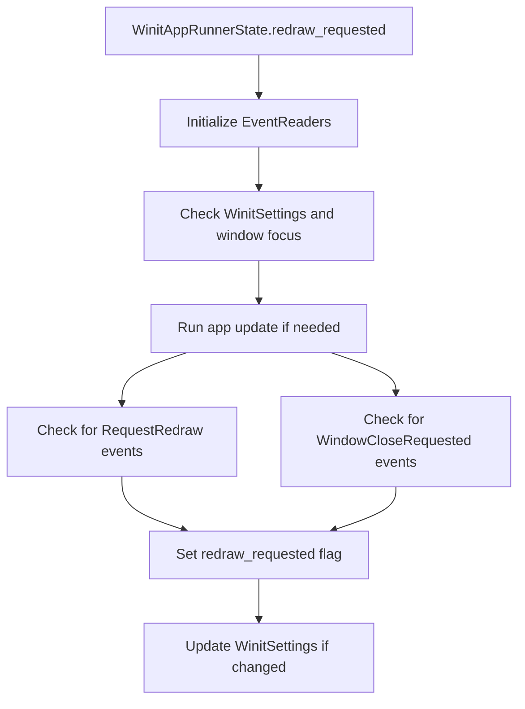

+++
title = "#20624 Fix missed RedrawRequested and WindowCloseRequested events with UpdateMode::Reactive (part 2) [ADOPTED]"
date = "2025-09-07T00:00:00"
draft = false
template = "pull_request_page.html"
in_search_index = true

[taxonomies]
list_display = ["show"]

[extra]
current_language = "en"
available_languages = {"en" = { name = "English", url = "/pull_request/bevy/2025-09/pr-20624-en-20250907" }, "zh-cn" = { name = "中文", url = "/pull_request/bevy/2025-09/pr-20624-zh-cn-20250907" }}
labels = ["C-Bug", "A-Windowing", "D-Complex"]
+++

# Fix missed RedrawRequested and WindowCloseRequested events with UpdateMode::Reactive (part 2) [ADOPTED]

## Basic Information
- **Title**: Fix missed RedrawRequested and WindowCloseRequested events with UpdateMode::Reactive (part 2) [ADOPTED]
- **PR Link**: https://github.com/bevyengine/bevy/pull/20624
- **Author**: atlv24
- **Status**: MERGED
- **Labels**: C-Bug, A-Windowing, S-Ready-For-Final-Review, D-Complex
- **Created**: 2025-08-17T19:31:47Z
- **Merged**: 2025-09-07T08:12:15Z
- **Merged By**: mockersf

## Description Translation
# Objective

- Adopt and rebase #18549

## Solution

- merge conflicts were just if let chains

## Testing

- example added by the PR works on mac

## The Story of This Pull Request

This PR addresses a subtle but important issue in Bevy's windowing system where `RedrawRequested` and `WindowCloseRequested` events were being missed when using `UpdateMode::Reactive`. The problem occurred because these events were only being checked at specific points in the event processing loop, potentially missing events that were generated during application updates.

The core issue was in the `redraw_requested` method of `WinitAppRunnerState`. Previously, the code only checked for `RequestRedraw` events at the beginning of the method and then again conditionally after running the app update. However, it didn't account for `WindowCloseRequested` events at all, and the timing of the event checks meant that events generated during the update could be missed.

The solution involved two key changes:

1. Adding proper event reading for both `RequestRedraw` and `WindowCloseRequested` events after the app update runs
2. Creating a comprehensive test example to verify the fix works correctly

The implementation ensures that after running the app update, the system checks for any new `RequestRedraw` events that might have been sent during the update, as well as any `WindowCloseRequested` events that may have been generated. If either type of event is found, it sets the `redraw_requested` flag to true, ensuring the window will be redrawn appropriately.

This fix is particularly important for applications using `UpdateMode::Reactive` (set via `WinitSettings::desktop_app()`) because this mode relies on event-driven updates rather than continuous rendering. Without this fix, such applications might fail to redraw when expected or miss window close requests.

The test example (`desktop_request_redraw`) demonstrates the fix by creating a 3D scene with a rotating cube and an FPS overlay. The example uses a high-resolution FPS counter refresh interval (16ms) to clearly show when updates are happening. Users can left-click to start animation and right-click to pause it, with the FPS counter updating rapidly during animation and pausing when idle.

## Visual Representation



## Key Files Changed

### `crates/bevy_winit/src/state.rs` (+19/-6)
This file contains the core fix for the event handling issue. The changes ensure that both `RequestRedraw` and `WindowCloseRequested` events are properly checked after running the app update.

**Key changes:**
```rust
// Before:
if let Some(app_redraw_events) = self.world().get_resource::<Events<RequestRedraw>>()
    && redraw_event_reader.read(app_redraw_events).last().is_some()
{
    self.redraw_requested = true;
}

// After:
// Read RequestRedraw events that may have been sent during the update
if let Some(app_redraw_events) = self.world().get_resource::<Events<RequestRedraw>>()
    && redraw_event_reader.read(app_redraw_events).last().is_some()
{
    self.redraw_requested = true;
}

// Running the app may have produced WindowCloseRequested events that should be processed
if let Some(close_request_events) =
    self.world().get_resource::<Events<WindowCloseRequested>>()
    && close_event_reader
        .read(close_request_events)
        .last()
        .is_some()
{
    self.redraw_requested = true;
}
```

### `tests/window/desktop_request_redraw.rs` (+109/-0)
This new test file provides a comprehensive example that verifies the fix works correctly. It creates a 3D scene with interactive elements and demonstrates proper redraw behavior.

**Key components:**
```rust
fn redraw(mut commands: Commands, query: Query<Entity, With<AnimationActive>>) {
    if query.iter().next().is_some() {
        commands.write_event(RequestRedraw);
    }
}
```

### `Cargo.toml` (+9/-0)
This change adds the new test example to the project configuration so it can be built and run.

## Further Reading

- [Bevy Window Management](https://bevyengine.org/learn/book/getting-started/window-management/)
- [Bevy Events System](https://bevyengine.org/learn/book/getting-started/events/)
- [Winit Documentation](https://docs.rs/winit/latest/winit/)
- [Original PR #18549](https://github.com/bevyengine/bevy/pull/18549) - The original implementation that this PR adopts and rebases

# Full Code Diff
```diff
diff --git a/Cargo.toml b/Cargo.toml
index 97bbfdddb0152..f9a42862f6802 100644
--- a/Cargo.toml
+++ b/Cargo.toml
@@ -3874,6 +3874,15 @@ doc-scrape-examples = true
 [package.metadata.example.minimizing]
 hidden = true
 
+[[example]]
+name = "desktop_request_redraw"
+path = "tests/window/desktop_request_redraw.rs"
+doc-scrape-examples = true
+required-features = ["bevy_dev_tools"]
+
+[package.metadata.example.desktop_request_redraw]
+hidden = true
+
 [[example]]
 name = "window_resizing"
 path = "examples/window/window_resizing.rs"
diff --git a/crates/bevy_winit/src/state.rs b/crates/bevy_winit/src/state.rs
index 6c1ed3dd446f0..8fb9e4547d2b0 100644
--- a/crates/bevy_winit/src/state.rs
+++ b/crates/bevy_winit/src/state.rs
@@ -500,16 +500,11 @@ impl<T: BufferedEvent> ApplicationHandler<T> for WinitAppRunnerState<T> {
 impl<T: BufferedEvent> WinitAppRunnerState<T> {
     fn redraw_requested(&mut self, event_loop: &ActiveEventLoop) {
         let mut redraw_event_reader = EventCursor::<RequestRedraw>::default();
+        let mut close_event_reader = EventCursor::<WindowCloseRequested>::default();
 
         let mut focused_windows_state: SystemState<(Res<WinitSettings>, Query<(Entity, &Window)>)> =
             SystemState::new(self.world_mut());
 
-        if let Some(app_redraw_events) = self.world().get_resource::<Events<RequestRedraw>>()
-            && redraw_event_reader.read(app_redraw_events).last().is_some()
-        {
-            self.redraw_requested = true;
-        }
-
         let (config, windows) = focused_windows_state.get(self.world());
         let focused = windows.iter().any(|(_, window)| window.focused);
 
@@ -619,6 +614,24 @@ impl<T: BufferedEvent> WinitAppRunnerState<T> {
                 self.redraw_requested = true;
             }
 
+            // Read RequestRedraw events that may have been sent during the update
+            if let Some(app_redraw_events) = self.world().get_resource::<Events<RequestRedraw>>()
+                && redraw_event_reader.read(app_redraw_events).last().is_some()
+            {
+                self.redraw_requested = true;
+            }
+
+            // Running the app may have produced WindowCloseRequested events that should be processed
+            if let Some(close_request_events) =
+                self.world().get_resource::<Events<WindowCloseRequested>>()
+                && close_event_reader
+                    .read(close_request_events)
+                    .last()
+                    .is_some()
+            {
+                self.redraw_requested = true;
+            }
+
             // Running the app may have changed the WinitSettings resource, so we have to re-extract it.
             let (config, windows) = focused_windows_state.get(self.world());
             let focused = windows.iter().any(|(_, window)| window.focused);
diff --git a/tests/window/desktop_request_redraw.rs b/tests/window/desktop_request_redraw.rs
new file mode 100644
index 0000000000000..5cabc42e23a39
--- /dev/null
+++ b/tests/window/desktop_request_redraw.rs
@@ -0,0 +1,109 @@
+//! Desktop request redraw
+use bevy::{
+    dev_tools::fps_overlay::{FpsOverlayConfig, FpsOverlayPlugin},
+    prelude::*,
+    window::RequestRedraw,
+    winit::WinitSettings,
+};
+
+fn main() {
+    App::new()
+        .add_plugins(DefaultPlugins)
+        .add_plugins(MeshPickingPlugin)
+        // Enable the FPS overlay with a high resolution refresh interval. This makes it
+        // easier to validate that UpdateMode is behaving correctly when desktop_app is used.
+        // The FPS counter should essentially pause when the cube is not rotating and should
+        // update rapidly when the cube is rotating or there is input (e.g. moving the mouse).
+        //
+        // Left and Right clicking the cube should roggle rotation on/off.
+        .add_plugins(FpsOverlayPlugin {
+            config: FpsOverlayConfig {
+                text_config: TextFont {
+                    font_size: 12.0,
+                    ..default()
+                },
+                text_color: Color::srgb(0.0, 1.0, 0.0),
+                refresh_interval: core::time::Duration::from_millis(16),
+                ..default()
+            },
+        })
+        .insert_resource(WinitSettings::desktop_app())
+        .add_systems(Startup, setup)
+        .add_systems(Update, (update, redraw.after(update)))
+        .run();
+}
+
+#[derive(Component)]
+struct AnimationActive;
+
+fn setup(
+    mut commands: Commands,
+    mut meshes: ResMut<Assets<Mesh>>,
+    mut materials: ResMut<Assets<StandardMaterial>>,
+) {
+    commands.spawn((
+        Camera3d::default(),
+        Transform::from_xyz(0.0, 5.0, 0.0).looking_at(Vec3::ZERO, Vec3::Y),
+    ));
+
+    commands.spawn((
+        PointLight {
+            intensity: 1e6,
+            ..Default::default()
+        },
+        Transform::from_xyz(-1.0, 5.0, 1.0),
+    ));
+
+    let node = Node {
+        display: Display::Block,
+        padding: UiRect::all(Val::Px(10.0)),
+        row_gap: Val::Px(10.0),
+        ..Default::default()
+    };
+
+    commands.spawn((
+        node.clone(),
+        children![
+            (
+                node.clone(),
+                children![Text::new("Right click cube to pause animation")]
+            ),
+            (
+                node.clone(),
+                children![Text::new("Left click cube to start animation")]
+            )
+        ],
+    ));
+
+    commands
+        .spawn((
+            Mesh3d(meshes.add(Cuboid::from_length(1.0))),
+            MeshMaterial3d(materials.add(Color::WHITE)),
+            AnimationActive,
+        ))
+        .observe(
+            |trigger: On<Pointer<Click>>, mut commands: Commands| match trigger.button {
+                PointerButton::Primary => {
+                    commands.entity(trigger.entity()).insert(AnimationActive);
+                }
+                PointerButton::Secondary => {
+                    commands
+                        .entity(trigger.entity())
+                        .remove::<AnimationActive>();
+                }
+                _ => {}
+            },
+        );
+}
+
+fn update(time: Res<Time>, mut query: Query<&mut Transform, With<AnimationActive>>) {
+    if let Ok(mut transform) = query.single_mut() {
+        transform.rotate_x(time.delta_secs().min(1.0 / 60.0));
+    }
+}
+
+fn redraw(mut commands: Commands, query: Query<Entity, With<AnimationActive>>) {
+    if query.iter().next().is_some() {
+        commands.write_event(RequestRedraw);
+    }
+}
```