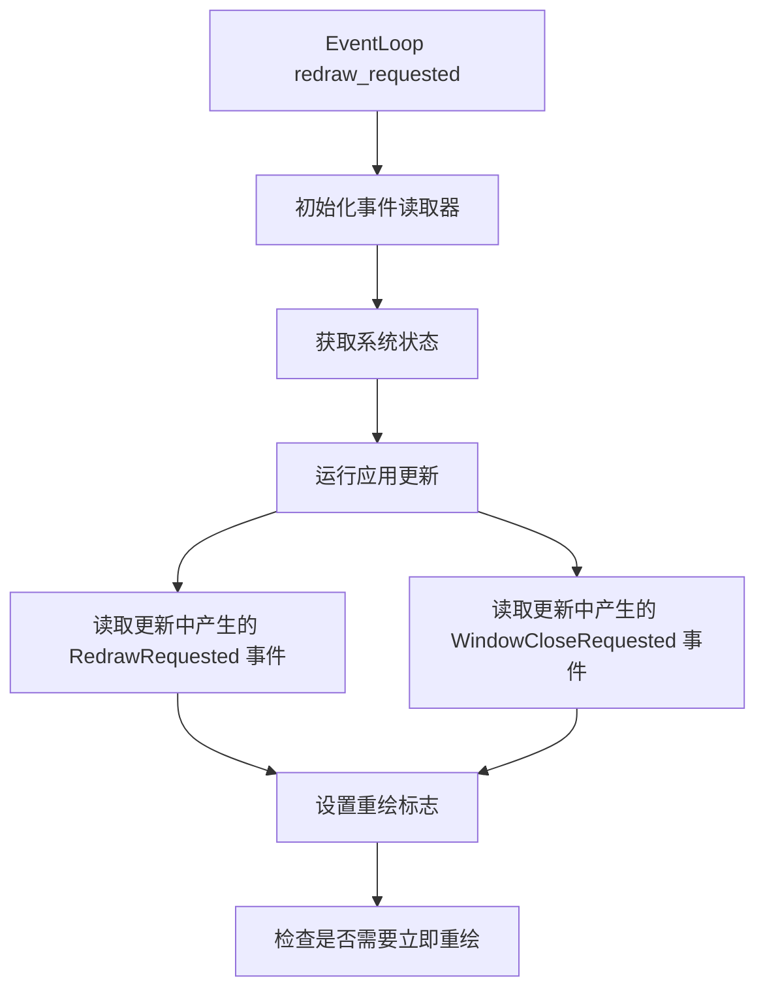

+++
title = "#20624 Fix missed RedrawRequested and WindowCloseRequested events with UpdateMode::Reactive (part 2) [ADOPTED]"
date = "2025-09-07T00:00:00"
draft = false
template = "pull_request_page.html"
in_search_index = false

[extra]
current_language = "zh-cn"
available_languages = {"en" = { name = "English", url = "/pull_request/bevy/2025-09/pr-20624-en-20250907" }, "zh-cn" = { name = "中文", url = "/pull_request/bevy/2025-09/pr-20624-zh-cn-20250907" }}
+++

# 分析报告：PR #20624 - 修复 UpdateMode::Reactive 模式下遗漏的 RedrawRequested 和 WindowCloseRequested 事件（第二部分）

## 基本信息
- **标题**: Fix missed RedrawRequested and WindowCloseRequested events with UpdateMode::Reactive (part 2) [ADOPTED]
- **PR 链接**: https://github.com/bevyengine/bevy/pull/20624
- **作者**: atlv24
- **状态**: 已合并
- **标签**: C-Bug, A-Windowing, S-Ready-For-Final-Review, D-Complex
- **创建时间**: 2025-08-17T19:31:47Z
- **合并时间**: 2025-09-07T08:12:15Z
- **合并人**: mockersf

## 描述翻译
### Objective
- 采用并重新基于 #18549

### Solution
- 合并冲突只是 if let 链

### Testing
- PR 添加的示例在 Mac 上工作正常

## 这个 PR 的故事

这个 PR 解决了一个在 Bevy 窗口系统中存在的关键问题：当使用 `UpdateMode::Reactive` 模式时，某些重要的事件可能会被遗漏处理。具体来说，`RedrawRequested` 和 `WindowCloseRequested` 事件在处理流程中的特定时机没有被正确捕获。

### 问题和背景

在 Bevy 的窗口事件处理系统中，存在一个时序问题。当应用处于 `UpdateMode::Reactive` 模式时，系统只在有事件或请求时才进行更新和重绘。然而，原来的实现在处理重绘请求时存在一个缺陷：它在应用更新之前就检查了 `RequestRedraw` 事件，这意味着在应用更新过程中产生的新重绘请求会被忽略。

此外，系统完全没有处理 `WindowCloseRequested` 事件，这可能导致窗口关闭请求被忽略，特别是在响应式更新模式下。

### 解决方案方法

开发者采用了直接而有效的方法来解决这个问题：

1. 调整事件读取的时机：将 `RequestRedraw` 事件的读取从应用更新之前移动到应用更新之后
2. 新增对 `WindowCloseRequested` 事件的检查：在处理流程中添加了对窗口关闭请求的处理
3. 添加测试用例：创建了一个完整的示例来验证修复效果

这种方法确保了所有在应用更新过程中产生的事件都能被正确捕获和处理。

### 实现细节

核心的修改在 `crates/bevy_winit/src/state.rs` 文件中的 `redraw_requested` 方法。原来的实现在应用更新前就检查重绘事件：

```rust
// 之前的代码（有问题）：
if let Some(app_redraw_events) = self.world().get_resource::<Events<RequestRedraw>>()
    && redraw_event_reader.read(app_redraw_events).last().is_some()
{
    self.redraw_requested = true;
}
```

修改后的实现将事件读取移到应用更新之后，并添加了对关闭事件的处理：

```rust
// 读取在更新过程中可能发送的 RequestRedraw 事件
if let Some(app_redraw_events) = self.world().get_resource::<Events<RequestRedraw>>()
    && redraw_event_reader.read(app_redraw_events).last().is_some()
{
    self.redraw_requested = true;
}

// 运行应用可能产生了需要处理的 WindowCloseRequested 事件
if let Some(close_request_events) =
    self.world().get_resource::<Events<WindowCloseRequested>>()
    && close_event_reader
        .read(close_request_events)
        .last()
        .is_some()
{
    self.redraw_requested = true;
}
```

这种修改确保了在应用更新过程中产生的所有相关事件都能被正确捕获。

### 技术洞察

这个修复展示了事件处理系统中的重要模式：**事件处理的时机至关重要**。在响应式系统中，事件可能在任何时候产生，包括在系统更新过程中。因此，事件读取需要在所有可能产生事件的代码执行完成后进行。

另一个关键点是使用了 `EventCursor` 来读取事件，这是一种不会消耗事件的方式，允许多个系统读取相同的事件。

### 影响

这个修复解决了以下具体问题：
1. 确保在 `UpdateMode::Reactive` 模式下，所有 `RequestRedraw` 事件都能被正确处理
2. 添加了对 `WindowCloseRequested` 事件的处理，防止窗口关闭请求被忽略
3. 提供了可靠的测试用例，确保修复的持续有效性

这个修改对于使用响应式更新模式的应用程序特别重要，因为它确保了用户交互和系统事件能够得到及时响应。

## 可视化表示



## 关键文件更改

### `crates/bevy_winit/src/state.rs` (+19/-6)
这个文件包含了核心的事件处理逻辑修复。

**主要修改：**
```rust
// 之前（有问题的代码位置）：
if let Some(app_redraw_events) = self.world().get_resource::<Events<RequestRedraw>>()
    && redraw_event_reader.read(app_redraw_events).last().is_some()
{
    self.redraw_requested = true;
}

// 之后（修复后的代码位置）：
// 读取在更新过程中可能发送的 RequestRedraw 事件
if let Some(app_redraw_events) = self.world().get_resource::<Events<RequestRedraw>>()
    && redraw_event_reader.read(app_redraw_events).last().is_some()
{
    self.redraw_requested = true;
}

// 运行应用可能产生了需要处理的 WindowCloseRequested 事件
if let Some(close_request_events) =
    self.world().get_resource::<Events<WindowCloseRequested>>()
    && close_event_reader
        .read(close_request_events)
        .last()
        .is_some()
{
    self.redraw_requested = true;
}
```

### `tests/window/desktop_request_redraw.rs` (+109/-0)
新增的测试文件，提供了一个完整的示例来验证修复。

**关键内容：**
```rust
fn redraw(mut commands: Commands, query: Query<Entity, With<AnimationActive>>) {
    if query.iter().next().is_some() {
        commands.write_event(RequestRedraw);
    }
}
```

这个测试创建了一个交互式的 3D 场景，用户可以通过点击来启动或停止动画，验证重绘请求是否正确处理。

### `Cargo.toml` (+9/-0)
添加了新测试示例的配置。

```toml
[[example]]
name = "desktop_request_redraw"
path = "tests/window/desktop_request_redraw.rs"
doc-scrape-examples = true
required-features = ["bevy_dev_tools"]

[package.metadata.example.desktop_request_redraw]
hidden = true
```

## 延伸阅读

对于想深入了解此 PR 相关概念的开发者，建议阅读以下资源：

1. **Bevy 事件系统文档**：https://bevyengine.org/learn/books/introduction/events
2. **Winit 事件循环文档**：https://docs.rs/winit/latest/winit/event_loop/index.html
3. **响应式编程模式**：https://en.wikipedia.org/wiki/Reactive_programming
4. **Bevy 的 UpdateMode 文档**：https://docs.rs/bevy/latest/bevy/winit/struct.WinitSettings.html#UpdateMode

这些资源可以帮助开发者更好地理解 Bevy 的事件处理机制和响应式更新模式的工作原理。