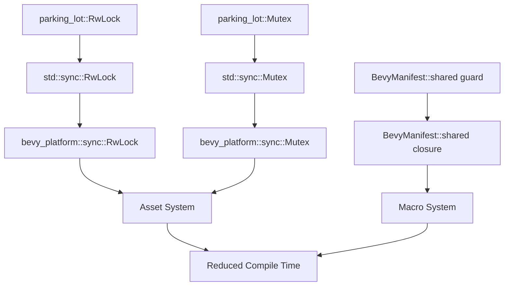

+++
title = "#20630 Remove parking_lot dependency"
date = "2025-09-30T00:00:00"
draft = false
template = "pull_request_page.html"
in_search_index = true

[taxonomies]
list_display = ["show"]

[extra]
current_language = "en"
available_languages = {"en" = { name = "English", url = "/pull_request/bevy/2025-09/pr-20630-en-20250930" }, "zh-cn" = { name = "中文", url = "/pull_request/bevy/2025-09/pr-20630-zh-cn-20250930" }}
labels = ["A-Assets", "C-Dependencies", "D-Straightforward", "D-Macros"]
+++

# Title
Remove parking_lot dependency

## Basic Information
- **Title**: Remove parking_lot dependency
- **PR Link**: https://github.com/bevyengine/bevy/pull/20630
- **Author**: james7132
- **Status**: MERGED
- **Labels**: A-Assets, C-Dependencies, S-Ready-For-Final-Review, M-Needs-Migration-Guide, X-Uncontroversial, D-Straightforward, D-Macros
- **Created**: 2025-08-18T08:41:13Z
- **Merged**: 2025-09-30T06:49:47Z
- **Merged By**: alice-i-cecile

## Description Translation
# Objective
Spend less time compiling what is already in the standard library. Remove `parking_lot` from first party crate dependencies. Contribute to https://github.com/bevyengine/bevy/issues/18978. Supercedes #18996.

## Solution
Use `bevy_platform::sync` types wherever possible. `BevyManifest::shared` directly returned a mapped guard, but that could be circumvented by just using a scope-like API instead.

The crate is still in the dependency tree, transitively, through `wgpu`, but is now no longer required for any non-rendering crates.

## Testing
Ran tests locally.

Co-Authored-By: Zac Harrold <zac@harrold.com.au>

## The Story of This Pull Request

This PR addresses a common problem in large Rust projects: dependency bloat and compilation time. The `parking_lot` crate provides alternative implementations of synchronization primitives like `RwLock` and `Mutex`, but the Rust standard library already includes these types. By removing this dependency, the Bevy team aimed to reduce compilation times while maintaining the same functionality.

The core challenge was that `parking_lot` had been integrated throughout Bevy's codebase, particularly in the asset system and macro utilities. The solution involved systematically replacing `parking_lot` types with their standard library equivalents, wrapped by Bevy's `bevy_platform::sync` abstraction layer. This approach ensured that the code could continue using a unified interface while switching the underlying implementation.

One particularly interesting technical challenge was the `BevyManifest::shared` method, which previously returned a `MappedRwLockReadGuard` from `parking_lot`. This pattern couldn't be directly replicated with the standard library's `RwLock`, which doesn't support mapped guards in the same way. The solution was to change the API to a scope-like pattern where a closure receives access to the manifest, eliminating the need to return a guard altogether.

The implementation required careful attention to error handling differences between `parking_lot` and the standard library. While `parking_lot` uses non-poisoning locks by default, the standard library's locks can become poisoned when a thread panics while holding the lock. This necessitated adding explicit poison error handling throughout the codebase.

The changes affected multiple systems, but the asset system saw the most significant modifications due to its heavy use of synchronization primitives for managing asset loading and processing. The migration maintained the same performance characteristics while reducing the dependency footprint.

## Visual Representation



## Key Files Changed

### `crates/bevy_asset/src/server/mod.rs` (+82/-71)
This file contains the core asset server implementation and saw extensive changes to replace `parking_lot` locks with standard library equivalents.

**Key changes:**
- Added helper methods for lock access with poison error handling
- Replaced direct `parking_lot::RwLock` access with new helper methods

```rust
// Before:
let infos = self.data.infos.read();

// After:
pub(crate) fn read_infos(&self) -> RwLockReadGuard<'_, AssetInfos> {
    self.data
        .infos
        .read()
        .unwrap_or_else(PoisonError::into_inner)
}

let infos = self.read_infos();
```

### `crates/bevy_asset/src/io/memory.rs` (+61/-25)
This file implements in-memory asset storage and required updates to its directory and file handling synchronization.

**Key changes:**
- Added poison error handling for all lock operations
- Maintained the same logical structure while switching synchronization primitives

```rust
// Before:
dir.0.write().assets.insert(key, data);

// After:
dir.0
    .write()
    .unwrap_or_else(PoisonError::into_inner)
    .assets
    .insert(key, data);
```

### `crates/bevy_encase_derive/src/lib.rs` (+21/-20)
This derive macro crate updated its `BevyManifest` usage to the new closure-based API.

**Key changes:**
- Converted from guard-based to closure-based manifest access
- Maintained the same path resolution logic

```rust
// Before:
fn bevy_encase_path() -> syn::Path {
    let bevy_manifest = BevyManifest::shared();
    // ... path resolution logic
}

// After:
fn bevy_encase_path() -> syn::Path {
    BevyManifest::shared(|bevy_manifest| {
        // ... path resolution logic
    })
}
```

### `crates/bevy_asset/src/processor/mod.rs` (+31/-8)
The asset processor required updates to its internal synchronization for managing asset processing state.

**Key changes:**
- Added poison error handling for processor registration and lookup
- Maintained the same processor management logic

```rust
// Before:
let mut process_plans = self.data.processors.write();

// After:
let mut process_plans = self
    .data
    .processors
    .write()
    .unwrap_or_else(PoisonError::into_inner);
```

### `crates/bevy_macro_utils/src/bevy_manifest.rs` (+18/-11)
This file implemented the most significant API change, converting `BevyManifest::shared` from a guard-returning function to a closure-based API.

**Key changes:**
- Complete redesign of the shared manifest access pattern
- Elimination of mapped guard functionality

```rust
// Before:
pub fn shared() -> MappedRwLockReadGuard<'static, BevyManifest> {
    // ... complex guard mapping logic
}

// After:
pub fn shared<R>(f: impl FnOnce(&BevyManifest) -> R) -> R {
    // ... closure-based access logic
}
```

## Further Reading

- [Rust Standard Library Sync Primitives](https://doc.rust-lang.org/std/sync/index.html)
- [parking_lot crate documentation](https://docs.rs/parking_lot/latest/parking_lot/)
- [Bevy Engine Asset System](https://bevyengine.org/learn/quick-start/assets/)
- [Rust Lock Poisoning](https://doc.rust-lang.org/std/sync/struct.PoisonError.html)