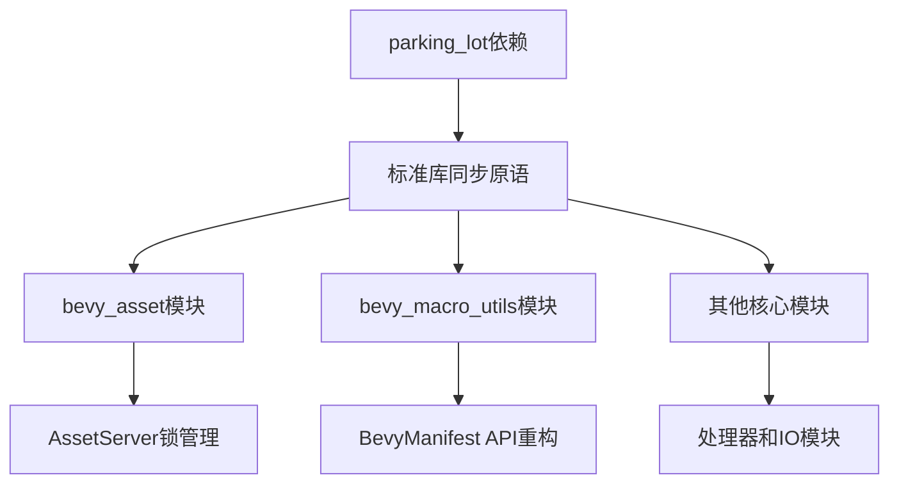

+++
title = "#20630 Remove parking_lot dependency"
date = "2025-09-30T00:00:00"
draft = false
template = "pull_request_page.html"
in_search_index = false

[extra]
current_language = "zh-cn"
available_languages = {"en" = { name = "English", url = "/pull_request/bevy/2025-09/pr-20630-en-20250930" }, "zh-cn" = { name = "中文", url = "/pull_request/bevy/2025-09/pr-20630-zh-cn-20250930" }}
labels = ["A-Assets", "C-Dependencies", "D-Straightforward", "D-Macros"]
+++

# Remove parking_lot dependency

## Basic Information
- **Title**: Remove parking_lot dependency
- **PR Link**: https://github.com/bevyengine/bevy/pull/20630
- **Author**: james7132
- **Status**: MERGED
- **Labels**: A-Assets, C-Dependencies, S-Ready-For-Final-Review, M-Needs-Migration-Guide, X-Uncontroversial, D-Straightforward, D-Macros
- **Created**: 2025-08-18T08:41:13Z
- **Merged**: 2025-09-30T06:49:47Z
- **Merged By**: alice-i-cecile

## Description Translation
**目标**
减少编译已经在标准库中的内容所需的时间。从第一方crate依赖中移除`parking_lot`。为https://github.com/bevyengine/bevy/issues/18978做贡献。取代#18996。

**解决方案**
尽可能使用`bevy_platform::sync`类型。`BevyManifest::shared`直接返回了一个映射的guard，但这可以通过使用作用域式API来规避。

该crate仍然通过`wgpu`传递性地存在于依赖树中，但现在不再被任何非渲染crate所需要。

**测试**
本地运行了测试。

共同作者：Zac Harrold <zac@harrold.com.au>

## The Story of This Pull Request

这个PR的核心目标是解决Bevy引擎中一个长期存在的依赖管理问题：减少对外部同步原语库`parking_lot`的依赖，转而更多使用Rust标准库中已经提供的同步机制。这个改变是Bevy项目整体依赖简化计划的一部分，旨在降低编译时间并简化依赖树。

**问题背景与上下文**

`parking_lot`是一个广泛使用的第三方同步原语库，提供了比标准库更丰富的功能和在某些情况下的性能优势。然而，在Bevy这样的游戏引擎中，依赖管理是一个重要的考量因素。每个额外的依赖都会增加编译时间、二进制大小和潜在的维护负担。特别是在Bevy的资产系统、宏系统和其他核心模块中，如果能够使用标准库提供的功能，就能显著简化整个项目的依赖结构。

**解决方案方法**

开发者选择了直接但系统性的方法：将代码库中所有使用`parking_lot`的地方替换为标准库的同步原语。这个替换不是简单的1:1映射，而是需要仔细考虑API差异和错误处理。关键的技术决策包括：

1. 使用`std::sync::RwLock`替代`parking_lot::RwLock`
2. 使用`std::sync::Mutex`替代`parking_lot::Mutex` 
3. 处理标准库同步原语的`PoisonError`错误处理
4. 重构`BevyManifest`的API以规避需要返回映射guard的场景

**具体实现细节**

在资产系统模块中，可以看到最显著的变化。例如在`crates/bevy_asset/src/server/mod.rs`中，添加了辅助方法来统一处理锁的获取和错误处理：

```rust
pub(crate) fn read_infos(&self) -> RwLockReadGuard<'_, AssetInfos> {
    self.data
        .infos
        .read()
        .unwrap_or_else(PoisonError::into_inner)
}

pub(crate) fn write_infos(&self) -> RwLockWriteGuard<'_, AssetInfos> {
    self.data
        .infos
        .write()
        .unwrap_or_else(PoisonError::into_inner)
}
```

这种模式在整个代码库中重复出现，确保在获取锁时能够正确处理可能的poison错误。

在宏系统中，`BevyManifest::shared`的API经历了重大重构。原来的实现返回一个映射的读写锁guard，这在标准库中难以实现。新的实现采用了作用域式API：

```rust
// 重构前
let manifest = BevyManifest::shared();
let path = manifest.get_path("bevy_ecs");

// 重构后  
let path = BevyManifest::shared(|manifest| {
    manifest.get_path("bevy_ecs")
});
```

这种设计避免了需要返回复杂guard类型的问题，同时保持了相同的功能。

**技术洞察**

这个PR展示了几个重要的工程模式：

1. **错误处理策略**：标准库的同步原语在线程panic时会poison锁，而`parking_lot`不会。PR中采用了统一的错误处理策略，使用`unwrap_or_else(PoisonError::into_inner)`来在锁被poison时继续执行。

2. **API设计演进**：当底层实现发生变化时，有时需要重新设计公共API。`BevyManifest`的变更是一个很好的例子，展示了如何通过改变API设计来适应不同的实现约束。

3. **依赖管理的权衡**：虽然`parking_lot`在某些情况下有性能优势，但减少外部依赖带来的编译时间改善和简化维护的收益被认为更重要。

**影响与成果**

这个PR成功地从Bevy的第一方依赖中移除了`parking_lot`，显著简化了依赖树。虽然`parking_lot`仍然通过`wgpu`间接存在，但Bevy的核心模块不再直接依赖它。这带来了编译时间的改善，并减少了潜在依赖冲突的可能性。

迁移指南的添加确保了用户能够平滑过渡到新的API，特别是对于使用`BevyManifest::shared`的开发者。

## Visual Representation



## Key Files Changed

### `crates/bevy_asset/src/server/mod.rs` (+82/-71)

这个文件包含了资产服务器的核心逻辑，是变化最大的文件之一。主要变化是添加了辅助方法来统一处理标准库RwLock的获取和错误处理。

**关键修改：**
```rust
// 添加的辅助方法
pub(crate) fn read_infos(&self) -> RwLockReadGuard<'_, AssetInfos> {
    self.data
        .infos
        .read()
        .unwrap_or_else(PoisonError::into_inner)
}

pub(crate) fn write_infos(&self) -> RwLockWriteGuard<'_, AssetInfos> {
    self.data
        .infos
        .write()
        .unwrap_or_else(PoisonError::into_inner)
}
```

这些方法在整个文件中被用来替换原来的`self.data.infos.read()`和`self.data.infos.write()`调用，确保正确处理锁的poison状态。

### `crates/bevy_asset/src/io/memory.rs` (+61/-25)

内存资产IO实现，包含了从`parking_lot::RwLock`到`std::sync::RwLock`的迁移。

**关键修改：**
```rust
// 修改前使用parking_lot
dir.0.write().assets.insert(...)

// 修改后使用标准库，需要错误处理  
dir.0.write().unwrap_or_else(PoisonError::into_inner).assets.insert(...)
```

这个变化影响了所有对内存中资产数据的并发访问，确保了线程安全。

### `crates/bevy_macro_utils/src/bevy_manifest.rs` (+18/-11)

Bevy清单系统的核心实现，经历了重大的API重构。

**关键修改：**
```rust
// 修改前的API
pub fn shared() -> MappedRwLockReadGuard<'static, BevyManifest> {
    // 返回映射的guard
}

// 修改后的作用域式API  
pub fn shared<R>(f: impl FnOnce(&BevyManifest) -> R) -> R {
    // 在作用域内执行回调
}
```

这个重构避免了标准库RwLock不支持返回映射guard的限制。

### `crates/bevy_asset/src/processor/mod.rs` (+31/-8)

资产处理器模块，更新了处理器注册和查找的锁管理。

**关键修改：**
```rust
// 修改后的处理器注册
pub fn register_processor<P: Process>(&self, processor: P) {
    let mut process_plans = self
        .data
        .processors
        .write()
        .unwrap_or_else(PoisonError::into_inner);
    // ... 注册逻辑
}
```

### `crates/bevy_encase_derive/src/lib.rs` (+21/-20)

encase派生宏的实现，更新了Bevy清单的访问方式。

**关键修改：**
```rust
// 修改前
fn bevy_encase_path() -> syn::Path {
    let bevy_manifest = BevyManifest::shared();
    // ... 路径构建逻辑
}

// 修改后  
fn bevy_encase_path() -> syn::Path {
    BevyManifest::shared(|bevy_manifest| {
        // ... 路径构建逻辑
    })
}
```

## Further Reading

- [Rust标准库std::sync模块文档](https://doc.rust-lang.org/std/sync/index.html)
- [parking_lot crate文档](https://docs.rs/parking_lot/latest/parking_lot/)
- [Bevy引擎依赖管理讨论](https://github.com/bevyengine/bevy/issues/18978)
- [Rust并发编程指南](https://doc.rust-lang.org/book/ch16-00-concurrency.html)