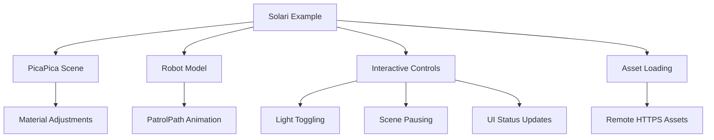

+++
title = "#20658 Solari PicaPica scene"
date = "2025-09-03T00:00:00"
draft = false
template = "pull_request_page.html"
in_search_index = true

[taxonomies]
list_display = ["show"]

[extra]
current_language = "en"
available_languages = {"en" = { name = "English", url = "/pull_request/bevy/2025-09/pr-20658-en-20250903" }, "zh-cn" = { name = "中文", url = "/pull_request/bevy/2025-09/pr-20658-zh-cn-20250903" }}
labels = ["A-Rendering", "C-Examples"]
+++

# Solari PicaPica scene

## Basic Information
- **Title**: Solari PicaPica scene
- **PR Link**: https://github.com/bevyengine/bevy/pull/20658
- **Author**: JMS55
- **Status**: MERGED
- **Labels**: A-Rendering, C-Examples, S-Ready-For-Final-Review
- **Created**: 2025-08-19T18:15:57Z
- **Merged**: 2025-09-03T02:56:45Z
- **Merged By**: alice-i-cecile

## Description Translation
# Objective
- Improve the Solari example to showcase the feature's strengths better (emissive meshes, dynamic lighting conditions)

I used the SEED PicaPica project, which besides being a great fit and compact, is pretty cool as it's also was one of the first demos for realtime raytracing :)

## Showcase


## The Story of This Pull Request

This PR enhances Bevy's Solari raytracing example by replacing the basic Cornell Box scene with a more sophisticated PicaPica scene that better demonstrates Solari's capabilities. The original example was limited in showcasing dynamic lighting conditions and emissive materials, so the developer selected the SEED PicaPica project - a compact scene that was historically significant as one of the first realtime raytracing demos.

The implementation required several technical changes. First, the asset loading was modified to fetch GLTF models from remote GitHub repositories instead of local files, necessitating the addition of the "https" feature flag. The WebAssetPlugin warning message was also fixed with proper spacing.

The core changes involved completely replacing the scene setup. Instead of a single Cornell Box, the example now loads two GLTF scenes: a diorama environment and an animated robot. The robot follows a predefined patrol path using a new `PatrolPath` component that cycles through waypoints with specific positions and rotations.

Significant material adjustments were made to optimize the scene for raytracing:
- Emissive materials were enhanced with extremely high intensity values (1,000,000x multiplier)
- Glass materials were made opaque to avoid transparency issues
- Specific materials like "Lights" and "Glass_Dark_01" received custom treatments
- Mesh compatibility was ensured by generating missing UV and tangent attributes

The camera controller was reconfigured with more appropriate movement speeds for the new scene scale, and the initial camera position was carefully set to provide an optimal viewing angle.

New interactive features were added:
- Space bar to pause/resume the scene
- Number keys (1, 2) to toggle directional lighting and robot emissive lights
- Real-time UI text showing current control options and denoising status

The implementation demonstrates several advanced Bevy patterns:
- Complex scene loading and material manipulation
- Custom component systems for animation (`PatrolPath`)
- Conditional system registration based on feature flags
- Resource-based material referencing (`RobotLightMaterial`)
- Comprehensive input handling with multiple interaction modes

## Visual Representation



## Key Files Changed

### `examples/3d/solari.rs` (+231/-31)
**Purpose**: Complete overhaul of the Solari example scene and functionality

**Key Changes**:
- Replaced Cornell Box with PicaPica diorama and robot scenes loaded from remote URLs
- Added patrol path animation system for the robot
- Implemented interactive light toggling and scene pausing
- Enhanced material handling for better raytracing demonstration
- Added UI text system for control instructions

```rust
// Added patrol path component and system
#[derive(Component)]
struct PatrolPath {
    path: Vec<(Vec3, Quat)>,
    i: usize,
}

fn patrol_path(mut query: Query<(&mut PatrolPath, &mut Transform)>, time: Res<Time<Virtual>>) {
    for (mut path, mut transform) in query.iter_mut() {
        // Path following implementation
    }
}

// Enhanced material handling in scene loading
if material_name.map(|s| s.0.as_str()) == Some("Lights") {
    let material = materials.get_mut(material_handle).unwrap();
    material.emissive = LinearRgba::from(Color::srgb(0.941, 0.714, 0.043)) * 1_000_000.0;
    material.alpha_mode = AlphaMode::Opaque;
    material.specular_transmission = 0.0;
    commands.insert_resource(RobotLightMaterial(material_handle.clone()));
}
```

### `Cargo.toml` (+1/-1)
**Purpose**: Enable HTTPS asset loading for the example

**Change**: Added "https" feature requirement to solari example

```toml
required-features = ["bevy_solari", "https"]
```

### `crates/bevy_asset/src/io/web.rs` (+2/-2)
**Purpose**: Fix warning message formatting

**Change**: Added missing spaces in warning message

```rust
// Before:
warn!("WebAssetPlugin is potentially insecure! Make sure to verify asset URLs are safe to load before loading them.\
            If you promise you know what you're doing, you can silence this warning by setting silence_startup_warning: true\
            in the WebAssetPlugin construction.");

// After:
warn!("WebAssetPlugin is potentially insecure! Make sure to verify asset URLs are safe to load before loading them. \
            If you promise you know what you're doing, you can silence this warning by setting silence_startup_warning: true \
            in the WebAssetPlugin construction.");
```

### `examples/helpers/camera_controller.rs` (+1/-1)
**Purpose**: Fix time resource type for camera controller

**Change**: Updated time resource type from `Time` to `Time<Real>`

```rust
// Before:
fn run_camera_controller(time: Res<Time>, ...)

// After:
fn run_camera_controller(time: Res<Time<Real>>, ...)
```

## Further Reading

- [Bevy Solari Documentation](https://github.com/bevyengine/bevy/tree/main/crates/bevy_solari)
- [WGSL Shader Language](https://gpuweb.github.io/gpuweb/wgsl/)
- [GLTF Material System](https://github.com/KhronosGroup/glTF/tree/main/specification/2.0#materials)
- [Realtime Raytracing Techniques](https://developer.nvidia.com/rtx/raytracing)