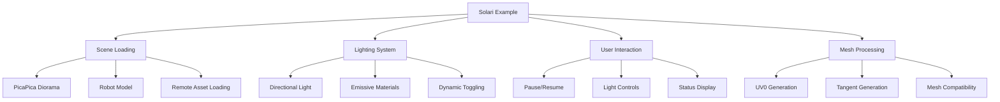

+++
title = "#20658 Solari PicaPica scene"
date = "2025-09-03T00:00:00"
draft = false
template = "pull_request_page.html"
in_search_index = false

[extra]
current_language = "zh-cn"
available_languages = {"en" = { name = "English", url = "/pull_request/bevy/2025-09/pr-20658-en-20250903" }, "zh-cn" = { name = "中文", url = "/pull_request/bevy/2025-09/pr-20658-zh-cn-20250903" }}
labels = ["A-Rendering", "C-Examples"]
+++

# Solari PicaPica scene

## Basic Information
- **Title**: Solari PicaPica scene
- **PR Link**: https://github.com/bevyengine/bevy/pull/20658
- **Author**: JMS55
- **Status**: MERGED
- **Labels**: A-Rendering, C-Examples, S-Ready-For-Final-Review
- **Created**: 2025-08-19T18:15:57Z
- **Merged**: 2025-09-03T02:56:45Z
- **Merged By**: alice-i-cecile

## Description Translation
# Objective
- 改进 Solari 示例以更好地展示该功能的优势（自发光网格、动态光照条件）

我使用了 SEED PicaPica 项目，它不仅非常适合且紧凑，而且很酷，因为它也是实时光线追踪的首批演示之一 :)

## Showcase


## The Story of This Pull Request

这个PR的主要目标是改进Bevy引擎中Solari光线追踪功能的示例场景。原来的Solari示例使用简单的Cornell Box场景，虽然能展示基本功能，但无法充分体现Solari在复杂光照条件下的优势。

开发者JMS55选择使用SEED的PicaPica项目作为新场景，这是一个技术上很合适的选择。PicaPica不仅场景紧凑、视觉效果出色，还具有历史意义——它是最早的实时光线追踪演示之一。这个选择既展示了技术能力，又向图形学历史致敬。

从技术实现角度看，PR进行了多方面改进。首先彻底更换了场景资产，从本地的Cornell Box模型改为从GitHub加载的PicaPica GLB文件。这需要修改Cargo.toml，为solari示例添加https特性支持：

```toml
# File: Cargo.toml
required-features = ["bevy_solari", "https"]
```

场景加载逻辑完全重写，现在加载两个不同的GLB文件：一个是主要场景(mini_diorama_01.glb)，另一个是机器人模型(robot_01.glb)。机器人被设置为沿预定路径巡逻，这通过新增的PatrolPath组件实现：

```rust
// File: examples/3d/solari.rs
PatrolPath {
    path: vec![
        (Vec3::new(-2.0, 0.05, -2.1), Quat::from_rotation_y(PI / 2.0)),
        (Vec3::new(2.2, 0.05, -2.1), Quat::from_rotation_y(0.0)),
        (Vec3::new(2.2, 0.05, 2.1), Quat::from_rotation_y(3.0 * PI / 2.0)),
        (Vec3::new(-2.0, 0.05, 2.1), Quat::from_rotation_y(PI)),
    ],
    i: 0,
}
```

光照系统进行了重大改进。原来的静态光照被替换为可动态切换的光照系统。用户现在可以通过按键切换方向光和机器人的自发光光源：

```rust
// File: examples/3d/solari.rs
if key_input.just_pressed(KeyCode::Digit1) {
    if let Ok(directional_light) = directional_light.single() {
        commands.entity(directional_light).despawn();
    } else {
        commands.spawn((DirectionalLight { /* ... */ }));
    }
}
```

材质处理也更加精细。代码现在根据GLTF材质名称区别处理不同材质，特别是对发光材质("Lights")和玻璃材质("Glass_Dark_01")进行特殊处理：

```rust
// File: examples/3d/solari.rs
if material_name.map(|s| s.0.as_str()) == Some("Lights") {
    let material = materials.get_mut(material_handle).unwrap();
    material.emissive = LinearRgba::from(Color::srgb(0.941, 0.714, 0.043)) * 1_000_000.0;
    // ...
}
```

新增了完整的用户交互系统：
- 空格键暂停/继续场景
- 数字键1切换方向光
- 数字键2切换机器人自发光
- 实时状态文本显示

Mesh处理逻辑也更加健壮，确保所有网格都包含Solari所需的UV0和切线属性：

```rust
// File: examples/3d/solari.rs
if !mesh.contains_attribute(Mesh::ATTRIBUTE_UV_0) {
    let vertex_count = mesh.count_vertices();
    mesh.insert_attribute(Mesh::ATTRIBUTE_UV_0, vec![[0.0, 0.0]; vertex_count]);
    // ...
}
```

还修复了一个WGSL着色器中的语法错误：

```wgsl
// File: crates/bevy_solari/src/realtime/world_cache_compact.wgsl
// Before:
if t < 1u { w2  [t] = w1[t]; } else { w2[t] = w1[t] + w1[t - 1u]; } workgroupBarrier();

// After:  
if t < 1u { w2[t] = w1[t]; } else { w2[t] = w1[t] + w1[t - 1u]; } workgroupBarrier();
```

这个PR展示了如何构建一个高质量的技术演示场景，不仅视觉效果出色，还提供了完整的交互体验。它充分展示了Solari在复杂光照条件下的能力，特别是对自发光表面和动态光照的处理。

## Visual Representation



## Key Files Changed

### `examples/3d/solari.rs` (+231/-31)
这是主要的修改文件，彻底重写了Solari示例：
- 替换为PicaPica场景资源
- 添加机器人巡逻路径系统
- 实现完整的光照控制系统
- 添加用户交互界面
- 改进mesh和材质处理逻辑

```rust
// 新增的巡逻系统组件
#[derive(Component)]
struct PatrolPath {
    path: Vec<(Vec3, Quat)>,
    i: usize,
}

// 材质处理逻辑改进
if material_name.map(|s| s.0.as_str()) == Some("Lights") {
    let material = materials.get_mut(material_handle).unwrap();
    material.emissive = LinearRgba::from(Color::srgb(0.941, 0.714, 0.043)) * 1_000_000.0;
}
```

### `crates/bevy_asset/src/io/web.rs` (+2/-2)
修复警告消息的格式问题：

```rust
// Before:
warn!("WebAssetPlugin is potentially insecure! Make sure to verify asset URLs are safe to load before loading them.\
If you promise you know what you're doing, you can silence this warning by setting silence_startup_warning: true\
in the WebAssetPlugin construction.");

// After:
warn!("WebAssetPlugin is potentially insecure! Make sure to verify asset URLs are safe to load before loading them. \
If you promise you know what you're doing, you can silence this warning by setting silence_startup_warning: true \
in the WebAssetPlugin construction.");
```

### `crates/bevy_solari/src/realtime/world_cache_compact.wgsl` (+1/-1)
修复WGSL着色器语法错误：

```wgsl
// Before:
if t < 1u { w2  [t] = w1[t]; } else { w2[t] = w1[t] + w1[t - 1u]; } workgroupBarrier();

// After:
if t < 1u { w2[t] = w1[t]; } else { w2[t] = w1[t] + w1[t - 1u]; } workgroupBarrier();
```

### `examples/helpers/camera_controller.rs` (+1/-1)
调整时间系统使用：

```rust
// Before:
fn run_camera_controller(time: Res<Time>, ...)

// After:
fn run_camera_controller(time: Res<Time<Real>>, ...)
```

### `Cargo.toml` (+1/-1)
为solari示例添加https特性支持：

```toml
required-features = ["bevy_solari", "https"]
```

## Further Reading

1. [SEED PicaPica Project](https://github.com/SEED-EA/PicaPica) - 原始的PicaPica演示项目
2. [Bevy Solari Documentation](https://github.com/bevyengine/bevy/tree/main/crates/bevy_solari) - Solari光线追踪系统的官方文档
3. [Real-Time Ray Tracing Techniques](https://developer.nvidia.com/rtx/ray-tracing) - NVIDIA关于实时光线追踪的技术资源
4. [GLTF Material System](https://github.com/KhronosGroup/glTF/tree/main/specification/2.0#materials) - GLTF材质规范