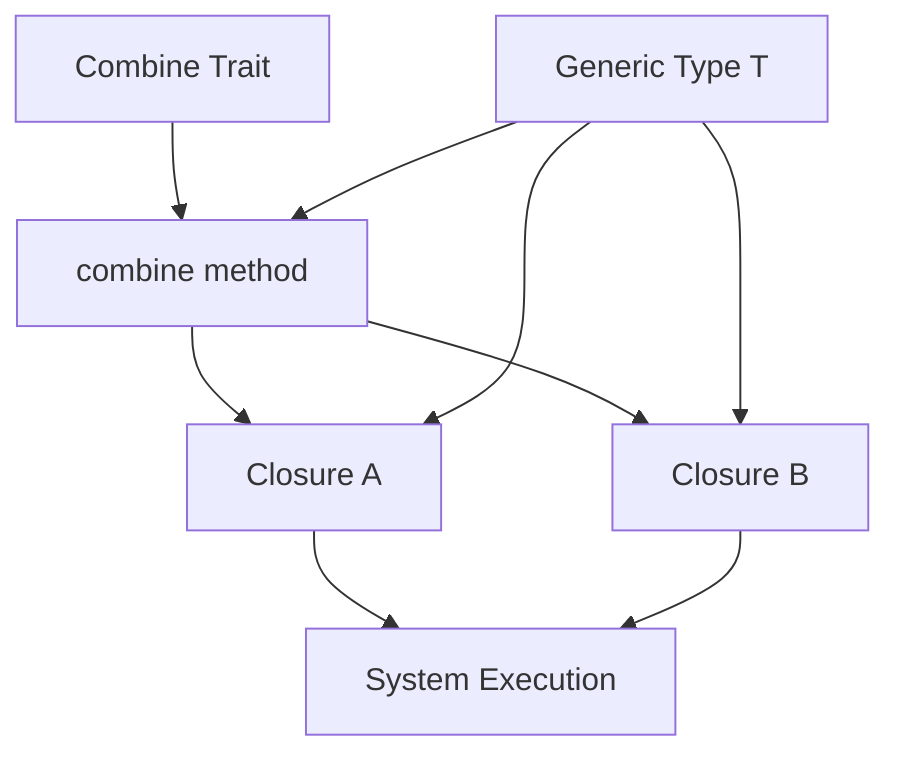

+++
title = "#20689 Ensure systems passed to `Combine` cannot be called re-entrantly either"
date = "2025-09-01T00:00:00"
draft = false
template = "pull_request_page.html"
in_search_index = true

[taxonomies]
list_display = ["show"]

[extra]
current_language = "en"
available_languages = {"en" = { name = "English", url = "/pull_request/bevy/2025-09/pr-20689-en-20250901" }, "zh-cn" = { name = "中文", url = "/pull_request/bevy/2025-09/pr-20689-zh-cn-20250901" }}
labels = ["C-Bug", "A-ECS", "D-Complex", "P-Unsound", "D-Unsafe"]
+++

# Ensure systems passed to `Combine` cannot be called re-entrantly either

## Basic Information
- **Title**: Ensure systems passed to `Combine` cannot be called re-entrantly either
- **PR Link**: https://github.com/bevyengine/bevy/pull/20689
- **Author**: SkiFire13
- **Status**: MERGED
- **Labels**: C-Bug, A-ECS, S-Ready-For-Final-Review, D-Complex, P-Unsound, D-Unsafe
- **Created**: 2025-08-21T07:09:49Z
- **Merged**: 2025-09-01T23:15:13Z
- **Merged By**: alice-i-cecile

## Description Translation
# Objective

- Fix #14709

## Solution

- Add an extra parameter to `Combine::combine` of a generic type `T`, which ensures only one of the two closures can be called at any given time, including re-entrantly.

## The Story of This Pull Request

This PR addresses a critical soundness issue in Bevy's ECS system combinators. The problem was that systems using the `Combine` trait could potentially be called re-entrantly, leading to undefined behavior and memory safety violations.

The core issue was in the `Combine::combine` method signature, which accepted two closures that could theoretically be called multiple times or in overlapping ways. This created a potential scenario where systems could access world data in unsafe ways, violating Rust's ownership rules.

The solution introduces a generic type parameter `T` to the `combine` method, which acts as a guard to prevent re-entrant calls. By requiring a mutable reference to this type, the compiler ensures that only one closure can be executed at a time, as Rust's borrow checker prevents multiple mutable references to the same data.

The implementation modifies both the `Combine` trait definition and all its implementations in the condition system. Each implementation now accepts an additional `data: &mut T` parameter and passes it to the closure calls. This change maintains the same logical behavior while adding the necessary safety guarantees.

In the combinator implementation, a private type `PrivateUnsafeWorldCell` is used to ensure that the world cell cannot be accessed from outside the intended scope. This prevents malicious or accidental re-entrant calls by making it impossible to create another instance of the guard type.

The changes are minimal and focused, affecting only the necessary parts of the codebase while maintaining backward compatibility for users of the public API. The migration guide provides clear instructions for any custom implementations of the `Combine` trait.

## Visual Representation



## Key Files Changed

### `crates/bevy_ecs/src/system/combinator.rs` (+20/-13)
This file contains the core `Combine` trait definition and its implementation for combined systems. The changes modify the trait method signature to include the generic guard type.

```rust
// Before:
fn combine(
    input: <Self::In as SystemInput>::Inner<'_>,
    a: impl FnOnce(SystemIn<'_, A>) -> Result<A::Out, RunSystemError>,
    b: impl FnOnce(SystemIn<'_, B>) -> Result<B::Out, RunSystemError>,
) -> Result<Self::Out, RunSystemError>;

// After:
fn combine<T>(
    input: <Self::In as SystemInput>::Inner<'_>,
    data: &mut T,
    a: impl FnOnce(SystemIn<'_, A>, &mut T) -> Result<A::Out, RunSystemError>,
    b: impl FnOnce(SystemIn<'_, B>, &mut T) -> Result<B::Out, RunSystemError>,
) -> Result<Self::Out, RunSystemError>;
```

### `crates/bevy_ecs/src/schedule/condition.rs` (+30/-24)
This file contains implementations of `Combine` for various logical operators (AND, OR, XOR, etc.). Each implementation was updated to include the new parameter and pass it to the closure calls.

```rust
// Example for And combination:
fn combine<T>(
    input: <Self::In as SystemInput>::Inner<'_>,
    data: &mut T,
    a: impl FnOnce(SystemIn<'_, A>, &mut T) -> Result<A::Out, RunSystemError>,
    b: impl FnOnce(SystemIn<'_, A>, &mut T) -> Result<B::Out, RunSystemError>,
) -> Result<Self::Out, RunSystemError> {
    Ok(a(input, data)? && b(input, data)?)
}
```

### `release-content/migration-guides/combine_soundness_fix.md` (+6/-0)
This new file provides migration guidance for the change, explaining that the `Combine::combine` method now takes an extra parameter that needs to be passed to the closures.

## Further Reading

- [Rust Ownership and Borrowing](https://doc.rust-lang.org/book/ch04-00-understanding-ownership.html)
- [Bevy ECS System Combinators](https://bevyengine.org/learn/advanced-topics/system-combinators/)
- [Unsafe Code Guidelines](https://rust-lang.github.io/unsafe-code-guidelines/)

## Full Code Diff
[See provided diff in original request]