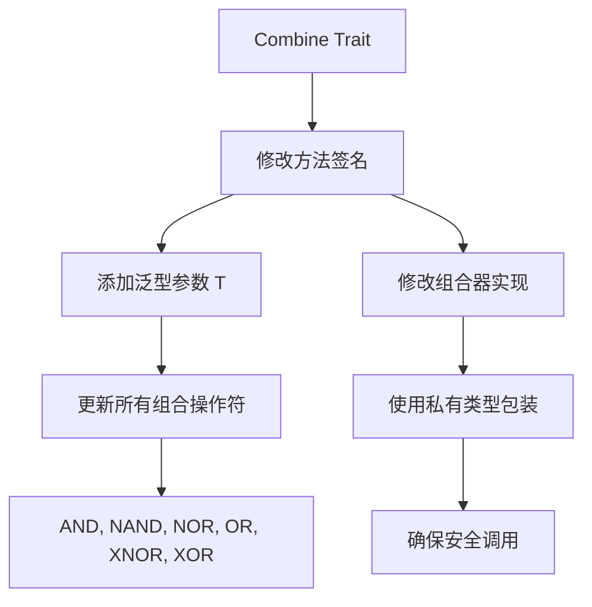

+++
title = "#20689 Ensure systems passed to `Combine` cannot be called re-entrantly either"
date = "2025-09-01T00:00:00"
draft = false
template = "pull_request_page.html"
in_search_index = false

[extra]
current_language = "zh-cn"
available_languages = {"en" = { name = "English", url = "/pull_request/bevy/2025-09/pr-20689-en-20250901" }, "zh-cn" = { name = "中文", url = "/pull_request/bevy/2025-09/pr-20689-zh-cn-20250901" }}
+++

# Ensure systems passed to `Combine` cannot be called re-entrantly either

## 基本信息
- **标题**: Ensure systems passed to `Combine` cannot be called re-entrantly either
- **PR 链接**: https://github.com/bevyengine/bevy/pull/20689
- **作者**: SkiFire13
- **状态**: 已合并
- **标签**: C-Bug, A-ECS, S-Ready-For-Final-Review, D-Complex, P-Unsound, D-Unsafe
- **创建时间**: 2025-08-21T07:09:49Z
- **合并时间**: 2025-09-01T23:15:13Z
- **合并者**: alice-i-cecile

## 描述翻译

### Objective
- 修复 #14709

### Solution
- 向 `Combine::combine` 添加一个泛型类型 `T` 的额外参数，确保在任何给定时间（包括重入调用时）只能调用两个闭包中的一个。

## 本 PR 的故事

这个 PR 解决了一个在 Bevy ECS 中组合器系统的潜在安全问题。问题的核心在于 `Combine` trait 的实现可能存在重入调用（re-entrancy）导致的数据竞争和未定义行为。

### 问题和背景

在原始的 `Combine::combine` 实现中，两个系统闭包可以被并行或重入调用，这违反了 Rust 的安全保证。虽然之前的修复确保了系统不会并行运行，但仍然存在重入调用的可能性。当一个闭包可能通过某种方式（如回调或递归）再次调用另一个闭包时，就会发生重入调用，这可能导致对同一世界（World）数据的并发访问，违反了 Rust 的借用规则。

### 解决方案方法

开发者采用了一个巧妙的类型系统技巧来解决这个问题。通过在 `combine` 方法中添加一个泛型参数 `T`，并要求传入一个可变引用，他们确保了：

1. 两个闭包必须共享同一个 `T` 实例的可变引用
2. `T` 的类型在每次调用时都是未绑定的（unbound）
3. 由于 Rust 的借用规则，同一时间只能有一个闭包持有这个可变引用

这种方法利用了 Rust 的类型系统来静态地防止重入调用，而不需要运行时检查。

### 实现细节

关键的修改是在 `Combine` trait 和所有组合操作符的实现中添加了一个泛型参数 `T`：

```rust
// 修改前:
fn combine(
    input: <Self::In as SystemInput>::Inner<'_>,
    a: impl FnOnce(SystemIn<'_, A>) -> Result<A::Out, RunSystemError>,
    b: impl FnOnce(SystemIn<'_, A>) -> Result<B::Out, RunSystemError>,
) -> Result<Self::Out, RunSystemError> {
    Ok(a(input)? && b(input)?)
}

// 修改后:
fn combine<T>(
    input: <Self::In as SystemInput>::Inner<'_>,
    data: &mut T,
    a: impl FnOnce(SystemIn<'_, A>, &mut T) -> Result<A::Out, RunSystemError>,
    b: impl FnOnce(SystemIn<'_, A>, &mut T) -> Result<B::Out, RunSystemError>,
) -> Result<Self::Out, RunSystemError> {
    Ok(a(input, data)? && b(input, data)?)
}
```

在 `combinator.rs` 中，实现使用了私有类型来包装 `UnsafeWorldCell`，确保外部代码无法伪造这个类型的实例：

```rust
struct PrivateUnsafeWorldCell<'w>(UnsafeWorldCell<'w>);

Func::combine(
    input,
    &mut PrivateUnsafeWorldCell(world),
    |input, world| unsafe { self.a.run_unsafe(input, world.0) },
    |input, world| unsafe {
        self.b.validate_param_unsafe(world.0)?;
        self.b.run_unsafe(input, world.0)
    },
)
```

### 技术洞察

这个解决方案展示了如何使用 Rust 的类型系统来强制执行安全保证。通过要求一个可变引用到泛型类型 `T`，并且使 `T` 在每次调用时都是不同的具体类型，系统确保了：

1. **唯一性**: 由于可变引用的独占性，同一时间只能有一个闭包执行
2. **防伪造**: 使用私有类型防止外部代码创建额外的实例
3. **零成本抽象**: 不需要运行时检查，所有保证都在编译时验证

### 影响

这个修复确保了 Bevy 的 ECS 组合器系统的内存安全，防止了潜在的数据竞争和未定义行为。虽然从 API 角度看这是一个破坏性变更，但它对于维护 Rust 的安全保证至关重要。

## 可视化表示



## 关键文件变更

### `crates/bevy_ecs/src/schedule/condition.rs` (+30/-24)
这个文件包含了所有逻辑组合操作符的实现（AND、NAND、NOR、OR、XNOR、XOR）。每个操作符的 `combine` 方法都被更新以接受新的泛型参数 `T` 并将 `data` 参数传递给两个闭包。

**关键修改:**
```rust
// 所有组合操作符的类似修改
fn combine<T>(
    input: <Self::In as SystemInput>::Inner<'_>,
    data: &mut T,
    a: impl FnOnce(SystemIn<'_, A>, &mut T) -> Result<A::Out, RunSystemError>,
    b: impl FnOnce(SystemIn<'_, A>, &mut T) -> Result<B::Out, RunSystemError>,
) -> Result<Self::Out, RunSystemError> {
    Ok(a(input, data)? && b(input, data)?)
}
```

### `crates/bevy_ecs/src/system/combinator.rs` (+20/-13)
这个文件包含了 `Combine` trait 的主要实现。修改包括更新 trait 定义和具体的组合器实现，使用私有类型来确保安全。

**关键修改:**
```rust
// 在 run_unsafe 方法中
struct PrivateUnsafeWorldCell<'w>(UnsafeWorldCell<'w>);

Func::combine(
    input,
    &mut PrivateUnsafeWorldCell(world),
    |input, world| unsafe { self.a.run_unsafe(input, world.0) },
    |input, world| unsafe {
        self.b.validate_param_unsafe(world.0)?;
        self.b.run_unsafe(input, world.0)
    },
)
```

### `release-content/migration-guides/combine_soundness_fix.md` (+6/-0)
新增的迁移指南文档，解释了 API 变更和修复的安全问题。

**内容:**
```markdown
---
title: Combine now takes an extra parameter
pull_requests: [20689]
---

The `Combine::combine` method now takes an extra parameter that needs to be passed mutably to the two given closures. This allows fixing a soundness issue which manifested when the two closures were called re-entrantly.
```

## 延伸阅读

- [Rust 所有权和借用规则](https://doc.rust-lang.org/book/ch04-00-understanding-ownership.html)
- [Bevy ECS 系统组合器](https://bevyengine.org/learn/advanced/ecs/system-combinators/)
- [Rust 泛型和 trait 系统](https://doc.rust-lang.org/book/ch10-00-generics.html)

## 完整代码差异

[见原始 PR 描述中的完整 diff]