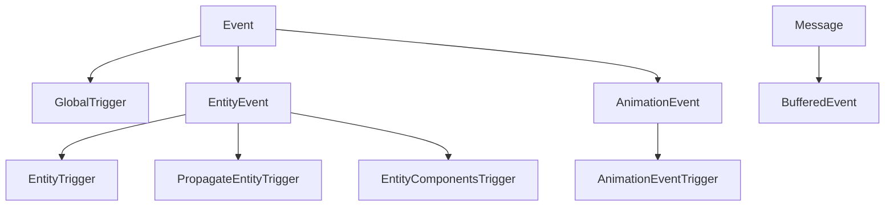

+++
title = "#20731 Event Rearchitecture"
date = "2025-09-10T00:00:00"
draft = false
template = "pull_request_page.html"
in_search_index = true

[taxonomies]
list_display = ["show"]

[extra]
current_language = "en"
available_languages = {"en" = { name = "English", url = "/pull_request/bevy/2025-09/pr-20731-en-20250910" }, "zh-cn" = { name = "中文", url = "/pull_request/bevy/2025-09/pr-20731-zh-cn-20250910" }}
labels = ["A-ECS", "C-Usability", "A-Animation", "D-Complex", "X-Blessed", "D-Unsafe", "S-Waiting-on-Author"]
+++

# Event Rearchitecture

## Basic Information
- **Title**: Event Rearchitecture
- **PR Link**: https://github.com/bevyengine/bevy/pull/20731
- **Author**: cart
- **Status**: MERGED
- **Labels**: A-ECS, C-Usability, A-Animation, M-Needs-Migration-Guide, D-Complex, M-Needs-Release-Note, X-Blessed, D-Unsafe, S-Waiting-on-Author
- **Created**: 2025-08-24T02:16:51Z
- **Merged**: 2025-09-10T00:08:24Z
- **Merged By**: cart

## Description Translation
There is general consensus that our terminology for Events, "entity events", Observers,  and BufferedEvents needs clarity. Additionally, many of us also agree that the current Observer system would benefit from additional static-ness: currently it is assumed that you can use events in pretty much any context, and they all go through the exact same code path.

Alice put forth a proposal to [Overhaul Observers](https://hackmd.io/@bevy/rk4S92hmlg), and we have already partially implemented it for 0.17. I think it does a great job of outlining many of the issues at play, and it solves them reasonably well. But I _also_ think the proposed solution isn't yet ideal. Given that it is already partially implemented for 0.17, it is a breaking change, _and_ given that we have already broken the Observer API a number of times, I think we need to sort this out before the next release.

This is a big changeset, but it is _largely_ just a reframing of what is already there. I haven't fundamentally changed the behaviors. I've just refined and constrained in a way that allows us to do what we are currently doing in a clearer, simpler, and more performant way.

First, I'll give some quick notes on Alice's proposal (which you all should read if you haven't yet!):
### Notes on Alice's Proposal
- I like the move toward a more static API
- I think we've gone too far down the "separate terminology" path. The proposal introduces a zoo of apis, terms, and "subterms". I think we need to simplify our concepts and names to make this all easier to talk about and use in practice.
- BroadcastEvent feels like the wrong name. EntityEvent is also "broadcast" in the exact same way
- BufferedEvent is a completely different system than EntityEvent and BroadcastEvent. This muddles concepts too much. It needs its own standalone, single-word concept name.
- "Universal observers": I think this should be fully context driven, rather than needing encoding in the API.
- I agree we can't get rid of buffered events, and that merging them with "broadcast events" isn't helpful
- I'm not quite sure how we'd make the proposed PropagateEvent subtrait work transparently. This can't be "layered on top" as a trait. It needs to be baked in at more fundamental level.
* I don't like `app.add_broadcast_observers()`, `app.add_universal_observers()`, `Observer::entity_observer`, `Observer::broadcast`, etc. The `On` event should statically determine whether an observer is an "entity observer" or a "broadcast" Observer. This would already be encoded in the type system and is therefore something we can do on the developer's behalf. Likewise, any observer being registered at a top level is inherently _not_ a specific entity observer. All of these variants serve to make users guess and poke around in a way that is unnecessary. I want simple one word concept names, single constructors, etc.
### Proposed Principals
- Static-ness:
	- Events should only be usable in the context they were defined to be used.
	- When triggered, Observers should *only* have access to fields and behaviors that are relevant:
		- Dont return Option or PLACEHOLDER: the field or function shouldn't exist
		- Entity events that don't support propagation shouldn't expose that functionality
- Don't do unnecessary work at runtime
	- Event triggers shouldn't branch through every potential event code path
		- Don't clone potentially large lists of event context unnecessarily (Ex: we currently clone the component list for every observer invocation)
- Minimize codegen
	- Don't recompile things redundantly.
	- Don't compile unnecessary code paths.
- Clear and Simple
	- Minimize the number of concept names floating around, and lock each concept down heavily to a specific context
	- I'm convinced at this point that "buffered events" and "observer events" sharing concept names is wrong. We need two clean and clear terms, and I'm willing to give "buffered events" a slightly worse name if it means "observer events" can be nicer.
	- Don't throw the concept name "Event" out ... it is a very good name. Instead, constrain it to one specific thing.
	- Minimize our API surface
	- Events contain all context, including what used to be the "target". This lets people define the "target" name that makes the most sense for the context, and lets the documentation fully describe the context of that "target".
### Concepts
- **Event** (the thing you "observe")
	- Rationale: "Event" is the clear choice for this concept. An "event" feels like something that happens in real time. "Event observers" are things that observe events when they occur (are triggered). Additionally, this is the concept that "propagates", and "event propagation" is a term people understand.
	- **Trigger**: (the verb that "causes" events to happen for targets). Events are Triggered. This can include additional context/ data that is passed to observers / informs the trigger behavior. Events have _exactly_ one Trigger. If you want a different trigger behavior, define a new event. This makes the system more static, more predictable, and easier to understand and document. `world.trigger_ref_with` makes it possible to pass in mutable reference to your own Trigger data, making it possible to customize the input trigger data and read out the final trigger data.
	- **Observer** (the thing that "observes" events): An event's `Trigger` determines which observers will run.
	- **Event Types**: You can build any "type" of event. The concept of a "target" has been removed. Instead, define a `Trigger` that expects a specific kind of event (ex: `E: EntityEvent`).
		- **EntityEvent** We add a new `EntityEvent` trait, which defines an `event.entity()` accessor. This is used by the `Trigger` impls : `EntityTrigger`, `PropagateEntityTrigger`, and `EntityComponentsTrigger`.
- **Message** (the buffered thing you "read" and "write")
	- `Message` is a solid metaphor for what this is ... it is data that is written and then at some later point read by someone / something else. I expect existing consumers of "buffered events" to lament this name change, as "event" feels nicer. But having a separate name is within everyone's best interest.
	- **MessageReader** (the thing that reads messages)
	- **MessageWriter** (the thing that writes messages)
### The Changes
- `Event` trait changes
	- Event is now used exclusively by Observers
	- Added `Event::Trigger`, which defines what trigger implementation this event will use
- Added the `Trigger` trait
	- All of the shared / hard-coded observer trigger logic has been broken out into individual context-specific Trigger traits.
- "Trigger Targets" have been removed.
	- Instead, Events, in combination with their Trigger impl, decide how they will be triggered. In general, this means that Events now include their "targets" as fields on the event. 
	- APIs like `trigger_targets` have been replaced by `trigger`, which can now be used for any `Event`
- `EntityEvent` trait changes
	- Propagation config has been removed from the `EntityEvent` trait. It now lives on the `Trigger` trait (specifically the `PropagateEntityTrigger` trait).
	- `EntityEvent` now provides `entity / entity_mut` accessors for the Event it is implemented for
	- `EntityEvent` defaults to having no propagation (uses the simpler `EntityTrigger`)
	- `#[entity_event(propagate)]` enables the "default" propagation logic (uses ChildOf). The existing `#[entity_event(traversal = X)]` has been renamed to `#[entity_event(propagate = X)`
	- Deriving `EntityEvent` requires either a single `MyEvent(Entity)`, the `entity` field name (`MyEvent { entity: Entity}`), or `MyEvent { #[event_entity] custom: Entity }`
- Animation event changes
	- Animation events now have their own `AnimationEvent` trait, which sets the `AnimationEventTrigger`. This allows developers to pass in events that _dont_ include the Entity field (as this is set by the system). The custom trigger also opens the doors to cheaply passing in additional animation system context, accessible through `On` 
- `EntityComponentsTrigger`
	- The built in Add/Remove/etc lifecycle events now use the `EntityComponentsTrigger`, which passes in the components as additional state. This _significantly_ cuts down on clones, as it does a borrow rather than cloning the list into _each_ observer execution.
	- Each event now has an `entity` field.
- Style changes
	- Prefer the event name for variables: `explode: On<Explode>` not `event: On<Explode>`
	- Prefer using the direct field name for the entity on entity events, rather than `event.entity()`. This allows us to use more specific names where appropriate, provides better / more contextual docs, and coaches developers to think of `On<MyEvent>` _as_ the event itself. 

Take a look at the changes to the examples and the built-in events to see what this looks like in practice.

### Downsides
- Moving the "target" into the event adds some new constraints:
	- Triggering the same event for multiple entities requires multiple trigger calls. For "expensive" events (ex: lots of data attached to the event), this will be more awkward. Your options become:
		-  Create multiple instances of the event, cloning the expensive data
		-  Use `trigger_ref`, and mutate the event on each call to change the target.
		- Move the "expensive" shared data into the Trigger, and use `trigger_ref_with``
		- We could build a new EntityEvent method that abstracts over the "event mutation" behavior and provides something like the old `trigger_target` behavior.
		- Use a different `EntityTargetTrigger` (not currently provided by bevy, but we could), which brings back the old behavior. This would be used with `trigger_with` to replicate the old pattern: `world.trigger_with(MyEvent, [e1, e2].into())` (or we could make the `into()` implicit)
	- Bubbling the event involves mutating the event to set the entity. This means that `trigger_ref` will result in the event's `EntityEvent::entity()` being the final bubbled entity instead of the initial entity.
	- Some APIs (trivially) benefit from the "target entity" being separate from the event. Specifically, this new API requires changes to the "Animation Event" system in AnimationPlayer. I think this is actually a good change set, as it allows us to:
		- Cheaply expose more animation state as part of a new AnimationEventTrigger impl
		- Move that "implict" entity target provided by the AnimationPlayer into the AnimationEventTrigger
		- Encode the "animation event trigger-ness" of the event into the type itself (by requiring `#[event(trigger = AnimationEventTrigger)]`)
		- By not implementing Default for AnimationEventTrigger, we can block animation events from being fired manually by the user.

### Draft TODO
- [x] Fill in documentation and update existing docs
- [ ] Benchmark: I expect this impl to be significantly faster. There might also be tangible binary size improvements, as I've removed a lot of redundant codegen.
- [x] Update release notes and migration guides

### Next Steps
- The `BufferedEvent -> Message` rename was not included to keep the size down.

Fixes #19648 

## The Story of This Pull Request

This PR addresses fundamental issues with Bevy's event system architecture. The existing system had become complex and ambiguous, with overlapping terminology and inefficient runtime behaviors. The core problem was that events were designed to work in any context, which led to unnecessary runtime branching, code duplication, and conceptual confusion for developers.

The solution introduces a more static and constrained architecture. Events are now categorized into clear concepts: **Events** for observable actions and **Messages** for buffered data. Each event type defines its own triggering behavior through the new `Trigger` trait, which determines which observers run and what data they receive.

Key technical changes include:
1. **Event trait refinement**: The `Event` trait now includes an associated `Trigger` type that defines how the event is triggered
2. **Entity events**: The new `EntityEvent` trait handles events targeting specific entities, with the target included as a field
3. **Trigger specialization**: Different trigger implementations (`GlobalTrigger`, `EntityTrigger`, `PropagateEntityTrigger`) provide optimized paths for different event types
4. **Performance improvements**: Reduced cloning and branching through better static dispatch and borrow-based data passing

The implementation required significant changes to the observer system, event macros, and related APIs. For example, the `trigger_targets` method was removed in favor of including targets directly in event data:

```rust
// Before:
#[derive(Event)]
struct Explode;
world.trigger_targets(Explode, entity);

// After:
#[derive(EntityEvent)]
struct Explode {
    entity: Entity
}
world.trigger(Explode { entity });
```

This change makes the API more explicit and allows for better documentation of event context. The `On` type (previously `Trigger`) was also updated to provide direct access to event fields:

```rust
// Before:
world.add_observer(|trigger: Trigger<Explode>| {
    println!("Entity {} exploded", trigger.entity());
});

// After:
world.add_observer(|explode: On<Explode>| {
    println!("Entity {} exploded", explode.entity);
});
```

The architecture now supports proper propagation control through the `PropagateEntityTrigger`, which allows events to bubble up entity hierarchies while maintaining type safety and performance.

These changes result in a clearer, more performant event system that is easier to understand and use. The static nature of the new design eliminates unnecessary runtime checks and reduces codegen, while the improved terminology and APIs make the system more intuitive for developers.

## Visual Representation



## Key Files Changed

### `crates/bevy_ecs/src/event/mod.rs` (+345/-33)
This file now defines the core event traits and types. The `Event` trait was refactored to include an associated `Trigger` type, and the `EntityEvent` trait was added for entity-targeted events.

**Key changes:**
- Added `Event` trait with associated `Trigger` type
- Added `EntityEvent` trait with entity accessors
- Removed old event types and consolidated functionality

```rust
// Before:
pub trait Event: Send + Sync + 'static {
    fn register_event_key(world: &mut World) -> EventKey;
    fn event_key(world: &World) -> Option<EventKey>;
}

// After:
pub trait Event: Send + Sync + Sized + 'static {
    type Trigger<'a>: Trigger<Self>;
}
```

### `crates/bevy_ecs/src/event/trigger.rs` (+430/-0)
This new file implements the `Trigger` trait and its specialized implementations for different event contexts.

**Key code:**
```rust
pub unsafe trait Trigger<E: Event> {
    unsafe fn trigger(
        &mut self,
        world: DeferredWorld,
        observers: &CachedObservers,
        trigger_context: &TriggerContext,
        event: &mut E,
    );
}

// GlobalTrigger implementation for basic events
unsafe impl<E: for<'a> Event<Trigger<'a> = Self>> Trigger<E> for GlobalTrigger {
    unsafe fn trigger(...) {
        // Trigger global observers
    }
}
```

### `crates/bevy_ecs/src/observer/mod.rs` (+152/-467)
This file was significantly refactored to work with the new event system. The `trigger_targets` API was removed and replaced with a unified `trigger` method.

**Key changes:**
- Removed `TriggerTargets` trait and related functionality
- Updated `World::trigger` to handle all event types
- Simplified observer invocation logic

```rust
// Before:
world.trigger_targets(Explode, entity);

// After:
world.trigger(Explode { entity });
```

### `crates/bevy_ecs/src/observer/system_param.rs`
The `On` type was updated to work with the new event system and provide better access to event data.

```rust
pub struct On<'w, 't, E: Event, B: Bundle = ()> {
    event: &'w mut E,
    trigger: &'w mut E::Trigger<'t>,
    // ...
}

impl<'w, 't, E: Event, B: Bundle> On<'w, 't, E, B> {
    pub fn event(&self) -> &E {
        self.event
    }
    
    pub fn event_mut(&mut self) -> &mut E {
        self.event
    }
}
```

### `crates/bevy_ecs/macros/src/component.rs`
The event derives were updated to support the new attributes and generate appropriate `Trigger` implementations.

```rust
// EntityEvent derive with propagation
#[derive(EntityEvent)]
#[entity_event(propagate)]
struct Click {
    entity: Entity
}
```

## Further Reading

- [Bevy Observer Documentation](https://bevyengine.org/learn/observer-system)
- [Event System RFC](https://github.com/bevyengine/rfcs/pull/45)
- [Entity Component System Chapter](https://bevyengine.org/learn/ecs-introduction/)