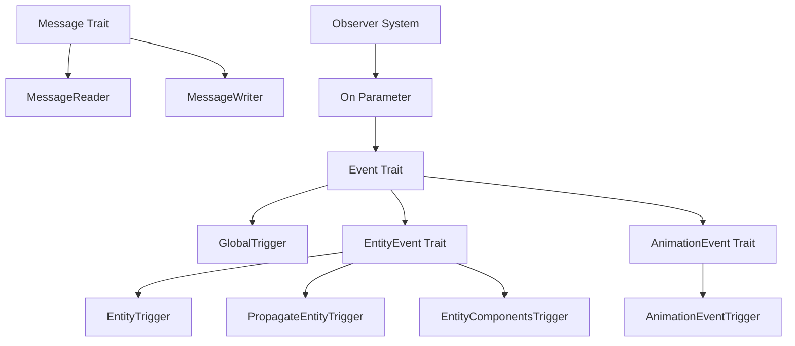

+++
title = "#20731 Event Rearchitecture"
date = "2025-09-10T00:00:00"
draft = false
template = "pull_request_page.html"
in_search_index = false

[extra]
current_language = "zh-cn"
available_languages = {"en" = { name = "English", url = "/pull_request/bevy/2025-09/pr-20731-en-20250910" }, "zh-cn" = { name = "中文", url = "/pull_request/bevy/2025-09/pr-20731-zh-cn-20250910" }}
labels = ["A-ECS", "C-Usability", "A-Animation", "D-Complex", "X-Blessed", "D-Unsafe", "S-Waiting-on-Author"]
+++

# Event Rearchitecture

## Basic Information
- **Title**: Event Rearchitecture
- **PR Link**: https://github.com/bevyengine/bevy/pull/20731
- **Author**: cart
- **Status**: MERGED
- **Labels**: A-ECS, C-Usability, A-Animation, M-Needs-Migration-Guide, D-Complex, M-Needs-Release-Note, X-Blessed, D-Unsafe, S-Waiting-on-Author
- **Created**: 2025-08-24T02:16:51Z
- **Merged**: 2025-09-10T00:08:24Z
- **Merged By**: cart

## Description Translation

普遍共识认为，我们对Events、"entity events"、Observers和BufferedEvents的术语需要更清晰。此外，许多人也同意当前的Observer系统将受益于更多的静态性：目前假设您可以在几乎任何上下文中使用事件，并且它们都通过完全相同的代码路径。

Alice提出了一个[Overhaul Observers](https://hackmd.io/@bevy/rk4S92hmlg)的提案，并且我们已经在0.17版本中部分实现了它。我认为它很好地概述了许多问题，并合理地解决了它们。但我也认为提议的解决方案还不理想。鉴于它已经为0.17版本部分实现，这是一个破坏性变更，并且考虑到我们已经多次破坏了Observer API，我认为我们需要在下一次发布之前解决这个问题。

这是一个大的变更集，但它主要只是对现有内容的重新构架。我没有从根本上改变行为。我只是以更清晰、更简单和更高效的方式进行了精炼和约束。

首先，我会对Alice的提案给出一些简要说明（如果你们还没有阅读，应该去读一下！）：

### 关于Alice提案的说明
- 我喜欢向更静态API的转变
- 我认为我们在"分离术语"的道路上走得太远了。提案引入了大量的API、术语和"子术语"。我认为我们需要简化我们的概念和名称，使这一切在实践中更容易讨论和使用。
- BroadcastEvent感觉是错误的名称。EntityEvent在完全相同的方式下也是"broadcast"
- BufferedEvent是一个完全不同于EntityEvent和BroadcastEvent的系统。这混淆了概念太多。它需要自己独立的、单字的概念名称。
- "Universal observers"：我认为这应该是完全上下文驱动的，而不是需要在API中编码。
- 我同意我们不能摆脱buffered events，并且将它们与"broadcast events"合并没有帮助
- 我不太确定如何使提议的PropagateEvent子特质透明地工作。这不能作为一个特质"分层在上面"。它需要在更基础的层面上内置。
- 我不喜欢`app.add_broadcast_observers()`、`app.add_universal_observers()`、`Observer::entity_observer`、`Observer::broadcast`等。`On`事件应该静态地确定一个observer是"entity observer"还是"broadcast" Observer。这将已经在类型系统中编码，因此是我们可以代表开发人员做的事情。同样，任何在顶层注册的observer本质上不是特定的entity observer。所有这些变体都使用户不必要地猜测和摸索。我想要简单的单字概念名称、单一构造函数等。

### 提议的原则
- 静态性：
  - 事件应该只能在它们被定义使用的上下文中使用。
  - 当触发时，Observers应该只访问相关的字段和行为：
    - 不要返回Option或PLACEHOLDER：字段或函数不应该存在
    - 不支持传播的entity events不应该暴露该功能
- 不在运行时做不必要的工作
  - 事件触发器不应该分支通过每个潜在的事件代码路径
  - 不要不必要地克隆可能很大的事件上下文列表（例如：我们目前为每个observer调用克隆组件列表）
- 最小化代码生成
  - 不要冗余地重新编译东西。
  - 不要编译不必要的代码路径。
- 清晰和简单
  - 最小化浮动的概念名称数量，并将每个概念严格锁定到特定上下文
  - 我现在确信"buffered events"和"observer events"共享概念名称是错误的。我们需要两个干净清晰的概念，如果这意味着"observer events"可以更好，我愿意给"buffered events"一个稍微差一点的名称。
  - 不要抛弃"Event"这个概念名称...它是一个非常好的名称。相反，将其约束到一个特定的事物。
  - 最小化我们的API表面
  - 事件包含所有上下文，包括曾经是"target"的内容。这允许人们为上下文定义最有意义的"target"名称，并允许文档完全描述该"target"的上下文。

### 概念
- **Event**（你"observe"的东西）
  - 理由："Event"是这个概念的明确选择。一个"event"感觉像是实时发生的事情。"Event observers"是在事件发生（被触发）时观察事件的东西。此外，这是"传播"的概念，"event propagation"是人们理解的术语。
  - **Trigger**：（导致事件为目标发生的动词）。事件被Triggered。这可以包括传递给observers / 通知触发行为的额外上下文/数据。事件有且只有一个Trigger。如果你想要不同的触发行为，定义一个新事件。这使系统更静态、更可预测、更容易理解和文档化。`world.trigger_ref_with`使得可以传入你自己Trigger数据的可变引用，从而可以自定义输入触发数据并读取最终的触发数据。
  - **Observer**（"observes"事件的东西）：事件的`Trigger`决定哪些observers将运行。
  - **Event Types**：你可以构建任何"类型"的事件。"target"的概念已被移除。相反，定义一个期望特定类型事件的`Trigger`（例如：`E: EntityEvent`）。
    - **EntityEvent** 我们添加一个新的`EntityEvent`特质，它定义了一个`event.entity()`访问器。这由`Trigger`实现使用：`EntityTrigger`、`PropagateEntityTrigger`和`EntityComponentsTrigger`。
- **Message**（你"read"和"write"的缓冲东西）
  - `Message`是一个坚实的隐喻，表示这是什么...它是被写入的数据，然后在稍后的某个时间点被某人/某物读取。我期望现有的"buffered events"消费者会对这个名称更改感到遗憾，因为"event"感觉更好。但有一个单独的名称符合每个人的最佳利益。
  - **MessageReader**（读取消息的东西）
  - **MessageWriter**（写入消息的东西）

### 变更
- `Event`特质变更
  - Event现在专门由Observers使用
  - 添加了`Event::Trigger`，它定义了此事件将使用什么触发实现
- 添加了`Trigger`特质
  - 所有共享/硬编码的observer触发逻辑已被分解为单独的特定上下文的Trigger特质。
- "Trigger Targets"已被移除。
  - 相反，事件结合它们的Trigger实现决定它们将如何被触发。通常，这意味着事件现在将它们的"targets"作为事件上的字段包含。
  - 像`trigger_targets`这样的API已被`trigger`替换，现在可以用于任何`Event`
- `EntityEvent`特质变更
  - 传播配置已从`EntityEvent`特质中移除。它现在位于`Trigger`特质上（具体是`PropagateEntityTrigger`特质）。
  - `EntityEvent`现在为它实现的事件提供`entity / entity_mut`访问器
  - `EntityEvent`默认为无传播（使用更简单的`EntityTrigger`）
  - `#[entity_event(propagate)]`启用"默认"传播逻辑（使用ChildOf）。现有的`#[entity_event(traversal = X)]`已重命名为`#[entity_event(propagate = X)`
  - 派生`EntityEvent`需要单个`MyEvent(Entity)`、`entity`字段名称（`MyEvent { entity: Entity}`）或`MyEvent { #[event_entity] custom: Entity }`
- 动画事件变更
  - 动画事件现在有它们自己的`AnimationEvent`特质，它设置`AnimationEventTrigger`。这允许开发人员传入不包括Entity字段的事件（因为这由系统设置）。自定义触发器还打开了廉价传入额外动画系统上下文的大门，可通过`On`访问
- `EntityComponentsTrigger`
  - 内置的Add/Remove/etc生命周期事件现在使用`EntityComponentsTrigger`，它将组件作为额外状态传入。这显著减少了克隆，因为它进行借用而不是将列表克隆到每个observer执行中。
  - 每个事件现在都有一个`entity`字段。
- 样式变更
  - 偏好使用事件名称作为变量：`explode: On<Explode>`而不是`event: On<Explode>`
  - 偏好使用entity events上entity的直接字段名称，而不是`event.entity()`。这允许我们在适当的地方使用更具体的名称，提供更好/更上下文化的文档，并指导开发人员将`On<MyEvent>`视为事件本身。

查看示例和内置事件的变更，以了解这在实践中的样子。

### 缺点
- 将"target"移动到事件中添加了一些新约束：
  - 为多个实体触发相同的事件需要多个触发调用。对于"昂贵"的事件（例如：附加到事件的大量数据），这将更加尴尬。你的选项变为：
    - 创建事件的多个实例，克隆昂贵的数据
    - 使用`trigger_ref`，并在每次调用时改变事件以更改目标。
    - 将"昂贵"的共享数据移动到Trigger中，并使用`trigger_ref_with`
    - 我们可以构建一个新的EntityEvent方法，抽象"事件突变"行为并提供类似于旧`trigger_target`行为的东西。
    - 使用不同的`EntityTargetTrigger`（目前bevy未提供，但我们可以），这带来了旧行为。这将与`trigger_with`一起使用以复制旧模式：`world.trigger_with(MyEvent, [e1, e2].into())`（或者我们可以使`into()`隐式）
  - 冒泡事件涉及改变事件以设置实体。这意味着`trigger_ref`将导致事件的`EntityEvent::entity()`成为最终冒泡的实体而不是初始实体。
  - 一些API（琐碎地）受益于"target entity"与事件分开。具体来说，这个新API需要对"Animation Event"系统中的AnimationPlayer进行更改。我认为这实际上是一个好的变更集，因为它允许我们：
    - 廉价地暴露更多动画状态作为新AnimationEventTrigger实现的一部分
    - 将AnimationPlayer提供的那个"隐式"实体目标移动到AnimationEventTrigger中
    - 将事件的"animation event trigger-ness"编码到类型本身中（通过要求`#[event(trigger = AnimationEventTrigger)]`）
    - 通过不为AnimationEventTrigger实现Default，我们可以阻止用户手动触发动画事件。

### 草案TODO
- [x] 填写文档并更新现有文档
- [ ] 基准测试：我期望这个实现显著更快。可能还有明显的二进制大小改进，因为我删除了许多冗余的代码生成。
- [x] 更新发布说明和迁移指南

### 下一步
- `BufferedEvent -> Message`重命名未包括以保持大小。

修复 #19648

## The Story of This Pull Request

### 问题和背景

Bevy的事件系统在之前的版本中存在几个核心问题。首先，术语混乱：Events、EntityEvents、BufferedEvents和Observers这些概念之间的界限不清晰，导致开发者难以理解和使用。其次，API缺乏静态性：任何事件类型都可以在任何上下文中使用，这导致了不必要的运行时分支和代码生成。最后，性能问题：系统需要为所有可能的事件路径生成代码，即使某些路径永远不会被使用。

开发者cart认识到需要从根本上重新架构事件系统，而不是在现有基础上进行小修小补。这个PR的目标是创建一个更清晰、更静态、更高效的事件系统，同时保持向后兼容性尽可能好。

### 解决方案方法

这个重构的核心思想是将事件系统分为两个清晰的概念：**Event**（用于观察者模式）和**Message**（用于缓冲模式）。Event现在专门用于Observers，而Message用于传统的EventReader/EventWriter模式。

关键技术决策包括：
1. 引入`Trigger` trait来定义不同事件的触发行为
2. 移除单独的"target"概念，将目标实体作为事件本身的字段
3. 为不同类型的事件（EntityEvent、AnimationEvent等）提供专门的Trigger实现
4. 通过类型系统静态地约束事件的使用上下文

### 实现细节

#### Event Trait重构

新的Event trait现在包含一个关联的Trigger类型：

```rust
pub trait Event: Send + Sync + Sized + 'static {
    type Trigger<'a>: Trigger<Self>;
}
```

这允许每个事件类型定义自己的触发行为，而不是所有事件都通过相同的代码路径。

#### EntityEvent的改进

EntityEvent现在要求事件包含目标实体信息：

```rust
#[derive(EntityEvent)]
struct Explode {
    entity: Entity,
}
```

触发方式从：
```rust
world.trigger_targets(Explode, entity);
```
变为：
```rust
world.trigger(Explode { entity });
```

#### Trigger系统的实现

新的Trigger trait定义了事件的触发逻辑：

```rust
pub unsafe trait Trigger<E: Event> {
    unsafe fn trigger(
        &mut self,
        world: DeferredWorld,
        observers: &CachedObservers,
        trigger_context: &TriggerContext,
        event: &mut E,
    );
}
```

提供了几个内置的Trigger实现：
- `GlobalTrigger`：用于全局事件
- `EntityTrigger`：用于实体事件
- `PropagateEntityTrigger`：用于支持传播的实体事件
- `EntityComponentsTrigger`：用于组件生命周期事件

#### 性能优化

`EntityComponentsTrigger`显著减少了克隆操作，通过借用组件列表而不是克隆它们：

```rust
pub struct EntityComponentsTrigger<'a> {
    pub components: &'a [ComponentId],
}
```

### 技术洞察

这个重构展示了几个重要的软件工程原则：

1. **关注点分离**：将Events和Messages分为两个不同的概念，每个都有明确的用途和API
2. **静态类型安全**：通过类型系统在编译时捕获错误的使用模式
3. **零成本抽象**：专门的Trigger实现允许编译器为每个事件类型生成最优化的代码
4. **渐进式迁移**：虽然API发生了变化，但旧的模式仍然可以通过适配器支持

### 影响

这个重构带来了几个显著改进：

1. **更清晰的API**：开发者现在可以更清楚地理解每个事件类型的用途和正确用法
2. **更好的性能**：减少了不必要的分支和克隆操作
3. **更小的代码大小**：移除了冗余的代码生成
4. **更好的可维护性**：更模块化的设计使得系统更容易理解和扩展

## Visual Representation



## Key Files Changed

### `crates/bevy_ecs/src/event/mod.rs` (+345/-33)

这个文件重新组织了事件模块的结构，引入了新的Event trait和相关的类型系统。

**关键变更：**
```rust
// 新的Event trait定义
pub trait Event: Send + Sync + Sized + 'static {
    type Trigger<'a>: Trigger<Self>;
}

// EntityEvent trait
pub trait EntityEvent: Event {
    fn event_target(&self) -> Entity;
    fn event_target_mut(&mut self) -> &mut Entity;
}
```

### `crates/bevy_ecs/src/event/trigger.rs` (+430/-0)

新文件，包含了Trigger trait和其各种实现。

**关键代码：**
```rust
pub unsafe trait Trigger<E: Event> {
    unsafe fn trigger(
        &mut self,
        world: DeferredWorld,
        observers: &CachedObservers,
        trigger_context: &TriggerContext,
        event: &mut E,
    );
}

// GlobalTrigger实现
unsafe impl<E: for<'a> Event<Trigger<'a> = Self>> Trigger<E> for GlobalTrigger {
    unsafe fn trigger(...) { ... }
}
```

### `crates/bevy_ecs/src/observer/mod.rs` (+152/-467)

Observer系统的重大重构，移除了旧的trigger_targets API，统一使用trigger API。

**关键变更：**
```rust
// 旧的API
world.trigger_targets(Explode, entity);

// 新的API
world.trigger(Explode { entity });
```

### `crates/bevy_ecs/src/event/buffered_event/mod.rs` (+180/-0)

新文件，包含了BufferedEvent相关的功能（虽然重命名为Message的计划暂未实施）。

### `crates/bevy_animation/src/animation_event.rs` (+58/-0)

新文件，为动画事件提供了专门的AnimationEvent trait和Trigger实现。

## Further Reading

1. [Bevy ECS Event System Documentation](https://bevyengine.org/learn/ecs/events/)
2. [Observer Pattern Explained](https://en.wikipedia.org/wiki/Observer_pattern)
3. [Rust Type System and Generics](https://doc.rust-lang.org/book/ch10-00-generics.html)
4. [Zero-Cost Abstractions in Rust](https://blog.rust-lang.org/2015/05/11/traits.html)

对于想要深入了解这个PR的开发者，建议阅读：
- PR描述中的详细设计 rationale
- 修改后的示例代码，特别是`examples/ecs/observers.rs`
- 新的测试用例，了解各种事件类型的使用方式